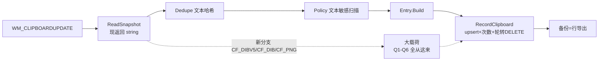
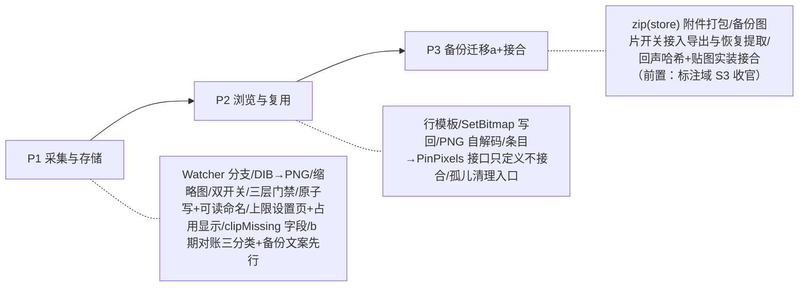

# 剪贴板图片历史 · 可行性裁决与实施方案（对话全记录收拢版）

> 需求：剪贴板栏增强——保存复制的图片，与截屏/贴图/画布功能组合。发起人同时要求
> **"千万不能过于乐观"**。本文档收录 2026-09-27 三轮对话的完整结论：可行性分析（六问）→
> 发起人裁决（Q1/Q2/Q6 + 存储形态）→ 顾问反批（四洞 + 默认值）。
> **这是实现前的唯一决议出处**；与本文冲突的口头结论一律以本文为准。状态：已裁决，**实现前复核已完成**
> （§1 逐条对过工作区，F9 与代码矛盾已按发起人裁决更正；§2 补两条落点裁决），P1 施工中。

---

## 0. 结论

- 技术可行：链路 80% 有现成地基（帧丢弃留了口子、回放/去重/置顶豁免语义图文同构）。
- 但它不是"给剪贴板加一个格式"：图片是本架构**第一种大载荷**，进场即冲击六个既有纪律
  （磁盘上界 / 敏感闸门 / 备份完整性 / 删除一致性 / 内存峰值 / 与标注域重做的边界）。
- 六问全部已有终态裁决（§4），默认值已钉死（§5），阶段与门禁见 §6。
- **一句话底线**：磁盘有界（Q1）、删除可账（Q6）、备份口径自洽（Q2）三者做齐才叫增强；
  缺任何一个，它就是"代码看着好、用户数据在看不见的地方漏"的那类东西。

## 1. 现状硬事实（逐行核验，行号已对 2026-09-27 工作区复核）

| # | 事实 | 出处 |
|---|---|---|
| F1 | 采集只认 CF_UNICODETEXT/CF_HDROP；**纯图片帧是刻意的丢弃**（注释原话"空剪贴板/只有图片等"） | `Integrations/Clipboard/ClipboardNative.cs:47` |
| F2 | 裁决链以 string 为通货：CaptureAsync(rawText) → Dedupe.ShouldSkip(text) → Policy.ShouldRecord(text) → Entry.Build(text) | `ClipboardWatcher.cs:27-40` |
| F3 | 条目入 `items` 表（source='clipboard'，键=文本归一哈希，正文 Description），**无 BLOB 列** | `Abstractions/Clipboard/ClipboardEntry.cs` |
| F4 | 轮转/清空/删单条共四处纯 SQL DELETE（另有轮转子查询批量删），无"文件"概念 | `Data/ItemRepository.Local.cs:147/167/335/365/383` |
| F5 | 备份=items 行导出（(source, source_id) 关联），二进制不进备份 | `Data/BackupRepository.cs` 导出注释 |
| F6 | 敏感闸门=文本规则（私钥/JWT/卡号 Luhn）+ 前台进程排除（密码管理器），对图片字节失明 | `ClipboardPolicy.cs:60-66,201-258` |
| F7 | 写回=WinRT `DataPackage.SetText`（UI 线程+Flush），回声登记（NoteOwnWrite）只认文本 | `UI/ViewModels/ClipboardPageViewModel.cs:113-117`、`ClipboardWatcher.cs:264` |
| F8 | `ReadGlobal` 已有 HGLOBAL 字节拷贝通路与 64MB 拷贝防护 | `ClipboardNative.cs:72-88` |
| F9 | ~~剪贴板条 `search_text` 本就写空串（不入 FTS）~~ **已核实为错（2026-09-27 实现前复核）**：`RecordClipboardAsync` 的 INSERT 那一列确实写字面 `''`（`ItemRepository.Local.cs:300`），**但紧接着第 329 行 `RebuildSearchTextAsync(conn, id)`** 按 title+description+笔记+标签重建并写回，而 description 就是复制的正文 ⇒ **剪贴板文本条目是入 FTS、可搜正文的**。既有测试直接钉着这个行为：`ClipboardRepositoryTests.Replay_KeepsSecondLineSearchable`（搜正文第二行命中）、`Replay_KeepsNoteAndTagWordsSearchable`。发起人裁决：§7 那条"图片不进 FTS/搜索"**结论保留、理由更正**（见 §7） | `ItemRepository.Local.cs:300/329`、`ClipboardRepositoryTests.cs` |
| F10 | 文本正文 32KB 截断 + `clipFullLength` 记实长——"超限出声"在本域有成熟先例 | `ClipboardPolicy.cs:30/129-135` |

## 2. 方案骨架（低风险部分，裁决后原样成立）

> **实现前复核补两条落点裁决（2026-09-27，发起人选的）**：
> ① **PNG 编码器不重写**——复用仓库里已有的唯一一处 `Integrations/Capture/GdiScreenCapture.EncodePngAsync`
>   （WinRT `BitmapEncoder`，该文件注释立着"编码只这一处：两边各写一遍编码器，早晚会写出两种尺寸或两种 alpha 处理"）。
>   **只调用不修改**该文件（截图域仍属禁区）。剪贴板侧自写一份 PNG 编码＝故意造第二真值，已否。
> ② **`ClipboardCapture` 不搬文件**——它是住在 `Integrations/Clipboard/ClipboardWatcher.cs:20-41` 的类
>   （§1-F2 的出处写的就是这个文件），采集链改动就地改这个类；新建 `ClipboardCapture.cs` 搬 20 行属无谓重构，
>   且 `ClipboardWatcher.ReadLoopAsync` 本来也要改，两半分家反而更难读。

- **采集**：`ReadSnapshot` 增加 image 分支，格式优先级 **CF_DIBV5 → CF_DIB → CF_PNG**；
  CF_BITMAP（HBITMAP，不走 GlobalAlloc）v1 明确放弃并写进注释。字节原样拷出 + 记录主格式串。
- **身份**：`source_id = "c-" + SHA256(DIB 字节)`；同图再复制命中 → copyCount+1 移回最近——
  与文本回放语义同构，**白拿**（Office 连发两帧字节相同，突发去抖天然成立）。
- **格式统一**：内部只存 **PNG**（无损、WinRT `BitmapEncoder` 支持 MTA 可在采集线程池跑，
  不碰 STA）；CF_PNG 命中时校验魔数后按字节存；JPEG 仅导出场景；alpha 丢弃并写明
  （剪贴板图无半透明语义）。
- **解码**：PNG→BGRA 纯托管自研（inflate + defilter，百行级）；JPEG 不自研、不引 NuGet
  ——PNG 单格式使依赖消失。这是"历史图片→贴到桌面"的能力地基。
- **回声**：`ClipboardDedupe.NoteOwnWrite` 加哈希重载（登记即带字节身份）——支持图片后
  没有它 = 用户每点一次"复制图片"历史多一条自回声。签名放 Abstractions。
- **UI**：行模板按 `clipFormat='image'` 选择，显示预生成缩略图；写回加 `SetBitmap` 分支
  （STA 通路已存在）。
- **与截图/画布组合**：历史条目「贴到桌面」调 `ScreenshotService.PinPixels(BGRA)`（现成公开入口，
  **只调用不修改**）；接口定义冻结在 Abstractions，实装时点见 §6 P3。

## 3. 六问与裁决记录（风险 → 双方立场 → 终态）

### Q1 磁盘上界
- **风险**：轮转按条数封顶 500；图片 500 张最坏 GB 级，而用户视角只是"开了个历史开关"。
- **原建议**：三层硬线（单张拒收 / 总字节闸 / 条数独立）。
- **发起人裁决**：图片/文本**分别**存储上限进设置页，标注"调高可能占用存储"，按用户自身情况自配。
- **反批与终态**：选择权交用户可以，**单张字节上限 20MB 保持内部常数、不进设置页**——
  它挡的是异常帧灌入这类与偏好无关的事故（§4-洞1）。终态三层：
  ① 单张 >20MB 拒集 + 状态行出声（沿用"哑丢弃是缺陷"定性）；
  ② 图片/文本条数上限 = 用户配置（默认见 §5）；
  ③ 设置页实时显示当前实际占用（目录 stat 打开时算一次）+ 预估增量，让"按需配置"有数字可依。

### Q2 备份完整性
- **风险**：备份只导行（F5）；图片落地不处理 = 换机/灾备那一刻"每条图片历史都在、每条都坏"。
- **原建议**：a 附件打包 / b 如实标缺失 / c 整条排除。
- **发起人裁决**：**先 b 后迁 a**；存储对用户直接可见（不加密不藏）；**仅备份时**用压缩包携带
  图片并出"是否备份剪贴板图片"开关；关备份图 → 恢复数据从源头不含图片。
- **反批与终态（洞2）**：PNG 已是无损压缩，"备份压缩"的真实价值是**封装完整性不是省空间**
  （deflate 对截图 PNG 平均再省 <5%）——文案写"打包"禁写"省空间"；体积优化的真路径是换格式
  （WebP/JPEG 有损），列入 §8 不做清单。开关语义跨 b→a 全程一致（b 期关无副作用，a 期生效）。
  a 期导出=行数据+附件（zip store），恢复按 source_id 还原文件名；**a 上线前 b 的恢复文案不许撤**。

### Q3 隐私失明
- **风险**：文本能扫卡号/私钥/JWT，图片扫不了（F6）；密码管理器排除按前台进程名，对图片来源无分辨力。
- **裁决**：维持"采集默认关 + 独立开关"，文案明说"图片无法做敏感检查，开启即包含一切屏幕内容"。
  不做采集路径上的同步 OCR 扫描（那是另一条 AI 链，不进剪贴板）。截图工具"复制的图片要不要进历史"
  的口径：**进**（用户按了复制=显式动作，与 §20.4 即时分类同判据）。

### Q4 与标注域重做的边界
- **风险**：另一代理正在重做 Screenshot/Capture/Overlay/LayerDirector 全域，本功能有三条交点
  （回声登记在 Dedupe 属 Abstractions 可先行；PinPixels 是调用方；将来"历史↔贴图"来回传）。
- **终态**：P1/P2 不碰标注域文件；两个接口（`NoteOwnWrite(bytes)`、"条目→PNG→BGRA"）
  定义冻结在 Abstractions / Core，**实装接合统一推到标注域 S3 之后**。

### Q5 内存与解码
- **风险**：列表每次滚动 × 全屏 PNG → WIC 全尺寸解码，4K 单张解码态 30MB+；采集线程 DIB 拷贝+
  编码缓冲瞬时 70–100MB（LOH）。
- **终态**：采集时同步预生成 160px 缩略图（BitmapDecoder+BitmapTransform+JPEG q60，5–15KB，
  线程池可跑）；列表只加载缩略图；采集瞬时峰值**列入真机验收**，不做纸面承诺。
  每条目主图+缩略图两文件，同生同死（Q6 删除路径双倍计数）。

### Q6 删除一致性
- **风险**：四处 DELETE 全要变"删行后尽力删文件"；文件系统不在事务里，两个方向的脏必然存在。
- **原方案**：尽力删 + 启动对账 + `clipMissing` 标。
- **裁决增量（洞3）**：存储"对用户直接可见"使对账升级为**对外部篡改的容忍**——用户手动删文件是
  合法操作不是故障。对账三类口径：
  - 行有图无（手删/旧备份恢复）→ 条目保留 + `clipMissing` + 点击给原话；
  - 图有行无（删行时文件失败残留/用户拷入）→ 孤儿只计数、给"清理孤儿"入口、**不静默删用户目录**；
  - 半写残（进程被杀在编码中途）→ 临时名 + 原子 rename 根治；这一类由构造消灭。
- 命名顺"可见"改：`clip\2026-09-27_1432_9f2a3b.png`（时间+8 位哈希前缀；完整性靠 source_id
  记录的真哈希，文件名只做人类友好——"一堆十六进制散目录"等于没兑现可见）。

## 4. 默认值决议（每条带理由，实现不得擅改）

| 项 | 默认 | 可调 |
|---|---|---|
| 剪贴板历史总开关 | 关（现状） | 设置页 |
| **图片采集分开关** | **关** | 设置页，开关旁就是 Q3 警示文案 |
| 单张字节上限 | 20MB | **不可调**（内部常数，洞1） |
| 图片条数上限 | 200（夹 10–2000） | 设置页 NumberBox + 占用预估 |
| 文本条数上限 | 500（夹 10–10000） | 同上；等于现行为，只是从常量变可见（F: MaxEntries） |
| 备份包含剪贴板图片 | **开**（a 期生效） | 设置页；关=导出阶段跳附件、恢复从源头不含 |
| 启动对账 | 开 | 安全护栏不设关 |

## 5. 阶段与门禁

- 每阶段独立可停：P1 完成后文本行为零变化、图片行为"开了才采、处处如实"；
  P2 完成后用户能看图、复制图、把图钉出去（对贴图走 PinPixels 的调用若标注域接口未稳，
  允许该按钮临时置灰并给出原因文案，不许接半成品）。
- 每阶段验收 = build 0 新增警告 + 全量 dotnet test 绿 + 新增纯逻辑测试（Payload image 解码/
  Entry 图片构造/Policy 门禁/对账三分类/DIB→**BGRA 归一**与 PNG 容器读做字节级单测；
  **PNG 编码本身按 §2 落点裁决复用现成唯一编码器，不再自写一份，因此不设"DIB→PNG 字节级"这项**——
  能字节级验的是"头解析 + 行序 + 位深 → BGRA"那一段，编出来的 PNG 是否可解由 §"PNG 解码"的往返测覆盖）
  + 真机清单（§6）。

## 6. 真机确认清单（沙盒不可测）

1. 真实 DIB/DIBV5/PNG 各来源截图（微信/QQ/浏览器/Office/系统截图工具/终端）格式命中与尺寸分布；
2. 采集瞬时内存峰值（任务管理器口径，连续 20 张 4K 截图复制）与 LOH 表现；
3. Office 系连发通知的图片去抖实感（700ms 对图片帧率是否够，可能要调参——实测定值）；
4. 设置页占用统计在大量图目录下的打开耗时；
5. `SetBitmap` 写回后各目标应用收到格式是否齐全（CF_DIB/CF_DIBV5 兼容转换由系统补，要实际粘贴验证）;
6. 双开关文案与默认值的可见性（第一次开图片采集的人必须读到那条隐私警示）。

## 7. 明确不做（本期及裁决前）

- WebP/JPEG 存储（有损换体积，未裁决）；Ditto 侧图片导入（`ooData` 里确有 DIB BLOB，独立二期）；
- CF_BITMAP 支持；alpha 通道保留；备份体积"压缩"承诺（洞2 已证不成立）；
- 图片进 FTS/搜索——**理由已按 F9 的核实结果更正**（原文写"文本条目本就 search_text=''，口径一致"，那句是错的）：
  现在的口径是**图片条目没有文本正文可入索引**（`description` 为空，索引里只剩"1920×1080 PNG"这类尺寸标题），
  且刻意**不为图片生成任何可搜文本**（采集期 OCR 在 §7 末条另行排除）。结论不变，实现时不得照抄旧理由写注释。
- 采集路径上的图片敏感扫描（OCR）。

## 8. 实现禁区（与并行会话共处纪律）

`src/StarMark.UI/Services/LayerDirector.cs`、`AnnotationHub.cs`、`AnnotationStage.cs`、
`ScreenshotService.cs`、`Views/Capture*`、`Views/Canvas*`、`PinWindow*` 及一切标注域新文件——
**一行不碰**（P3 的接合等该域 S3 收官后另批）；`SettingsPage.xaml` 属公共文件，
改动窗口必须先查 `git status` 确认无他人未提交修改，改后尽快单独提交锁定归属。
