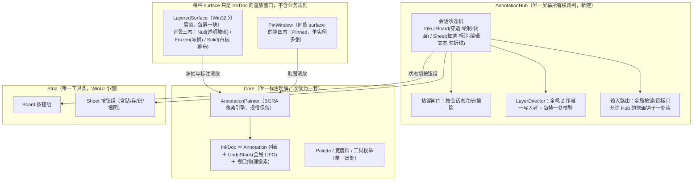
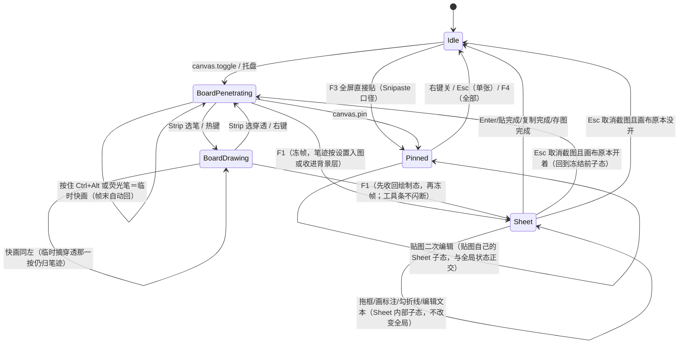

# 屏幕标注系统整合架构方案

> 目标：把截图、画布、贴图三个功能整合为一个 Snipaste × ppInk 深度融合的「屏幕标注系统」。
> 本文档为裁定性方案：先立目标架构，再定推翻边界，最后给迁移次序。不含工作量估算，不回避架构债。
> 冲突编号 C1–C9 引用《交互冲突查验》（2026-09-26 会话），本方案逐条有主。

---

## 0. 心智模型（一句话）

**笔迹永远活在屏幕上；截图是屏幕被冻住的那一瞬；贴图是把那一瞬从屏幕上揭下来。**

这是 ppInk 的骨架（一块常驻玻璃画板，"带不带背景图"只是画板的一种属性）叠加
Snipaste 的工作流（F1 → 框选 → 原地标注 → F3 钉住 → 贴图可继续编辑/缩放/穿透）。
两者能在架构上统一，正因为它们对"标注存在哪里"的答案是同一个：**在屏幕上，不在某个文档窗口里**。

当前架构给不出这个体验，不是实现不够好，而是三套宿主各自持有屏幕所有权、两套引擎各自理解"笔迹"、
没有一个仲裁者回答"此刻谁在吃鼠标"。整合＝**收权**，不是拼接。

---

## 1. 现状的架构性病因

查验结论：C1 提层拉扯、C2 轮询截胡、C3 重影、C4 会话串键、C5 合成双份、C6 同名异义工具/双撤销、
C7 生命周期分裂、C8 贴图被画布压制、C9 穿透语义分裂。归纳起来只有三个根因：

| 根因 | 表现 |
|---|---|
| **R1 无仲裁者** | 屏幕所有权散落在 ScreenshotService、CanvasService、各窗体的每帧自愈逻辑里；任何一方都无法在按下热键的那一刻回答"现在归谁"。C1/C2/C3/C4/C8 全部由此生。 |
| **R2 双引擎** | `Annotation+AnnotationPainter+AnnotationHistory`（截图/贴图）与 `CanvasInk+CanvasCompositor+EphemeralInk`（画布）平行存在，坐标约定、撤销语义、工具行为各一套。C5/C6 由此生。 |
| **R3 宿主分裂** | 截图遮罩（WinUI 窗）/画布（Win32 分层窗）/贴图（WinUI 窗）三种窗类型承载同一个"对着屏幕涂画"的动作，Z 序、穿透、焦点规则各写各的。C1/C8 的战场就是这三类窗在 topmost 带里的相互不认识。 |

任何只补闸门的方案（再加一条互斥检查、再加一处豁免名单）治标——R3 不动，自愈逻辑就永远需要新的特判，
特判数量随宿主组合数增长。本方案对 R1/R2/R3 逐一收权。

---

## 2. 目标架构总览

要点：
- **AnnotationHub** 是新架构的心脏，也是唯一可以修改任意窗样式与 Z 序的地方。
  `ScreenshotService`/`CanvasService` 降为 Hub 的两个动作入口（建图 / 冻屏），不再各持自愈循环。
- **InkDoc** 复用截图那条链（模型设计经过逐行查验、质量可靠），画布 `CanvasInk/CanvasCompositor` 退役，
  其真正有价值的部分——`EphemeralInk` 的 TTL 淡出——变成 InkDoc 上的工具属性（聚光灯笔），而非另一个世界（R2 消解）。
- **宿主层统一为分层窗（UpdateLayeredWindow）**：ppInk/gInk 十几年验证的路线（R3 消解）。
  WinUI 遮罩窗的截图态整条链退役，只保留贴图（Pinned 复用同一渲放管线）。工具条/输入框保留为独立 WinUI 小窗（chrome），
  它们吃焦点只影响自己、不再与遮罩抢。
- **穿透语义收进状态机命名空间**：Board·穿透 / Sheet·拦截 / Pinned·穿透 是状态机的显式属性，全机一处读（C9 消解）；"交出鼠标"的 F5 键行为不变。
- **热键闸门**：Sheet 会话期间摘除九条 Ctrl+Alt+字母注册；Esc 不再"画布退一层"。Hub 一处定义（R1 消解）。
- **Undo 语义**：全局一份撤销历史（跨 surface LIFO，栈底按 surface 分组），撤销作用在"最后画的那一笔"上；
  Esc 作用在"当前会话态"上；每个语义一条测试（R1 消解）。
- **贴图（Pinned）纳入渲染管线**：Pinned = 背景态第四种，不再独立实现，直接继承 Hub 状态判定（C8 消解）。

---

## 3. 核心对象

以下只列接口职责，完整签名随实现落定；职责表写在这里是为了迁移时"谁管什么"不再反复。

### 3.1 AnnotationHub
- 持有唯一状态机（§5）；任何公开动作（热键/托盘/工具条按钮/截图结束）都表达为**事件**，Hub 统一做转移判定。
- 每帧对 LayerDirector 做一次校验（把现在散在三处的每帧自愈合回一处），**只在状态机与窗口实际不一致时**修窗，修完必须发事件让工具条状态行跟着改口。
- 持全局热键注册表投影（§6.1）。

### 3.2 IInkSurface / 实现：LayeredSurface（画布）、PinSurface（贴图）、SheetSurface（截图）
> **[实现期改判，见 §14.1 [S3 改判]]** 这一层的抽象**不引入**：S2 已经把"模型统一"该拿的收益拿完了（一块面一份 `InkDoc`、
> 序号同源、跨面落点路由），而把截图宿主从 XAML 遮罩换成分层窗只能兑现"渲放同一件事"——
> 那正好是 §14.1 [S2-d 第二刀改判] 论证过不该在缺少第三个真读点时做的事。
> **本节保留的是判据不是宿主**："不持模式布尔位""命中测试交回一处""宿主自己不做选没选中判断"三条已经落地并被闸门钉住。
- 职责只三件：**渲放背景图（三态）/ 渲放 InkDoc / 把鼠标物理像素坐标按视口换算给 Hub**。
- 每屏一块 glass（多屏时是"每屏一块，合起来一个视口"），Sheet 是临时冻帧全屏（每屏一块，每屏独立）；
  Pinned 是按需创建单窗。
- 命中测试（窗口/笔/空）交给 AnnotationPainter 的现有 hit-test（截图链已验证），宿主自己不做任何"选没选中"判断。
- 不持模式布尔位：所有状态在 Hub（这是"状态说的与窗口做的必须一致"问题的唯一根治；画布注释里记的真机症状，本质就是状态散在两层各存了一份）。

### 3.3 Strip（工具条，唯一 chrome）
- 按钮组按状态切换（Board 组：笔/荧光/聚光/橡皮 + 图章/矩形/椭圆/折线/箭头/文字/序号 + 颜色粗细 + 撤销 / 清空 / 截图 / 保存·复制 / 贴图 / 退出 / 快捷键面板 / 穿透；
  Sheet 组 = Board 全量 + 贴/存/识/揭图 − "截图"按钮）。
- 只发事件给 Hub，自己不改状态、不改窗、不改热键：UI 是状态机的投影，不是第二个状态机（当前 CaptureBarWindow 和 CanvasToolbarWindow 各自持状态是 R3 的一部分）。
  > **[实现期改判，见 §14.1 [S3 改判]]** 这一条**照办**（收敛两扇条子各自持有的模式位与"自己改窗"的写点），
  > 但**不并成一扇 Strip 窗**：两扇条子服务两个不同的宿主与两套几何（截图条跟选区/贴图走＝WL/WQ，画布条常驻屏顶＝WD/WM），
  > 并窗会把 WQ/WN/WP 三条已验收的摆位与宽度判据重做一遍，用户看不见收益。
  > **[S3-a 普查结果（2026-09-28）]** 括号里那句"当前…各自持状态是 R3 的一部分"**已过时**：逐文件读完两扇条子之后，
  > 它们的字段只剩<b>窗自己的几何与拖拽态</b>（`_screen/_scale/_dragging/_grabOffset`、条子窗的 `_image/_work/_baseHeight`），
  > 每一次状态写都发生在按钮处理器里（`CanvasService.ToggleTool/SelectWidth/SetClickThrough…`），
  > `Refresh` 是<b>纯投影</b>（只读服务态画高亮），层序全部走 `LayerDirector`，"在不在场"问 `IsWindowVisible` 而不是自己记旗标。
  > 本条不删的原因：留个读者会问"那还要不要收敛"——答案是要守，但守的是<b>别再退回去</b>，
  > 闸门＝`TheBarsProjectStateAndNeverWriteItBackFromARefreshPath`（钉"投影不许写回"，不是钉某颗按钮写了什么）。
- 永远可点：Strip 不在任何 surface 之下（由 LayerDirector 保证），Board·穿透态下仍可点工具（与现在一致，状态机只摘 glass 那两位）。

### 3.4 InkDoc 与 AnnotationPainter
> **[实现期裁定，见 §14.1 [S2-d 第二刀改判]]** 这一节的"合并为 PixelInkRenderer"排在 **S3**，不在 S2：
> 两条链在"底／边缘／混合律／输入"四条轴上无共享量，S2 能机检的重复只有步进（已由 `InkPath` 收掉），
> 而 S2 已把合并所需的前提补齐——<b>两条链各有逐像素参照</b>（`CanvasKernelIdentityTests` ＋ `CaptureKernelIdentityTests`）。
> 下面那句"字节一致"从此有了可执行的含义：<b>搬完之后两份参照仍逐像素相等</b>，不是"看起来一样"。
- `AnnotationPainter`（BGRA 逐像素，截图链）与 `CanvasCompositor`（画布链）**合并为 PixelInkRenderer**：把 AnnotationPainter 的渲染逻辑搬进 CanvasCompositor 的 dirty-region 帧管线，合并前必须逐方法比对（截图链支持文字/序号/箭头/橡皮擦的渲染，画布链只渲染线段；PixelInkRenderer 要全量覆盖两边的渲染能力）；
  **输出仍是纯函数 (InkDoc, viewport) → BGRA 缓冲**，两世界渲染结果必须字节一致（像素级回归对照）。
- InkDoc 持 `IReadOnlyList<Annotation>` ＋ 全局 `UndoStack`（LIFO，栈底按 Surface 记录分组，撤销跨 surface OK）＋ 当前工具状态 ＋ Palette（单一出处）。
- EphemeralInk/CanvasInk 的**渲染价值**（TTL 段、cursor halo）收进 PixelInkRenderer；
  CanvasInk 的模型概念（Begin/Extend/End/AddPoint 语义、dirty bounds）是 AnnotationPainter 已有的子集（AnnotationPainter 的 stroke 增量渲染），
  不再保留 CanvasInk 模型：`CanvasInk` 退化为渲染层内部工具，不是 InkDoc 的一部分。

### 3.5 LayerDirector
- 全机唯一的 `SetWindowPos`/样式改写点。规则表见 §4。
- 每帧校验只读比对（GetWindowLong / 顺序快照），不一致才动，且每次动都有状态机依据（C1/C8 的根治：
  当前三处自愈逻辑互不认识的根源是它们各自有"我以为该谁在上"的小算盘）。

---

## 4. Z 序与穿透规则表（LayerDirector 的完整规格）

topmost 带内从上到下，**只允许这一种排法**：

| 排名 | 窗口 | 条件 |
|---|---|---|
| 1 | Strip ＋文本编辑浮窗（若在场）＋快捷键面板 | 任意活动态 |
| 2 | Sheet surface（冻帧全屏块） | 仅 Sheet 态存在，盖住一切自家他窗，也盖住 Pinned |
| 3 | Pinned 贴图 | 任意（Sheet 态下被 Sheet 盖住；Board·绘制态下被 glass 盖住） |
| 4 | Board glass | 绘制态：压在 Pinned 之上（要能在贴图上继续圈注）；穿透态：压到 Pinned 之下（贴图可正常点击） |
| — | 下层应用 | glass 穿透态时鼠标归它 |

让位规则（绘制态）：命中窗口**不属于自家白名单**（Strip/Pinned/glass/编辑浮窗全在白名单）才交回鼠标——把现在"自家窗一律豁免"的粗判改成"按窗豁免"，
Sheet→Pinned→glass 之间的拉扯从结构上不存在（都归 LayerDirector 一处排）。
**C1、C8 消除**；`ReassertClickThrough` 的状态/样式对账合并进 LayerDirector 的一处校验。

**C2 消除**：PollPress 只在 Board·穿透态被 Hub 启动；F1 按下进入 Sheet 的第一帧起钩子必须已摘除（热键回调同步置态，摘钩在置态之前完成，帧间不存在两家用）。
Sheet 态 glass 不可见，连重影都不存在。

---

## 5. 会话状态与转移

规则：
- **Sheet 与 Board 各自是独立宿主，共享同一份会话态与同一套判据**（2026-09-28 用户裁决，见 §14.1 [S3 改判]；
  原文"同一 surface 的背景两态、F1 时不建新窗"已作废）。
  **不变的那半句留着**：用户看到的必须仍是"屏幕冻住"——一次冻结、没有窗消失又重建的闪断，
  这条由 S1-c 的实现兑现（抓帧 → 迁移会话 → 收玻璃与画布条 → 建 Sheet），而不是靠两窗合成成一窗。
- 进入 Sheet 时 Hub 一次性完成：冻帧、摘画布那批热键、摘 PollPress、glass 让位/隐藏、Strip 切按钮组。离开时反向恢复，恢复以"冻结前的子态快照"为准——修复"截完图回不来"类错误（C3、C4、C6 的状态侧）。
- **C7**：退出语义收进状态机：Sheet·Esc = 取消截图回 Board；Board·Esc = 退出画布回 Idle；Idle·Esc = 无事发生。当前"Esc 只管截图窗，画布玻璃没人收"的悬空由此终结（画布目前只有工具条按钮一个出口，`LayeredCanvasWindow` 是 NOACTIVATE 根本收不到键盘——统一后 Esc 路由表是 Hub 的输入路由的一部分）。
- Pinned 是**独立实例的宿主**，不占用全局会话：可以同时有"Board 开着 + 若干张贴图"，也可以有"Sheet 编辑中 + 贴图在场"（Sheet 在上，见 §4）。

---

## 6. 键盘、鼠标与热键闸门

### 6.1 热键注册表 = f(画布总开关, 截屏总开关, 会话状态)
**已落地（S1-c，批次 RP 加进第三个自变量），且与宿主数量无关**——这一条本来问的就是"此刻该注册哪些"，不存在"等单一宿主才成立"的前置。
出处只有一处：`SettingsStore.GetRegisterableHotkeyBindings()` 按总开关给可注册集，
`HotkeyGate.ShouldRegister` 再按会话态摘掉画布那批（Sheet 活动 → 整批摘，保留 `canvas.toggle` 并给一句"截图进行中"的回执，
与总开关那条先例同句法）。**C4 消除**。托盘/设置页读到的永远是"此刻真的生效的键"。

**批次 RP 补上的那一道闸（`Core/Hotkeys/CaptureGate`）与画布那道有三处刻意不同，别照抄**：
① 摘的是**截屏那三条发起框选的键**（F1/F3/识字），而**不留"开关那条"**——它们是裸功能键，
替一个关掉的功能继续占着＝让所有软件永久失去 Help 键，比"按了没反应"更糟；关掉之后的可见答复由
"托盘三项整条消失 + 设置页那句说明"给，不靠留哑键（画布那条之所以能留，是因为 `Ctrl+Alt+D` 带修饰键、不抢别人的键）。
② 两条链的**优先级顺序相反**：画布问的是"这条键此刻按下去会怎样"⇒ 会话 > 总开关；
截屏问的是"截图自己能不能发起"⇒ **总开关 > 会话**（会话中而功能已关时说"等截图结束"是把人支使去等一个根本没在跑的东西）。
③ 同前缀 ≠ 同能力：`screen.pinhidden` / `screen.pinthrough` 管的是**已经贴在桌上的图**，不随这条开关收——
`screen.pinhidden` 是穿透态贴图唯一的键盘出口，一起摘就把用户自己的东西困在屏幕上。
投影仍是唯一出处：四个 ApplyBindings 入口自动跟上，托盘与设置页读的是同一份。

### 6.2 Sheet 内键盘
沿用截图链已调好的本地键表（Ctrl+Z/Y/S/C、Enter、方向键、Delete/Esc 两级），不引入画布那套。编辑文本的焦点细节是现有资产，整段保留。
**[2026-09-28 升格]** 这句"整段保留"从此是**终态**而不是过渡：宿主不换，WinUI 的 TextBox/IME 链就一直在原位
（这正是 §14.1 [S3 改判] 记下的那笔意外之喜——原 §12 把"文本编辑浮窗的焦点与活动切换"列为 S3 风险第一位）。

### 6.3 Board 内"零摩擦快画"（2026-09-27 用户改判后口径）
穿透态下**只有一条路**能把鼠标抢回来自画笔迹：**按住 `Ctrl+Alt` 再拖动**（圈画）。
选荧光笔不再等于"抢按"，选任何一支工具都不改变鼠标归属（详见下面第二条裁定）。

**实现留在"Hub 侧一个定时器每帧读全局鼠标态"这一版**（2026-09-28 随 [S3 改判] 升格为终态；
原文"改为低级鼠标钩子、`_wasTemporary` 退役"不再执行）。理由与代价都写清：
轮询加"命中测试当场让位"（S2-h）之后，"一次按下两家用"那一类竞态已被 `LayerDirector.IsPointOnChrome` +
`ClaimsPressInPenetrating` 两处判据挡住，`WH_MOUSE_LL` 能多换来的只剩"挂/摘生命周期"这一处新风险，
而那条钩子在提权会话与多桌面环境里是更贵的东西。**留下的已知残余**：轮询天生有半帧延迟，
若将来出现"抢按窗口期内被别家吃掉那一按"的真机报告，再回来做钩子版（那是可证伪的事件，不是"以后再看"）。

---

## 7. 撤销与历史

- **一份全局 InkDoc 历史栈，按 surface 记录归属**（Board 笔迹带屏幕号——现有"每屏各撤各的"语义保留，只是栈全局化）。
- Sheet 提交/揭图/贴出后，其笔迹归贴图实例自带，全局栈不再持有（贴图编辑历史独立成栈，现状如此，保留）。
- `Ctrl+Z` 永远撤"当前焦点域内最后落的那一笔"：Sheet 态撤截图标注，Board 态撤板子笔迹，编辑文本时撤输入框——焦点路由表在 Hub，一张表读完，不再有"撤错了世界"。
- 荧光笔**两条链语义有意不同**（2026-09-28 用户裁决，见 §14.1 [P-106 已决]，**不是"整合没做完"**）：
  画布＝**临时高亮**——按 TTL 淡出、不进 `InkDoc`、因而**撤销不到**（它本来就留不住，"指一下不用擦"是它的用途）；
  截图/贴图＝**半透明永久墨**——进历史、可撤销、可擦。
  ~~原写法"两种笔都进撤销栈、TTL 淡出只是显示语义、历史里仍有一格"已作废~~：落实它要给每条荧光带起始时刻并在淡出期
  **每帧重烤包围盒**（撞批次 WG 的拖动期纪律），且观感变成"板上越涂越留淡黄"；
  折中方案（进历史但显示淡到 0）会新造一个"按了没反应"——撤销一条早已淡没的东西没有任何可见变化。
  **重开条件**：真机点名"画布荧光我想撤掉／想让它留下来" ⇒ 再谈，且与 S3 的"Board 渲放由 InkDoc 重渲"同批做最省。

---

## 8. 与 Snipaste / ppInk 的对位（行为规格）

| 用户动作 | Snipaste | ppInk | 本方案 |
|---|---|---|---|
| F1 即框选 | ✅ | ❌（F1 是全屏截图入板） | ✅（Snipaste 主轴） |
| 框选中就能画、越出选区 | ❌ | — | ✅（截图链 PU 批次已实现，保留，比 Snipaste 强） |
| 不冻屏直接画、穿透干活 | ❌ | ✅ | ✅（ppInk 主轴） |
| 穿透态按住即画 | ❌ | ✅ | ⚠️ 只保留 `Ctrl+Alt`+拖动这一条（2026-09-27 用户改判，见 §14.1） |
| 画完的板子一张图贴出来 | ❌ | ✅（快照，默认**只出笔迹、透明底**） | ✅（Board 快照 → 新 Pin 实例，**只裁笔迹那一块、钉回原位**；见 §14.1 [S4-⑤ 落地]） |
| 贴图上继续圈注 | ✅（编辑标注） | ❌ | ✅（Pinned 是第四背景态，直接画） |
| 白板底 | ❌ | ✅ | ✅（S4-① 落地：提交那一帧才叠的不透明底，见 §14.1 [S4-① 落地]） |
| 幕布半透明遮屏 | ✅（F9 窗帘） | ✅（`SpotLightMode`：整块矩形填半透明橙 alpha=128、按交替填充把光标那块圆**挖空**——`FormDisplay.cs:1165-1173`，就是"压暗四周只留光标那一圈"） | ✅（S4-② 落地：半透明黑（预乘 0x80000000）压暗 + 那块亮区，见 §14.1 [S4-② 落地]） |
| 指着讲时看得见光标（光晕） | ❌ | ❌（它只有上面那一块洞；半径 200 px、UI 上按主屏宽百分比调，`Root.cs:460-461`＋`FormOptions.cs:1452`。**"另加一圈光晕"在 ppInk 那儿不存在**） | ✅（同一块圆、两个读数：幕布开着⇒那块是亮区，幕布关着⇒同一块是那一团光；**两档 关（默认）／任何工具常开**，半径是一根滑杆、两块圆共用（40~400 DIP）。见 §14.1 [S4-⑥ 落地] 与 [RN 落地]） |
| 贴图滚轮缩放/穿透/角标 | ✅ | ❌ | ✅（截图链贴图态已实现，保留） |
| OCR | ✅ | ❌ | ✅（现有） |

验收口径：**一个熟悉 Snipaste 的人不需要学任何新概念；一个熟悉 ppInk 的人找不到"这里怎么不通"的缝隙。**
两者共有的心智模型只有"笔迹在屏幕上"，本方案把它做成唯一的。

---

## 9. 从 ppInk/gInk 保留什么、弃用什么（对位表）

> **[2026-09-28 升格]** 这张表原本按"最后只剩一个宿主、全都搬进分层窗管线"的终态写。
> 那条终态已被 P-107 作废（**二元宿主就是终态**：画布＝纯 Win32 分层窗，截图/贴图＝WinUI 遮罩窗 + 像素管线渲染），
> 所以每行的处置都改成了"读起来像待办、其实是已定形"的写法。**别把"迁到管线"这类字样再当成欠账去做。**

| 组件 | 处置（升格后的现行结论） | 理由 |
|---|---|---|
| 分层窗渲染管线（UpdateLayeredWindow + 32bpp DIB + 脏区） | **保留为画布专属**，不再"统一为唯一渲放路"；XAML 遮罩窗**不退役** | 全仓 `UpdateLayeredWindow` 只出现在 `LayeredCanvasWindow`/`CanvasNative`/`CanvasCompositor` 三处——玻璃要的是"每帧只提交脏区 + α=1 空白像素"，遮罩要的是"冻帧之上全帧显示"，两件事各自的实现都已验证；截图链的墨也早已走 `AnnotationPainter` → BGRA → `WriteableBitmap`（`CaptureOverlayWindow.Draw.cs`），"统一"能省的下只剩几件 chrome |
| 每帧自愈（ReassertClickThrough 等） | ✅ 已收敛为 `LayerDirector` 一处校验（S1-b） | 三家各自"我以为该谁在上"的算盘是 C1/C8 的根，这条与宿主数量无关 |
| PollPress | ✅ 已收敛为 Hub 的一处判据（S2-g/S2-h）；`WH_MOUSE_LL` 版**不做**，升格见 §6.3 | 轮询不是错，缺会话闸门与命中检查才是 |
| CanvasCompositor/CanvasInk | 模型 ✅ 已全量进 `InkDoc`（S2-c）；两条**逐像素渲染保留两份**（S2-d 第二刀改判），`PixelInkRenderer` 只在出现第三个真读点时谈 | 四条轴无共享量；EphemeralInk 的 TTL 段/cursor halo 留在画布侧（P-106 已决：画布荧光不进撤销栈） |
| 工具条 ×2（CaptureBarWindow/CanvasToolbarWindow）+ 贴图独立右键菜单 | **不并成一扇 Strip**；只守"只发事件、不持状态"（S3-a 普查＝净 + `TheBarsProjectStateAndNeverWriteItBackFromARefreshPath`），按钮几何/图标/摆位判据已合一（WS/WQ） | 两扇条子服务两个宿主与两套几何，并窗要重做 WN/WP/WQ 三条已验收判据，用户看不见收益 |
| 贴图窗（`_pinned` XAML 链） | **不迁管线**；模型/历史早已共用（一份 `InkDoc`、`SurfaceRole.Pin`） | 它是"同一条标注链"的实践者，换壳只带来风险 |
| AnnotationPainter 引擎 | 保留（截图链的逐像素渲染），并有 226 例逐像素参照守着 | 逐像素、无 WPS、不引外部依赖——质量已逐行查验可靠 |
| OCR 链 / 多屏几何（DIP/物理换算） | 保留 | 截图链成熟实现 |

**gInk/ppInk 的文本编辑浮窗**要抄的那条**到此为止**：现项目里 XAML TextBox 浮窗（RD-1 整条焦点/落笔链已调好）
就是终态——**不拆成 Strip 旁挂的独立宿主**（那是"迁管线"的配套动作，随 P-107 一起作废）。
反过来说，把文字编辑与 IME 整条链留在 WinUI 是这次改判**净赚**的一笔：原 §12 把"文本编辑浮窗的焦点与活动切换"
列为 S3 风险第一位，推翻宿主等于把 Win32 键盘/IME 那套坑重踩一遍，现在这条风险直接清零。

---

## 10. 推翻边界与迁移次序（每步可编译、可测、可回退）

推翻是**终态**，迁移**分步**——顺序按"先拆引信、再统一理解、再统一身体"：

**S1 仲裁者接管（改行为，不改形态）**
新建 AnnotationHub + LayerDirector + 热键闸门；三套宿主暂时保留原样，但所有控制点（藏玻璃、摘键、摘轮询、让位、Z 序）必须穿 Hub。
交付验收 = **冲突重现测试用例**：画布绘制态开截图不卡死、截图全程画布玻璃不可见、荧光笔模式不抢截图片、Board 快捷键在 Sheet 中不可触发、贴图在截图时不被误提到最上层。
（对应 C1/C2/C3/C4/C8 的行为级消除。）

**S2 模型统一**
`CanvasInk/CanvasCompositor/EphemeralInk` 的墨迹数据收进 InkDoc（Annotation/Painter/History，截图链模型）；Board 渲放改走 AnnotationPainter 合成 → BGRA 缓冲 → UpdateLayeredWindow；
`TryCompose` 不再"抓屏含笔迹再叠一遍"，改成"**抓干净屏 ＋ 渲 InkDoc**"（C5 根治，且截图结果不受板子状态影响）；
撤销全局栈化（C6 消除）；工具/色表/橡皮/聚光语义一处重定义（荧光笔＝聚光灯笔、TTL 淡出是显示属性，两种笔都可用在两种背景态）。

**S3 宿主统一（真正的推翻在这一步兑现）**
LayeredSurface 成为截图态唯一渲放路：Sheet 背景三态（§3.1）落地；XAML 遮罩窗的截图职责整条退役；
贴图 Pin 迁到管线渲放（最后收，因为 Pin 的 XAML 链已成熟、迁它纯为统一而统一，可容忍留在最后）；
TextBox 浮窗独立成宿主；Strip 按钮组合并完成。
**S3 可以拆成逐能力迁移**（先渲染冻帧、再框选、再标注、再工具条、最后贴图），每一步旧路径还在（旧路径按状态机开关短路，保证同一会话只走一条链），回退＝翻回开关。

> **[实现期改判，见 §14.1 [S3 改判]]** S3 **不做宿主推翻**：XAML 遮罩窗保留为截图宿主，`IInkSurface`／`LayeredSurface`／`SheetSurface` 这层抽象不引入。
> S3 收敛为**地基收尾三件**：① Strip 只发事件（§3.3 那句"各自持状态是 R3 的一部分"照办，但**不并窗**）；
> ② §13 冲突回归用例逐条复核、没被机检的补闸门；③ `PixelInkRenderer` 继续不合（等第三个真读点）。
> 省下的力气转 S4 体验层。**重开条件写在 §14.1 那一条里**——满足之前不许照本节正文重做。

**S4 体验层补齐**
白板底、幕布、贴图组管理（对齐 Snipaste 的成组隐藏/显示/穿透）、Board 快照成贴、光标光晕对齐 ppInk，全在统一地基上加，不再新增概念。

> **进度（2026-09-29 收官）**：白板底 ①／幕布 ②／贴图组 ③／拆千行大文件 ④／Board 快照成贴 ⑤／
> <b>光标那块圆（光晕对齐 ppInk）⑥ 已全部落地</b>
> （分别见 §14.1 的 [S4-① 落地]、[S4-② 落地]、[S4-③ 落地]、[S4-④ 落地]、[S4-⑤ 落地]、[S4-⑥ 落地]）。
> **S4 队列清空**；整合阶段（S1–S4）到此结束，剩下的都是真机验收与另开的新需求。
> ⑤ 那一格查出来的不是"功能没做"，而是<b>做出来的形状在真机上会把整块桌面封住</b>——
> 链从批次 WB 就在，这一批改的是"交出去的那一张是多大一块、钉在哪"（§14 那条对 ppInk 的描述也一并更正了）。
> ⑥ 那一格查出来的也不是"缺功能"，而是<b>同一块圆有两份半径、各乘一次缩放</b>：
> 亮区按 160 DIP 算、光晕按荧光笔笔宽档算，两处都编译得过、都测不出彼此。

次序不可颠倒的理由：先统一模型再统一宿主（S2→S3）让 S3 的渲放层只剩"画像素"一件事；
若先换宿主，XAML 遮罩的双引擎代码会被原样搬进分层窗一遍，等于给 C6 续命。
Hub 先行（S1）保证每一步迁移期间，用户至少不再遇到多窗打架。

---

## 11. 被否决的方案（一句话存档，防止回潮）

**否决 A：保留三套宿主，只做互斥矩阵**。每加一个能力（幕布/白板/贴图编辑）互斥矩阵就升一维；
Z 序自愈的三处逻辑继续互相不知对方存在——C 类冲突是这类矩阵的稳态而非暂态。本方案的 S1 恰恰**包含**互斥矩阵，
但把它定为临时桥（S3 结束即随宿主统一而删），不是终态。

**否决 B：画布吸收截图（纯 ppInk，砍掉框选流程）**。放弃 Snipaste 的主轴体验（不框选、只能全屏截图或贴完图再圈注）；
截图链的框选阶段就地标注、窗口检测、放大镜全是成熟资产，砍掉等于自毁。

**否决 C：先统一渲染再统一模型**。XAML 的渲放层搬进分层窗成本最低（S2→S3 的顺序反了，会重复搬一次）；且若模型还分裂，
渲放统一后"撤销不统一、工具条不统一"的两半还是分家 UI 状态。

**否决 D：引入第三方渲染框架**（Skia/SharpDX）。现役管线无 GPU 依赖、无新增运行时成本（本地优先三铁律），现有引擎无性能缺陷证据，不为整合引入新栈。

---

## 12. 风险清单

| 风险 | 缓解 |
|---|---|
| ~~S3 文本编辑浮窗的焦点与活动切换~~ **已随 P-107 改判清零**：宿主不换 ⇒ 文字/IME 整条链原地留在 WinUI，不需要"只换宿主不换逻辑"那次移植 | 若将来重开（§14.1 三条重开条件之一成立），仍按原方案沿用 RD-1 那套焦点兜底并三条全测（Enter/Esc/失焦） |
| 每帧全宽玻璃贴图 + 冻帧整屏像素拷贝的合成性能 | Board 只渲脏区（现 CanvasService 脏区帧管线已是这条方案，保留）；Sheet 冻帧是静态底图，一次贴入、只重渲标注脏区，两者共享管线 |
| WinUI Strip/浮窗的 Activate 抢遮罩（现注释里有配方） | 规则固化：任何 Show 自家窗前 LayerDirector 先登记再置顶；S1 里这条规则要最先立 |
| 迁移期状态机与旧服务的双头指挥 | 状态机是唯一真相源；服务入口（`ScreenshotService.Start`/`CanvasService.Toggle`）改为纯派发；旧自愈代码逐步删，每删一处全量跑冲突回归用例 |
| 板子笔迹迁移（模型切换时笔迹语义不对齐） | S2 逐工具对比渲放结果，相同工具、相同坐标的笔迹像素级一致 |
| 贴图（当前是截图窗的 `_pinned` 态）在 S3 后仍是独立宿主 | Pinned 是第四背景态，渲放走同一条管线，模型/历史共用；宿主差异只在"独立小窗"这个事实（S3 最后收） |

---

## 13. 操作手册（验收用例，S1/S2/S3 完成后跑）

> 每条用例都是一句用户动作 + 预期可观察结果。
> 全部走完后，"当前系统操作体验差"这个评价必须有具体反例——这是本方案的唯一验收标准。

1. **Board → Sheet**：`Ctrl+Alt+D` 开画板 → 用笔写几笔 → `F1`：屏幕冻住（画板笔迹按设置决定在不在图里，**不再出现"屏幕上有、图里没有"或"图里有两份"**）；画板玻璃和工具条**不可见**（不再出现任何悬浮幽灵层）。
2. **Sheet 框选标注**：在冻帧上拖框 → 框选阶段直接画箭头标注 → `F3`：贴图出来，框外标注裁掉；贴图可滚轮缩放、可再 `F1`（截图链贴图态已实现，统一后行为一致）。
3. **Sheet 退路**：框选阶段（未提交）按 `Esc` 一次 = 收笔；再按 = 取消截图回 Board（画板恢复冻结前的子态，笔迹原样在）。按 `Enter` 提交复制（截图链现成行为，Hub 下不变）。
4. **穿透态快画**（2026-09-28 按 §6.3／S2-g 用户改判**重写**：原文"选荧光笔后按住屏幕任意位置直接画"已被否决——那是"绕过命中测试抢别人那一按"那一族缺陷的形状）：
   Board·穿透态 → **按住 `Ctrl+Alt` 再拖**＝临时摘穿透画一笔**画笔墨**（落进持久层、进撤销栈、松手即把鼠标还回去）；
   荧光笔在穿透态长按**不画**（机检＝`CanvasModes.ClaimsPressInPenetrating` 三臂 + `QuickDrawReadsOnlyInPenetrating`）；
   → 切到 Board·绘制态选荧光笔＝**临时高亮**：TTL 淡出、不进持久层、**也不进撤销栈**
   （**P-106 已决 (A)**：与截图链那支"半透明永久墨"是两件事，验收时别再要求它们一致）。
5. **贴图圈注**：贴图中 → `Ctrl+Alt+D` 开板（板子穿透态，贴图可动）→ 切换 Board·绘制态 → 在贴图窗口上圈画（贴图压在 glass 之下还是之上由 LayerDirector §4 定：绘制态 glass 压在贴图之上可以圈注；贴图此时收鼠标穿透点击、但贴图自己的编辑态走自己的 Sheet 子态键盘路由，二者不抢）。
6. **截图全局热键闸门**：截图进行中按 Board 九个热键 → 无响应（工具条可见回执："截图进行中"）；截图结束后恢复注册。
7. **Z 序对抗测试**：打开开始菜单/系统弹窗/别的全屏程序覆盖画板 → 画板**自动交回鼠标** → 状态行说清原因（现有 Yield 链保留，改一处判定）→ 再点"画笔"继续。截图进行中按开始菜单 → Sheet 不吃键鼠、状态不丢（遮罩不抢焦点、Hub 摘键但保留自身输入路由）。
8. **贴图组管理**：F4 隐藏全部贴图 → 贴图全部隐去、画板不受影响；F5 交还鼠标穿透 → 所有贴图穿透、F5 再按恢复（画板穿透态与贴图穿透态是两个独立维度，各管各的，状态行说各自话）。
9. **撤销语义**：Board 画一笔 → 切 Sheet（F1 冻帧）→ 在截图上标注一笔 → `Ctrl+Z` 撤销截图标注（Sheet 子域）；再 `Ctrl+Z` 撤销 Board 笔迹（全局栈 LIFO 跨子态正确，Sheet·Esc 退回 Board 才撤到 Board 那层）。
10. **多屏混 DPI**：副屏拖框截图 → 标注 → 提交：贴图落在副屏原点，缩放显示正确、鼠标点位一致（截图链现成的混 DPI 换算保留；统一渲放层后只测一处）。

> 用例 1–10 全绿时，C1–C9 在行为层已不存在；S2/S3 完成后它们在代码层也不存在。

---

## 14. 开放问题（随实现定，不影响架构方向）

- Board 快画的低级钩子用 `SetWindowsHookEx(WH_MOUSE_LL)`（同步、实时，但每次鼠标都穿）还是定时器 + `GetAsyncKeyState`（轮询、快画语义已够用）——**实现期定，验收用例 #4 跑哪条实现都不影响**。
- 板子快照成贴（Board → Pinned）：整屏合成一张还是每屏一张——**原文那句"ppInk 是每屏一张快照"已核实为误记，见下**。
  本项目的现行口径（2026-09-29 用户裁决，§14.1 [S4-⑤ 落地]）：**取光标所在那一屏，再裁到笔迹那一块，钉回它原来的位置**；
  复制／存图仍交整幅（留档像一整页）。跨屏一张大图仍然否决（另一块屏的内容会被卷进来，钉上去后两边都不是）。
  > **[更正] ppInk 侧核实（2026-09-29，只读 `D:\Visual Studio Code\Something\ppInk\src`）**：
  > ① 它的板子是**一整块窗盖满虚拟屏**（`FormDisplay.cs:94-97` 取 `SystemInformation.VirtualScreen`），没有 per-monitor 窗列表
  >    ⇒ 谈不上"每屏一张"；② 它的"快照"没有贴图窗这个概念（`FormDisplay.cs:833 SnapShot(rect)`→`:888 Clipboard.SetImage`/`:892` 存 PNG）；
  > ③ **默认只出笔迹、透明底**（`Root.cs:479 StrokesOnlySnapshot=true`→`FormDisplay.cs:859-863`，关掉才 `BitBlt` 抓实时桌面 `:873`）；
  > ④ **贴出之后不清墨**（`FormDisplay.cs:1268-1269` 只有 `ClearCanvus(); DrawStrokes();`，而 `ClearCanvus`＝`g.Clear(Color.Transparent)` `:237`，
  >    动的是 GDI 画布位图，不是 `IC.Ink.Strokes`）⇒ 与"cut 而不是 copy"相反。
  > 教训同坑表 #160：<b>写进准绳的"参照实现如何做"必须带行号凭据</b>，否则下一轮就有人照这句错账去"修"。
- Sheet·放大镜和自动检测（Snipaste 窗口检测、截图链已有实现）在 Sheet 态保留；`Esc` 键路由表不混淆（检测候选、框选、标注、文字编辑、贴图、Board——每层自己的子 Esc，Hub 全局表见 §5）。
- 幕布（窗帘）/白板底在 S4 加到背景三态里（第四态 Solid），渲放走同一条管线——架构上预留，实现等 S1–S3 完成。
  **[S4-① 已落地，形态与此不同，见 §14.1 [S4-① 落地]]** 白板底<b>没有</b>做成"往那块缓冲里写白色"的第四态，
  而是<b>提交那一帧才叠</b>的底（`LayeredCanvasWindow.BackdropArgb` + `BackdropBlend`）：取大混合活在"预乘 + 透明"的语义上，
  白进缓冲＝任何墨与白取大＝白＝整块板子看不见。幕布（半透明底）继续沿用这条已验证的形状。
  **[S4-② 幕布也已落地]** 幕布＝半透明黑（预乘 0x80000000）+ 一块跟着鼠标的亮区，与白板共用<b>同一条</b>预乘 over
  （`BackdropBlend.Over`，alpha 也按那条式子走 ⇒ 没有"白板专用"的第二份混合式）。
  它<b>允许穿透</b>（压暗着翻下面的 PPT 正是主要用法），所以那条不变量的判据写成 `AllowsClickThrough = !IsOpaque`，
  而不是"只有白板不许"。§14.1 [S3 改判] 重开条件 ③ 仍未触发：幕布做在 Board 宿主上，没要求在 XAML 遮罩上复制管线。

### 14.1 实现期裁定（逐批追加，实现必须与此一致）

- **[S1] 快画读态沿用「定时器 + `GetAsyncKeyState`」，`WH_MOUSE_LL` 的决定推迟到 S3。**
  理由：S1 的目标是收权（把竞态点从三处收到一处），不是换机制。低级钩子多出的是一对挂/摘生命周期与
  每次鼠标都穿一层的成本，而在 S1 的形态下它消灭不了任何一条已编号冲突——C2 的根因是"读态没有会话闸门"，
  闸门本身就能消灭它。等到 S3 宿主统一（玻璃只剩一种）时再按 §13 用例 4 的实测定这一条。
- **[S1] Sheet 期间「不建新窗」这条规格暂以"收起画布玻璃与画布工具条"兑现，XAML 遮罩窗本身留到 S3 退役。**
  §5 要的是"用户看不到窗的消失与重建，只看到屏幕冻住"。S1 不改宿主形态，所以保证的是**看得见的部分**：
  整场会话期间玻璃与那条栏都不在场（重影 C3 与悬浮幽灵层由此消失），而不是抓完一帧又把它放回来。
- **[S1] 截图期间不摘 `screen.capture` / `screen.pin` / `screen.ocr` 三条。**
  只摘画布那九条（§6.1）。这三条背后是截图链自己的会话唯一闸门（两层遮罩叠加会让用户只能杀进程），
  把它们注册掉等于把"再按一次要叠第二层"这个真实风险换成"这条键坏了"的错觉——回执由那条链自己给。
- **[S1] 全局 Esc 只回答"会话级"那一次落点（§5 的三句话）；截图子态内部"编辑文字→收折线→收笔"的三级
  与贴图"先丢选中→再关这张"的优先次序沿用现有实现（§6.2 沿用截图链已调好的本地键表）。**
- **[S1] Sheet 期间那颗 `canvas.toggle` 的回执走托盘气泡／主窗提示条，不走工具条状态行。**
  §13 用例 6 写的是"工具条可见回执"，但同一段 §5 又要求 Sheet 期间画布工具条不在场（否则就是悬浮幽灵层）。
  两条同时成立的做法只有一个：回执换个通道给，且**照样给**——摘掉这条键变成哑键、或按下去一声不吭，都是最坏收尾。
- **[S1] 鼠标捕获的归还点定在"玻璃被藏起来"那一刻（`ApplyStage` 里 `!visible` 的分支），不定在抓帧前后。**
  `SetCapture` 抓的是鼠标，窗被隐藏并不会让它失效：抬起照样寄给那扇看不见的玻璃，后来上屏的遮罩等不到"松手"，
  整场截图卡在暗幕上。窗销毁时系统自己放手，所以只有"收起但没拆"（Sheet 态）这条路要手动还一次。
- **[S2-a] 工具词汇一张表：`AnnotationTool` 是全集，画布那八颗是它的子集投影；名字与"哪些算图形"只有一份出处。**
  代价是截图侧两条措辞跟着变（「荧光」→「荧光笔」、「橡皮擦」→「橡皮」——取两边里更完整、更口语的那一个，
  而不是让画布保留第二份表）。这两处**用户看得见**，真机验收若要保留旧措辞，改的应当是这张表（一处），
  不是把第二份表加回来。
- **[S2-a] 粗细档位两边有意不同并保留**：画布 `{4,9,18}`、截图 `{2,4,8}`（站着讲课要几米外看得见 / 截图上要贴住细节），
  标签同一套（细/中/粗）、默认同一档（中间那一档）。§3.4 的"一处重定义"管的是**语义**（哪颗笔是什么行为），
  不是把所有数值抹平——抹平会让一边明显变细或变粗，那是把架构改动做成了观感回归。有测钉着这两张表不许被顺手统一。
- **[S2 预裁] 渲放合并（`PixelInkRenderer`）只统一"怎么画"，不统一"画在什么上面"——合成规则按 surface 分一臂，仍是一处判据。**
  Board 那块玻璃是**透明层**：跨笔迹取大（`max`），同一条重复涂不变浓、荧光盖过黑字仍透得出来，代价是橡皮不幂等（批次 WB 的定案）；
  Sheet/Pin 是**不透明画面**：按 alpha 混合且"每条只混合一次"（马赛克与文字必须能盖住前面的笔迹，取大会让打码擦不掉字）。
  §3.4 说的"字节一致"钉的是**同一份 (InkDoc, viewport) 在合并前后逐像素相等**（两份旧算式各留一份当参照，
  沿用 `CanvasKernelIdentityTests` 的口径），不是把两种底板的混合律抹成一条——抹平会让一边出现"越涂越深"或"打码失效"。
  这一臂由 `SurfaceRole` 进 Core 纯函数决定，接线层只准调用（WF-1 口径）。
- **[S2 改判] 选任何一支工具都不改变"这一按归谁"（穿透／绘制），这条判据只由「穿透」按钮与 `canvas.through` 热键翻。**
  原规格（§16.5 三态判据批次 WF-1）写的是"选画笔/橡皮→不穿透、选荧光笔→保持穿透"，真机反馈两条故障：
  ① 在画笔/荧光笔/橡皮之间切换时穿透状态自己翻了；② 翻到一半时因状态与窗口样式不一致而**换不过去**
  （`Raise` 在 `to == from` 时短路、不发广播，界面于是以为无事发生）。用户 2026-09-27 裁决：换工具不该改变鼠标归属。
  落地＝`AnnotationStage` 里 `PickPersistentPen`/`PickSpotlightPen` 两条事件删除、`Move` 少两臂，`SelectTool` 只做
  "板子没开就开板子" + **无条件重放一次 `ApplyStage(当前态)`**（重放不是多余：短路让状态行/按钮点亮失去唯一刷新点，
  而"用户看得见的那一行"不能挂在广播上）。`CanvasModes.IsClickThroughAfter(tool)` 随语义一起删除——
  **留着一个"按工具判方向"的纯函数，就是在给下一次写反留插座**。
- **[S2 改判] 穿透态下的抢按只认 `Ctrl+Alt`＋拖动，且抢按前先看光标那一层是不是自家 chrome。**
  §6.3 原写"按荧光笔即画"（ppInk 行为）。它与"点工具条换工具"是**同一个真凶的两种表现**：
  每帧轮询全局鼠标态那段代码只看"键按下了没有"，不看"这一点落在谁身上"，于是穿透态下长按把工具条那一按
  一起吃掉，松开又交回去——用户看到的正是"荧光笔在穿透态长按还能画，但菜单栏点不动"。
  砍掉长按只保留 `Ctrl+Alt`（用户裁决"保留它，只砍荧光笔长按"），并在抢之前问一句 `LayerDirector.IsPointOnChrome`
  （落点在那几条 `Strip` 窗的**矩形**里即不吃；改名与判据换形见下面 S2-h 那条）。**判据仍走 WF-1 口径**：`CanvasModes.ClaimsPressInPenetrating(ctrlAltDown)` 是 Core 纯函数，
  接线层只准调用它，反向写法由闸门 `DoesNotContain` 钉死。
- **[S2 改判] "绘制态下直接点另一支工具即可切换"这条用户期望，落点是**命中测试当场让位**（批次 S2-h），不是 Z 序、也不是状态机让步。**
  这条期望用户 2026-09-27 连着报了三次，前两版各错过一次，错过的原因**是同一个**：都在"提前把窗口属性摆好，等系统按它分流"。
  ① 押 Z 序（条子压在玻璃之上＋每帧 `EnforceOrder` 维持）——赢一次能用、输一次没有痕迹（命中测试只答最上面那层＝玻璃自己）；
  ② 押整窗样式位（光标压在条子矩形里⇒临时带 `WS_EX_TRANSPARENT`）——那是每帧翻的，
  "光标进条子"与"按下"挤进同一帧（<33ms）就照旧吃掉那一按，而反方向（刚离开条子就按）新造出"说绘制中却画不上"。
  现在落在系统做这个决定那一刻的位置：`LayeredCanvasWindow` 答 `WM_NCHITTEST`，压在自家条子矩形里的那一格回
  `HTTRANSPARENT`（那一按既不寄给玻璃也不会被 `SetCapture`），否则 `HTCLIENT`；
  判据"这一点在不在 Strip 窗矩形里"只有 `LayerDirector.IsPointOnChrome` 一份（读窗真值，藏着的窗不算），
  抢按那一问与命中测试那一问共用它。整窗样式位因此退回只回答"这一态吃不吃鼠标"
  （`LayerRules.ShouldGlassBeClickThrough(stage)`，`ApplyStage` 与每帧对账问同一张表）。
  底线不押 Win32 行为：`OnPressed` 真收到落在条子里的按下就不落笔并记 `canvas:chrome-press` 日志。
  用户当时给的是"能实现就实现，不能就退化为只有穿透态才能更换"——落的是前者，**没有**加"必须先退出绘制态才能换工具"的限制。
  真机验收要点：绘制态点另一支工具＝只换工具、不翻穿透、条子上不留墨；在条子上按住并拖出去也不该画出轨迹；
  收起贴图后原条子位置应能正常画（藏着的窗不算矩形）。
- **[S2-c] 落笔序号只有一份时钟：`Core/Capture/InkOrder`；`Annotation` 与 `CanvasStroke` 各自"领号"，不各数一叠。**
  §7 要的是"撤销退当前焦点域内<b>最后落</b>的那一笔"，而笔迹天生分家（画布每块屏一叠、截图一叠、每张贴图又一叠）。
  两叠各数各的序号<b>没有大小关系</b>，跨叠就退化成"每叠各退一条"（双屏真机症状就是这么来的），所以时钟必须在叠之外。
  闸门钉的是"只有一处"：标注链里除 `InkOrder` 外出现 `Interlocked.Increment` 即红（这条闸门做过受控变异核对——
  临时在 `Annotation` 里加一发自增，该条如期转红）。
- **[S2-c] `Annotation` 的记录判等现在含 `Order`——这是有意改变的行为，不是附带副作用。**
  后果：两条几何完全相同的标注不再互相判等。修法前＝橡皮用 `HashSet<Annotation>` 挑"要擦掉的那几条"，
  按值判等会把"擦掉其中一个"实现成"两条重影一起没了"——矩形这类工整工具画得出完全相同的两条。
  一条标注的语义是"用户画过的那一次"（实体），不是那组数的集合（值）。
  **重开条件**：若将来真需要"按几何找出同一条"，那要写成显式的 `SameGeometryAs` 比较，
  不该靠判等顺带发生（顺带发生时没人知道它在管着橡皮的命中范围）。
- **[S2-c] 类型改名 `AnnotationHistory → InkDoc`，且不保留旧名字的任何别名/转发。**
  留别名＝承认"两个名字都可以"，下一次加笔迹容器时两个都还有人用，§3.4 的"唯一载体"当场作废
  （有闸门扫全 `src` 钉旧名字一处不剩）。
- **[S2-c 待落] `InkDoc` 的<b>归属</b>（哪一块面）与 Hub 的全局栈／跨面撤销路由、"贴出后全局栈不再持有"的显式动作，是 S2-c 的第二刀。**
  本批只立"序号同源 + 类型唯一"两格，避免一次改动同时动模型与编排（改坏了分不清是哪一半）。
- **[S2-c 落地] 上面那条"待落"的第二刀已完成（批次 S2-c3），并且<b>没有</b>引入"InkDoc 注册表"这一层。**
  读完代码后的事实：归属早就是"一块面一份 `InkDoc`"——`CaptureOverlayWindow` 的两个构造点各自
  `new InkDoc(SurfaceRole.Sheet / Pin)`，画布则按屏一份 `Board`；贴出时贴图拿到的是<b>像素</b>，
  截图那份栈不会跟着过去，所以 §7 的"贴出后全局栈不再持有"<b>按构造已成立</b>，
  再立一个注册表＝没有读者的死抽象（本仓已把"预埋而无人读"定性为缺陷）。
  这一刀真正缺的是<b>落点路由</b>：两条全局键从前无条件落到画布板，挂着贴图时"撤错东西"
  （两边都看起来成功了，只有用户知道撤错了）。口径：
  ① 判据是<b>"哪扇窗在吃键盘"</b>，不是"桌面上有没有贴图"——后者会在用户正对着画布作画时
  把这一键抢给一张他没在看的贴图；② 判据下沉 `Core/Capture/InkRouting`，接线只准调用（方向写反是本仓第三族"全绿而功能坏"）；
  ③ **贴图没东西可撤时也算"处理了"**，不回落画布；名册里查不到前台句柄才回落，并留一行 `Warn`
  （层名册与贴图名册是两份账，正在关闭的那一刻会错开）；④ <b>正在输入文字时不碰笔迹历史</b>
  （§7 那行"编辑文本时撤输入框"）——键位本身不撞车（全局那条是 `Ctrl+Alt+Z`，输入框撤字是 `Ctrl+Z`），
  撞的是意图：那一行字还没落定，撤销撤到的是它自己。
  Sheet 不占一臂不是遗漏：会话期内画布那批热键整批不注册（`HotkeyGate`），而截图窗有自己的窗口内 `Ctrl+Z/Y`。
  同时补齐画布的<b>重做</b>（`Ctrl+Alt+Y`／条上「重做」）：目标按 `InkDoc.NextOrder`＝"重做将要带回来的那一笔"的序号定，
  <b>不能</b>用 `LastOrder`——撤销之后那块屏的 `LastOrder` 指的还是它自己，两块屏就会挑错。
- **[S2-d 分刀] 渲放合并按"能机检的先走"拆成两刀：第一刀只并"落笔步进"（`InkPath.Each`，三份 → 一份），
  第二刀才动合成规则（`SurfaceRole` 分臂）与 `PixelInkRenderer` 这个名字。**
  理由：第一刀的等价性能<b>逐点机检</b>（三段旧写法逐字留一份当参照，含那个只在 `steps == 0` 成立的早退分支），
  而合成规则一动，症状是"越涂越深""打码失效"这类只能眼验的观感回归——两件事混在一次改动里，
  坏了分不清是哪一半（与 S2-c"不一次动模型又动编排"同一条纪律）。
  **本刀没做完的部分**：`AnnotationPainter` 与 `CanvasCompositor` 各自的圆盘盖章／混合／裁剪仍是两份，
  §3.4 里那个 `PixelInkRenderer` 这个名字还不存在。谁把这些当成"已完成"，就会在第二刀里漏掉参照实现。
- **[S2-d 第二刀改判] 两份逐像素循环<b>不合并</b>；`PixelInkRenderer` / `SurfaceRole` 推到 S3，
  触发条件＝"出现第三个真读点"（批次 S2-d 第二刀开工前把两条链逐行读完之后定下来）。**
  这条不是偷懒，是一次读完之后的结论，四条轴上两边<b>没有一个共享量</b>：
  ① **底的样子**＝`byte[]` BGRA（跨距 4、alpha 恒 255）vs `uint[]` 预乘（跨距 1、空白＝alpha 1）；
  ② **边缘**＝硬边圆 `d² ≤ r²`（截图靠"多笔叠出轮廓"，没有斜坡可言）vs 半径外那条 1 像素覆盖度斜坡
    （分层窗没有抗锯齿可借，硬边直接是台阶，且脏区必须多那一像素）；
  ③ **混合律**＝按 alpha over ＋ 半透明笔"每像素只混合一次"的掩码（马赛克与文字要能盖住前面的笔迹）
    vs 跨笔迹取大（同一条重复涂不变浓、荧光盖过黑字仍透得出来，代价是橡皮不幂等）；
  ④ **输入**＝`Annotation`（`InkRadius(thickness)`）vs `CanvasStroke`（`CanvasWidths.RadiusFor(tool,width)`，
    档位两边有意不同，已由测钉住不许顺手统一）。
  于是"合成一个渲染器"能得到的只有一件事：<b>一个文件里摆两条循环，并在热循环里为 role 分臂</b>——
  那既是本条 §S2 预裁自己排除的形状（"不统一画在什么上面"），又撞上批次 WG 定下的性能纪律
  （拖动期那条循环是每帧几百万次，多一次分支就是多几百万次）。
  第二刀<b>真正该交付的、也确实交付了的东西</b>是<b>尺子</b>：截图链原本只有点断言
  （"某个像素是不是红的"钉不住整张图的形状），现已补 `CaptureKernelIdentityTests`（226 例逐像素，
  参照＝今天那份算式，`> r2` 改成 `>= r2` 能让其中 141 例转红）。
  有了它＋画布那条早有的 `CanvasKernelIdentityTests`（234 例），<b>S3 真要合并宿主／渲染时两边都有
  "改坏了立刻红"的硬证据</b>——那次才是在有第三个读点（`TryCompose`：抓干净屏＋渲 InkDoc）的时刻动手，
  <b>今天还没到</b>：`TryCompose` 抓的确实是干净屏（`CaptureWithoutCanvas`），但叠上去的是已经烤好的
  `screen.Persistent` 位图＋还活着的荧光段，<b>不是从 InkDoc 重渲</b>（§10 那一格"抓干净屏＋渲 InkDoc"因此仍是 S3 的活）。
  `SurfaceRole` 一落地就有人读，而不是先造一枚没人读的枚举（本仓已定性"预埋而无人读"为缺陷）。
  现状登记：`AnnotationPainter`＝截图链的逐像素渲染，`CanvasCompositor`＝画布链的逐像素渲染＋帧/脏区编排，
  两条链共享的只有 `InkPath`（步进）与 `Annotation` 的几何出处；`PixelInkRenderer` 这个名字仍<b>不存在</b>。
- **[S2 收官普查] §10 那五格的逐条对代码结论（2026-09-28，进度报告 §一百六十）**：
  墨迹进 InkDoc ✅／撤销全局栈化（含跨面路由与重做）✅／工具与色表唯一出处 ✅（`Annotation.Palette` 两边同读）／
  Board 渲放合并 ⛔（四条轴，见上一条改判）／`TryCompose` <b>半格</b>——抓干净屏 ✅（`CaptureWithoutCanvas`，C5 已根治），
  但叠的是<b>已经烤好的 `screen.Persistent` 位图</b>，不是从 `InkDoc` 重渲 ⇒ "第三个真读点"还没出现，那半格随渲染器合并一起进 S3。
  归属那一格按构造已成立，<b>没有</b>立"InkDoc 注册表"（见上面 [S2-c 落地]）。
- **[P-106 已决：取 (A)] 画布荧光笔保持"临时高亮、不进撤销栈"，§7 那句已按此改写**（2026-09-28 用户裁决）。
  这一条存在的理由：§7 原文看起来像"整合欠的一格"，下一个人会照着去补——而补它的真实代价是
  淡出期每帧重烤包围盒（撞批次 WG 的拖动期纪律）＋观感变差（淡黄越积越多）。
  (C) 那种"进历史但显示淡到 0"的折中<b>被明确否决</b>：它新造"按了没反应"，比现状更差。
  改判只动文档，<b>零代码改动</b>；重开条件写在 §7 与 `docs/待决策事项.md` P-106。
- **[S3 改判] S3 不做宿主推翻（2026-09-28 用户裁决，登记 P-107）**：XAML 遮罩窗保留为截图宿主，
  §3.2 的 `IInkSurface`／`LayeredSurface`／`SheetSurface` 这层抽象<b>不引入</b>；S3 收敛成地基收尾三件。
  理由是<b>写准绳时还不成立、做完 S1/S2 之后才成立</b>的四条新事实：
  ① §1 的 R2"双引擎"在<b>模型层已消解</b>（一块面一份 `InkDoc`、序号同源、落点路由），宿主各留一套不再制造第二真值；
  ② 截图链的墨<b>早已走像素管线</b>（`AnnotationPainter` → BGRA → 冻帧显示，另有 226 例逐像素参照守着），
    "渲放统一"要换的只剩选区框／把手／文字浮窗这几件 chrome；
  ③ 症状类（重影／串键／截胡／Z 序拉扯／撤错东西）已由三条唯一出处 + 每帧对账收掉，真机验收连续多轮没再报这类；
  ④ 被推翻的那个宿主是 <b>30+ 批真机修正堆出来的</b>（RD/RE/RF/RH/PM/PN/PU/PV/WI/WL/WN/WO/WQ/WR/WT/WS/XU…），
    两套路径并存期间正是历史上最容易出新缺陷的形状（WD-2 半对造成 WD-7 真机回归就是先例）。
  **地基收尾三件**：(a) Strip 只发事件——两扇条子各自持有的模式位与"自己改窗"写点收敛掉，<b>但不并窗</b>；
  (b) §13 十条冲突回归用例逐条复核，"没人守"的那几条补闸门（优先钉判据与顺序，不新增行为）；
  (c) `PixelInkRenderer` 继续不合，触发条件仍是"出现第三个真读点"（承 [S2-d 第二刀改判]）。
  **重开条件**（三条都要能被具体证据证伪；满足任一条才回来谈宿主统一，且仍按 §10 的逐能力次序）：
  ① <b>可判定的形式</b>：一次真机报告能给出"同一个动作被两个宿主各响应一次"的可复现步骤，
    或日志里出现 `[Hub] 绘制态发现…`／同一对窗被来回提层（`AuditFrame` 相邻两轮方向相反）连续 ≥3 次。
    只有"感觉不对"而拿不出这两类证据 ⇒ 不算触发，先当普通缺陷去查三处唯一出处。
  ② <b>可判定的形式</b>：`PixelReferenceGateTests` 里"生产侧仍是两份逐像素渲染"那枚闸门<b>转红</b>（＝出现第三方读者），
    或 `TryCompose`／提交路径里出现"由 `InkDoc` 现算一帧"的调用点。任一发生即触发。
  ③ <b>可判定的形式</b>：S4 的某个背景态（白板底／幕布）在 XAML 遮罩上<b>只能靠把逐像素管线复制第二份</b>才做得出
    ——判据是"要新增第二个写像素／提交帧的地方"，不是"实现起来麻烦"。做得出来就不触发。
  **这次改判真正失去的东西**（不许被读成零代价）：截图链继续走 XAML `WriteableBitmap` <b>全帧</b>路径
  （`CaptureOverlayWindow.Draw.cs` 那两个构造点；全仓 `UpdateLayeredWindow` 只出现在画布那三个文件里），
  所以"超大冻帧 + 高频标注"这类性能痛点真出现时，遮罩窗拿不到脏区提交那份红利、改判成本会再现——
  <b>届时按上面三条走，不视为本次改判判断错误</b>（当时的判断只用当时能拿到的四条事实）。
  反过来有一笔<b>意外之喜</b>要记进账：文字编辑与 IME 整条链原地留在 WinUI——原 §12 把"文本编辑浮窗的焦点与活动切换"
  列为 S3 风险第一位，推翻宿主等于重踩 Win32 键盘/IME 那套坑；这次改判不只是省事，它把<b>最大的一个风险直接清零</b>。
  在此之前，S4 体验层允许先做（§10 "次序不可颠倒"的论证针对的是"先换宿主会把双引擎搬一遍"，
  本改判后不存在那次搬运，故 S4 不再被它挡住）。
- **[S4-① 落地] 白板底做成"提交那一帧才叠的底"，不是缓冲里的第四态（2026-09-28，批次 S4-①，进度报告 §一百六十六）**
  §14 那条"第四态 Solid"按字面做完会坏：把白写进 `Pixels` ⇒ 取大混合（任何墨与白逐通道取大＝白）当场把笔迹吃掉，
  而修它是给每帧几百万次的热循环加分臂（批次 WG 与 [S2-d 第二刀改判] 两条纪律都排除的形状）。
  落地形态＝`CanvasBackdrop`（Core 判据：`ArgbOf`/`IsOpaque`/`AllowsClickThrough`/`Next`）
  ＋ `LayeredCanvasWindow.BackdropArgb`（Integrations 只在 `Push` 里分臂，分支在循环外）＋ `BackdropBlend.OverOpaque`。
  **一条新的会话不变量**（判据在 `AnnotationSessions`，只有 Hub 写得动）：<b>白板与鼠标穿透不并存</b>——
  `IsBlockedByBackdrop` 拦住「交出鼠标」并给可见原因，`PointerConsequenceOf` 要求上白板那一刻收回鼠标；
  每帧自动让位那条先放下白板再交，否则状态行会撒谎。`LayerRules.ShouldGlassBeClickThrough` 因此<b>不需要背景态这个自变量</b>
  （会话里根本不存在"穿透 + 白板"这个组合）。
  **对 §14.1 [S3 改判] 重开条件 ③ 的回答＝未触发**：白板底落在 Board 宿主上，
  没有要求在 XAML 遮罩上复制逐像素管线，也没新增"由 `InkDoc` 现算一帧"的读者。
  要回来判这一条的时刻＝<b>幕布要做进截图态（Sheet 的背景）</b>，而不是"又一个背景值"。
  一处已知接缝登记给真机判断：白板态按 F1 截图时，冻帧走的是既有"收起玻璃再抓屏"那条路（批次 WH 的开关），
  所以那一帧里没有白底——要不要跟快照一样以白为底，等真机看了再说，不在这次擅自改截图链。
- **[S4-② 落地] 幕布＝同一条 over 的半透明底 + 跟着鼠标的亮区（2026-09-28，批次 S4-②，进度报告 §一百六十七）**
  没有新增第二份像素算术：`OverOpaque` 升格成通用预乘 `Over(ink, bg)`（alpha 也按同一条式子走），
  白与黑只是那个值自己的 alpha。<b>"不许穿透"的判据仍然只有一条＝底不透明</b>（`AllowsClickThrough = !IsOpaque`），
  所以幕布开着照样能点穿到下面的 PPT——那正是它的主要用法，也反过来证明 [S4-①] 那条不变量的形式写对了
  （不是"只有白板不许"，加第三块底时不会漏）。`LayerRules` 与每帧对账<b>一行没改</b>。
  两条按名的事件（`ToggleWhiteboard` / `ToggleCurtain`）取代"翻一翻"：三块底排成循环，用户猜不到下一颗是什么，
  而"点当前这块＝关掉它"才是这条链一贯的交互语言；事件→底的映射放在 Core（`BackdropTargetOf`），
  因为它与"哪块底不许穿透"是同一条知识，分两处写迟早一处没更新（症状＝幕布那颗亮着、屏幕却是白板）。
  亮区按<b>行区间</b>切（圈前叠／圈里拷／圈后叠），逐像素无分支、每行一次开方；
  <b>圈里是原样拷贝，不是"叠一块 0 底"</b>——后者会把空白像素的 alpha 从 1 抹成 0，
  而 alpha=0 在鼠标眼里不属于这块玻璃 ⇒ 亮区里"点不动、画不上"（批次 WO 那条坑的另一个入口，已被机检钉住）。
- **[S4-③ 落地] 贴图组：组只记成员，隐藏／穿透仍然只有每扇窗那一份（2026-09-29，批次 S4-③，进度报告 §一百六十九）**
  §10 那句"成组隐藏/显示/穿透"最容易做错的不是分组，而是**分组之后要不要给组存一份状态**。
  落地形态＝`PinGroup`（名字 + 成员，没有 `Hidden`／`ClickThrough` 字段），聚合态每次现算
  （`PinGrouping.AllIn`，空集合返回 false）；名册那两个"全体"开关因此从**存储改成派生读**，配套的 `ResetState()` 删掉。
  这次改判新引入的义务已经踩过一次：记录责任从"命令那一处"搬到**每一条改变可见性的出口**上
  （`Present()`／`HidePin()`），漏一条就永远假而单测不红——本批由结构闸门在提交前拦下（坑表 #168），
  这是"全绿而功能坏"一族（KJ／WF-1／WR）第一次没走到真机。
  出口义务按 §16.6 那条老口径补齐：**一组收起后它的条子也一起没了，那时唯一的出口是托盘与 F4**，
  所以托盘必须永远列得出每一组 ⇒ `MaxGroups = 8`（多到翻不动的菜单等于没有出口），到上限给可见原因不是静默拒绝。
  画板穿透与贴图穿透仍是两个独立维度（`CanvasWiringGateTests` 那枚"不交叉"闸门照旧守，
  其锚点已跟着改判：从"名册里那句赋值"改成"派生读那两行"）。
  组**不进 `widgets.json`、不参与布局与快照**——沿用 D3 裁决（贴图本身就不进组件体系），
  它是"这一屏期间"的现场工具；要做"下次开机还在"属新需求，需另议持久化形状，不许顺手加。
- **[S4-④ 落地] 六个千行大类拆完：结构没动，动的是"谁能看见它"（2026-09-29，批次 S4-④，进度报告 §一百七十）**
  六刀：`WidgetWindow` 2197→370、`SettingsPageViewModel` 1344→533、`SettingsPage` 1335→242、
  `MainWindow` 1198→203、`WidgetManager` 1167→111、`SettingsStore` 1204→394。
  <b>行为一字未改</b>是验收口径：脚本只搬行区间，写出前必须"按原顺序拼回去逐字符相等"，每块再自检
  "末行不是特性行 + 大括号配平"；每刀独立 commit、独立全绿（最终 3656/3656，0 警告 0 错误）。
  这一格对整合的意义是<b>地基性的</b>：S2/S3 之后每条链的读写点都堆在这几个类里，
  不拆开的话"统一模型"读不出来也改不动；拆完之后 §3.3"UI 是状态机的投影"这类判据第一次能按段核对。
  **同时留下一条通用口径（坑表 #170）**：拆文件的成本几乎全在守门——62 处读法改"读整个 partial 类"、
  放行名单从文件名改成按类、"段内计数"那类判据改为读那一段自己的文件，
  并给每个被拆的类补一枚"守门自身的保"（逐分段各钉一个代表声明）。
  还有一处必须记住的假绿形状：`WidgetSnapshotSymmetryGateTests` 那种"比对两侧字段集合相等"的守门，
  读法退回单文件会扫到 <b>0 个字段</b>，<b>零差异与完全对称在断言上长得一模一样</b>——
  它靠自带的"两侧各 ≥8 个字段"反空转句才没有假绿。<b>凡"比对两侧是否一致"的守门，必须同时断言两侧非空。</b>
- **[S4-⑤ 落地] Board 快照成贴：链早就在，缺的是"那一张不能是整块屏"（2026-09-29，用户裁决两条口径，批次 S4-⑤，进度报告 §一百七十一）**
  普查结果先说清：<b>这一格没有新功能要写</b>——工具条那颗、`canvas.pin` 那条热键、`TryCompose`（含 S4-① 的白板底臂、
  S4-② 的幕布臂）从批次 WB 起就是通的。要改的是<b>交出去的形态</b>，三处代码合起来是一句很硬的话：
  `TryCompose` 交出整块屏 ⇒ `CaptureOverlayWindow` 构造里 `_monitor = placement` ⇒ 贴图＝整屏、落在那块屏原点，
  而 `LayerRules` 在穿透态给 <b>Pin=3、Board=4</b>（贴图压在画布玻璃之上）且新贴的一张默认吃鼠标
  ⇒ <b>按一次「贴图」，整块桌面被一张静止的图盖住，之后每一按都落在这张图上</b>，
  唯一出口是永远在上面的条子与贴图自己的「穿透／✕」。这不是增量没做，是这一格今天<b>不能用</b>。
  **落地口径（用户 2026-09-29 两条裁决）**：① <b>只裁笔迹那一块，钉回它原来的位置</b>——贴出来那一块正好盖在眼睛看到的那一块上，
  底下桌面照常能点，形态与截图链贴出来的那一张一致（能拖、能缩放、能继续圈注）；
  ② <b>板子上那份墨原样留着</b>（copy 不是 cut）——讲完这一段还要在同一块板上接着写，这也与 ppInk 一致（它连清都不清）。
  **三条落点唯一的有意分岔**：复制／存图仍交<b>整幅</b>（留档像一整页），只有贴图裁。分岔已用闸门反向钉死
  （"好心把三条统一掉"是这一格最可能的下一次回归）。
  **两条新的会话不变量**：墨的落位必须在<b>叠幕布那层底之前</b>量（叠完每像素 alpha=128 ⇒ 判据返回"整幅"，裁等于没裁，
  而这条判据自己的单测照旧全绿——它测判据不测顺序）；留边是 <b>DIP × 这块屏的 Scale</b>（与幕布亮区同一条纪律）。
  判据一律下沉 Core（`CanvasSnapshotMath` 三条纯函数：`InkRegionOf`／`FrameOf`／`CropBgra`）：
  "什么算有墨"按 <b>alpha 高过空白位</b>判而不是"与空白位不等"（橡皮减到底留下 0，按不等判会白长一圈）；
  裁块越出画面<b>当场拒绝</b>，不静悄悄改成更小的一块（"贴出来的比眼睛看到的少一圈"正是这一格要修的病）。
  板上没墨时给一句看得见的原因，并且报的是 <b>`BindingText(ScreenCapture)`</b>——用户当前实际绑着的那颗键，
  不是写死的"F1"（把人支使去按一颗可能没用的键，等于给一条说明配了一颗哑键）。
  **对 §14.1 [S3 改判] 重开条件 ③ 的回答＝仍未触发**：这一格全在 Board 宿主与既有贴图链上，没要求在 XAML 遮罩上复制管线。
  **登记不做的一条**：ppInk 默认的"只出笔迹、透明底"快照（`Root.cs:479 StrokesOnlySnapshot=true`）＝**P-110 待决策**，
  理由是今天的贴图链整条按实底 BGRA 走（`OverlayOntoFrame` 把 alpha 钉成 255、PNG 编码与剪贴板写入同理），
  为透明底新开一条链的代价与风险远超这一格，且当前没有任何一条用户反馈指向它。<b>重开条件</b>：真机点名"贴图要盖在 PPT 上讲、
  那块白底挡事了"——那时按"透明 PNG + 贴图 alpha 合成 + 剪贴板 DIB 带 alpha"三处一起做，不做半条。
  **坑表 #171（本批自查）**：那条钉"先量墨再叠底"的闸门第一次跑变异<b>没红</b>——锚点写的是裸方法名，
  而我放进方法体里的那句注释正好含这个字面，`IndexOf` 命中注释 ⇒ 判据空转。锚点改成带分号的整条调用式才对。
  与 WA 记过的那条同族但更进一步：<b>切进方法体只挡住文件级注释，体内注释仍然是正文。</b>

- **[S4-⑦ 落地] 第七刀：`CanvasService` 1391 → 190 行，按访问面拆成九个 partial（2026-09-29，批次 S4-⑦，进度报告 §一百七十三）**
  S4-④ 收官时登记的那句"CanvasService 不在这六格里，要拆另开一刀"到此兑现，**不是新裁决、不改任何行为**：
  做法与四道自检照抄 S4-④（逐字符拼回校验／块末非特性行／块内花括号配平／未命名块当场报错），
  分段＝Host·Pointer·Editing·Control·Frame·Snapshot·Hotkey·Strip，<b>字段与嵌套类型一律留主文件</b>。
  成本仍在守门：六个测试文件 54 处 `ReadRepoFile(Service)` → `ReadRepoPartials(Service)`，
  换之前 47 条闸门当场转红、换之后全绿——<b>这条红→绿是"判据没被放宽"的凭据</b>（同坑表 #170）。
  一处新增的前提值得记进结构账：<b>跨锚点判据（`Between(A, B)`）要求 A、B 落在同一分段</b>——
  `InkModelGateTests` 那条 `Between(private sealed class Screen, private static readonly List<Screen> Screens)`
  就是靠"两个声明都留主文件"才没散架；改 spec 前先数 `Between`。
  另补一枚 `TheCanvasServiceGatesReadEveryPartialFile`（九分段各钉一个代表声明，变异核对过）。

- **[S4-⑥ 落地] 光标那块圆：两份半径合成一份，光晕从二值开关改成三档（2026-09-29，用户裁三条，批次 S4-⑥，进度报告 §一百七十二）**
  > <b>本条的裁决 ②③ 已被批次 RN 改判</b>（2026-09-29 同日，用户点名"光晕改成只有关和任何工具常开两种状态"＋"需要实现光晕半径调节设置"）：
  > 三档收成<b>两档、默认关</b>，半径从代码常量搬进<b>设置页那根滑杆</b>。下面这段照原样留着当决策轨迹（坑表 #160），
  > 现行口径看 <b>[RN 落地]</b> 那一格。合成一块圆这件事没有被改——被改的只是"几档"与"那个数住在哪"。
  这一格查出来的也不是"功能没做"，而是<b>同一块圆有两个大小</b>：幕布亮区按 `CanvasBackdropMath.FocusRadiusDip = 160 DIP` 算，
  光标光晕按<b>荧光笔的笔宽档</b>算（`CanvasWidths.RadiusFor(Highlighter, At(_widthStep))`），两处各自乘一次 `Scale`、各自决定一块脏区。
  "光晕比亮区小一圈"是两值同时成立的形状，<b>只有眼睛能看出来</b>（记忆 ⑧ 的第 N 次兑现）。
  **用户三条裁决**：① 合并成一块圆、两个读数；② 光晕加一档＝三态（关／只荧光笔／常开），<b>默认仍是"只荧光笔"</b>（那条是老裁决，现在只是中间那一档）；
  ③ 半径<b>先进代码一份常量、不进设置页</b>——手感没被真机看过之前不铺设置项。
  **落地形态**：判据全部下沉 `Core/Canvas/CursorCircle`（`RadiusDip`／`RadiusInPixels(scale)`／`BoxOf(center,radius)`／
  `IsOn(mode)`／`ShowsHalo(mode,tool,backdrop)`／`Next`／`NameOf`）；两处旧出处（`FocusRadiusDip`、`EphemeralInk.CursorHaloEnabled`）删除，
  帧循环算脏区、`Flush` 叠光、`UpdateCurtainFocus` 挪亮区三处都只问 `RadiusInPixels(screen.Scale)`，两处"那块圆占的地方"都只问 `BoxOf`。
  **两条新的会话不变量**：<b>幕布开着 ⇒ 光晕不叠</b>（那块已经是"不叠底"的亮区，再叠一团光就把亮区里的原色盖掉，两个读数糊成一个）；
  <b>白板底不拦光晕</b>（白底上那一团反而最清楚，它不算"亮区"）。判据写成 `!CanvasBackdropMath.HasFocusHole(backdrop)`（性质）
  而不是 `backdrop == Transparent`（名字）——同坑表 #166，加第五种背景态时它自动落进正确那一臂。
  **`IsOn` 与 `ShowsHalo` 必须是两个函数**：前者是"用户有没有要它"（按钮亮不亮），后者是"这一帧该不该叠"。
  合成一个读数的话，幕布一开那颗按钮就灭＝看起来像档位被取消了，而用户什么都没改（真机最难归因那一类）。
  **性能那条纪律照办**：光晕半径从笔宽档那几十像素涨到 160 DIP，一帧要碰的像素按<b>半径的平方</b>走（1× 约 10 万、150% 约 23 万），
  所以 `PaintGlow` 改成<b>逐行只算一次开方</b>定左右端；验收仍按纪律⑧＝<b>把改动前的旧算式原样留一份当参照逐像素对差分</b>
  （`CanvasKernelIdentityTests.PaintGlowRef`，注释写明"不许顺手优化它"），6 半径 × 5 圆心 × 2 色 × 3 种底（空白／全零／已有浓墨）
  不比像素还比<b>脏区</b>——画到了却没进脏区＝那块像素永不上屏，症状是"光晕后面拖着一条旧光"。
  **交互语言**：那颗按钮走<b>循环</b>而不是二值开关，当前哪一档写进状态行（与白板/幕布那颗同一族：一颗按钮管多值的事时，界面要把现值写在看得见的位置）。
  **ppInk 侧核实（只读 `ppInk/src`，两条更正）**：
  ① 它的 `SpotLightMode` 是<b>"压暗四周＋把光标那块挖空"</b>——`FormDisplay.cs:1165-1173` 往一个 `GraphicsPath` 里先 `AddRectangle`
     再 `AddEllipse`，靠默认交替填充让圆内不画 ⇒ 它<b>就是我们的幕布</b>，而不是"另加一圈光晕"；§8 对位表两行据此重写。
  ② 那块圆的颜色/半径是 `Root.cs:460-461`（`FromArgb(128, Orange)`、200），UI 上是<b>主屏宽百分比</b>（`FormOptions.cs:1452`
     用 `SystemParameters.PrimaryScreenWidth`）⇒ 混屏/副屏缩放与主屏不同时它那个圆在副屏上会偏大偏小；
     本项目沿用<b>DIP × 这块屏自己的 Scale</b>（批次 ⑦ 那条纪律），不跟这一处对齐。
  **登记不做的两条**：① 半径滑杆（等真机看过 160 DIP 的手感再谈，ppInk 那根是按主屏宽算的、不对齐）；
  ② `SpotLightTemp` 那种"按住才有、松开就没"的临时聚光（`FormCollection.cs:5573/5590/7144`）——本项目已有 Ctrl+Alt 快画与"常开"这一档，
  再加一个临时态要多一颗键与一套进出规则，收益不明；真机若点名"只想在指的那几下有"再议。
  **对 [S3 改判] 重开条件 ③ 的回答＝仍未触发**：这一格全在 Board 宿主与那块分层玻璃上，没要求在 XAML 遮罩上复制像素管线。
  **坑表 #172（本批自查）**：带下标访问的断言消息会被<b>提前求值</b>——`Assert.True(at < 0, $"…{want[at]:X8}…")` 在<b>通过</b>那一支也要索引一次，
  于是 30 条本该绿的用例报成 `IndexOutOfRangeException`，看起来像"改动打坏了 30 例"。固定口径：消息必须写成
  `at < 0 ? string.Empty : $"…{want[at]}…"`（本仓库 `AssertSame` 早就是这个形状，重写时没照抄）。

- **[RN 落地] 光标那块圆改判：三档收成两档（默认关）＋半径搬进设置页（2026-09-29，用户点名，批次 RN，进度报告 §一百七十五）**
  用户真机之后的原话两条：「光晕改成**只有关和任何工具常开两种状态**」＋「屏幕画布设置需要**实现光晕半径调节设置**」。
  第二条正是 P-111 预先写好的重开条件（点名"我要自己调"，而不是"你改成 X"），所以按当时预告的做法落：
  **量纲给 DIP、且幕布亮区与光晕挂同一根滑杆**——分成两根就是 S4-⑥ 合掉那个分岔的复发。
  **API 形状跟着变**（`CursorCircle`）：`HaloMode`／`IsOn`／`Next`／`NameOf` 四样整条删除，
  `RadiusDip` 常量改成 `DefaultRadiusDip(160) / MinRadiusDip(40) / MaxRadiusDip(400) / ClampRadiusDip`，
  `RadiusInPixels(scale)` → **`RadiusInPixels(scale, radiusDip)`**，`ShowsHalo(mode, tool, backdrop)` → **`ShowsHalo(always, backdrop)`**。
  ⚠️ 这一句是对 [S4-⑥ 落地] 里"落地形态"那段的更正：那里列的六个名字有四个已不存在，照旧文"修回去"会重新引入三档。
  **"半径现在会被用户当场拖动"带出的那条新分岔**（本批最值钱的一条）：帧循环算脏区时读一次设置、`Flush` 叠上去时再读一次，
  两次之间正好拖动，脏区圈住的就是<b>旧</b>半径那一块 ⇒ 症状是"调完半径屏幕上留一圈旧光"。
  固定做法＝叠光那一处<b>不再换算</b>，改用帧循环当场记在 `Screen.GlowRadius` 上的那一个数
  （它与 `GlowAt`／`LastGlow` 由同一处一起写，三者是一套）；闸门把这件事钉成两条：全类只许出现<b>两次</b>
  `RadiusInPixels(screen.Scale, CursorCircleRadiusDip)`（脏区＋亮区），而 `Flush` 里出现 `RadiusInPixels` 就红。
  **两个读数仍然分开**：`HaloEnabled => _haloAlways`（按钮亮不亮）与 `ShowsHalo(...)`（这一帧叠不叠），
  闸门反向钉死 `HaloEnabled => CursorCircle.ShowsHalo` 这种写法——两档之后只剩一位布尔，把两者合成一个读数的诱惑反而更大
  （幕布一开按钮就灭＝看起来像用户刚设过的开关被取消了）。
  **设置链**（拓展功能「屏幕画布」卡）：`SettingsData.CursorCircleRadiusDip`（可空 `double?`，与同组一致）→
  `LoadCursorCircleRadiusDip` / `SaveCursorCircleRadiusDip`（<b>读写两侧都 `ClampRadiusDip`</b>，合法区间只由 Core 说）→
  `SettingsPageViewModel.CursorCircleRadiusDip`（TwoWay 滑杆，回灌期间 `OnCursorCircleRadiusDipChanged` 只刷读数不写盘）→
  `CanvasService.CursorCircleRadiusDip`（<b>每帧现读、不缓存</b>，与总开关同一口径：缓存就要有人通知，漏一处就是"滑杆动了屏幕没动"）。
  夹法分两臂是有意的：<b>NaN／∞ 回默认</b>（那种输入没有"想要多大"的意图），<b>有限但越界夹到那一端</b>（0 与负数是"想要更小"，
  夹到下限而不是退回默认）——两种兜底给的是两种结论，测试按两臂分别钉。
  **界面语言改判**：那颗按钮从循环改成二值开关，状态行不再写"光晕××"（按钮亮灭就是那个读数；
  写进状态行的那段文字长度会随状态变，同批次 WP"宽度稳定优先于看得到解释"那条取舍）。tooltip 改为交代两档＋"半径在哪调"。
  **新增闸门（变异逐条核对过）**：`TheRadiusSettingReachesTheCircleItIsSupposedToMove`（设置链四环各钉一处）、
  `TheHaloButtonIsATwoStateSwitchAndItsLightIsTheOnlyReading`（替掉旧的"循环＋状态行"那枚）、
  `AChosenRadiusPaintsMorePixelsThanTheOneBelowIt`（<b>半径打到最终产物上</b>的那条测，含默认档观感 ±4% 带）、
  `TheBoxGrowsWithTheRadiusTheUserChose`、`AnUnreadableRadiusFallsBackToTheDefault` / `AReadableButOutOfBoundsRadiusClampsToThatEnd`。
  旧闸门里所有单参 `RadiusInPixels(screen.Scale)` 锚点同步改双参——锚点写得松，将来改坏了也不会红（坑表 #173 同族）。

---

## 附：一句话总结

**ppInk 的身体（分层玻璃画板 + 统一渲放管线）＋ Snipaste 的手艺（冻屏→框选→标注→贴→再编辑）＋ 一个裁判（AnnotationHub），三样凑齐，整合才成立。当前代码缺前者的统一和后者的仲裁——本方案补齐这两样，R1/R2/R3 三个病根逐刀收权，不再留缝。**
