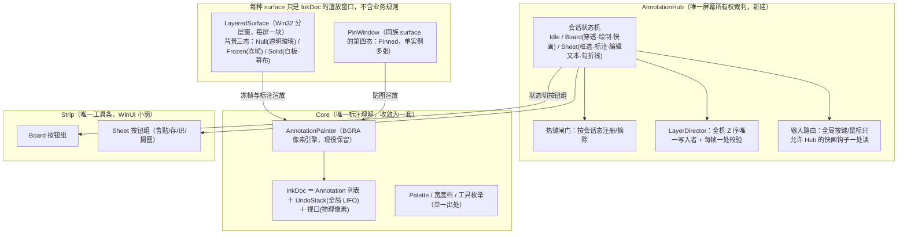
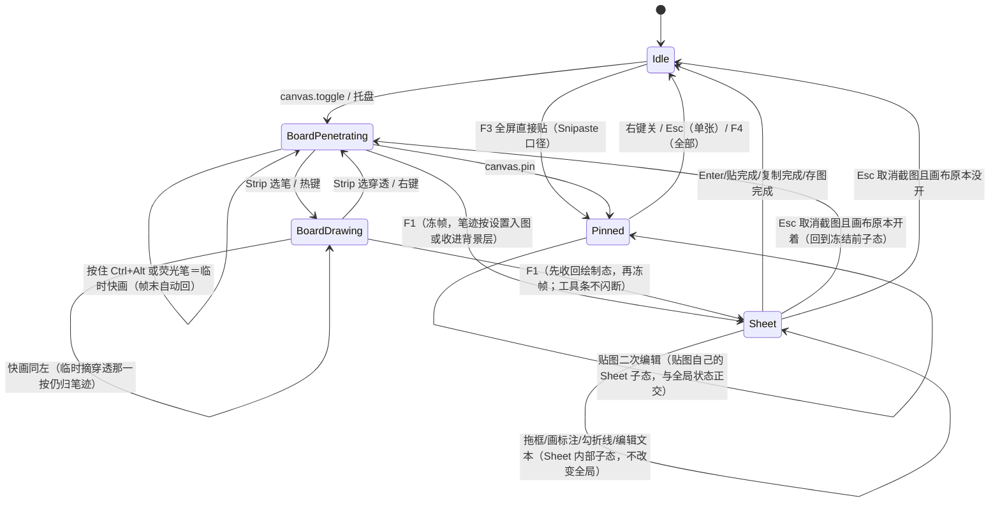

# 屏幕标注系统整合架构方案

> 目标：把截图、画布、贴图三个功能整合为一个 Snipaste × ppInk 深度融合的「屏幕标注系统」。
> 本文档为裁定性方案：先立目标架构，再定推翻边界，最后给迁移次序。不含工作量估算，不回避架构债。
> 冲突编号 C1–C9 引用《交互冲突查验》（2026-09-26 会话），本方案逐条有主。

---

## 0. 心智模型（一句话）

**笔迹永远活在屏幕上；截图是屏幕被冻住的那一瞬；贴图是把那一瞬从屏幕上揭下来。**

这是 ppInk 的骨架（一块常驻玻璃画板，"带不带背景图"只是画板的一种属性）叠加
Snipaste 的工作流（F1 → 框选 → 原地标注 → F3 钉住 → 贴图可继续编辑/缩放/穿透）。
两者能在架构上统一，正因为它们对"标注存在哪里"的答案是同一个：**在屏幕上，不在某个文档窗口里**。

当前架构给不出这个体验，不是实现不够好，而是三套宿主各自持有屏幕所有权、两套引擎各自理解"笔迹"、
没有一个仲裁者回答"此刻谁在吃鼠标"。整合＝**收权**，不是拼接。

---

## 1. 现状的架构性病因

查验结论：C1 提层拉扯、C2 轮询截胡、C3 重影、C4 会话串键、C5 合成双份、C6 同名异义工具/双撤销、
C7 生命周期分裂、C8 贴图被画布压制、C9 穿透语义分裂。归纳起来只有三个根因：

| 根因 | 表现 |
|---|---|
| **R1 无仲裁者** | 屏幕所有权散落在 ScreenshotService、CanvasService、各窗体的每帧自愈逻辑里；任何一方都无法在按下热键的那一刻回答"现在归谁"。C1/C2/C3/C4/C8 全部由此生。 |
| **R2 双引擎** | `Annotation+AnnotationPainter+AnnotationHistory`（截图/贴图）与 `CanvasInk+CanvasCompositor+EphemeralInk`（画布）平行存在，坐标约定、撤销语义、工具行为各一套。C5/C6 由此生。 |
| **R3 宿主分裂** | 截图遮罩（WinUI 窗）/画布（Win32 分层窗）/贴图（WinUI 窗）三种窗类型承载同一个"对着屏幕涂画"的动作，Z 序、穿透、焦点规则各写各的。C1/C8 的战场就是这三类窗在 topmost 带里的相互不认识。 |

任何只补闸门的方案（再加一条互斥检查、再加一处豁免名单）治标——R3 不动，自愈逻辑就永远需要新的特判，
特判数量随宿主组合数增长。本方案对 R1/R2/R3 逐一收权。

---

## 2. 目标架构总览

要点：
- **AnnotationHub** 是新架构的心脏，也是唯一可以修改任意窗样式与 Z 序的地方。
  `ScreenshotService`/`CanvasService` 降为 Hub 的两个动作入口（建图 / 冻屏），不再各持自愈循环。
- **InkDoc** 复用截图那条链（模型设计经过逐行查验、质量可靠），画布 `CanvasInk/CanvasCompositor` 退役，
  其真正有价值的部分——`EphemeralInk` 的 TTL 淡出——变成 InkDoc 上的工具属性（聚光灯笔），而非另一个世界（R2 消解）。
- **宿主层统一为分层窗（UpdateLayeredWindow）**：ppInk/gInk 十几年验证的路线（R3 消解）。
  WinUI 遮罩窗的截图态整条链退役，只保留贴图（Pinned 复用同一渲放管线）。工具条/输入框保留为独立 WinUI 小窗（chrome），
  它们吃焦点只影响自己、不再与遮罩抢。
- **穿透语义收进状态机命名空间**：Board·穿透 / Sheet·拦截 / Pinned·穿透 是状态机的显式属性，全机一处读（C9 消解）；"交出鼠标"的 F5 键行为不变。
- **热键闸门**：Sheet 会话期间摘除九条 Ctrl+Alt+字母注册；Esc 不再"画布退一层"。Hub 一处定义（R1 消解）。
- **Undo 语义**：全局一份撤销历史（跨 surface LIFO，栈底按 surface 分组），撤销作用在"最后画的那一笔"上；
  Esc 作用在"当前会话态"上；每个语义一条测试（R1 消解）。
- **贴图（Pinned）纳入渲染管线**：Pinned = 背景态第四种，不再独立实现，直接继承 Hub 状态判定（C8 消解）。

---

## 3. 核心对象

以下只列接口职责，完整签名随实现落定；职责表写在这里是为了迁移时"谁管什么"不再反复。

### 3.1 AnnotationHub
- 持有唯一状态机（§5）；任何公开动作（热键/托盘/工具条按钮/截图结束）都表达为**事件**，Hub 统一做转移判定。
- 每帧对 LayerDirector 做一次校验（把现在散在三处的每帧自愈合回一处），**只在状态机与窗口实际不一致时**修窗，修完必须发事件让工具条状态行跟着改口。
- 持全局热键注册表投影（§6.1）。

### 3.2 IInkSurface / 实现：LayeredSurface（画布）、PinSurface（贴图）、SheetSurface（截图）
- 职责只三件：**渲放背景图（三态）/ 渲放 InkDoc / 把鼠标物理像素坐标按视口换算给 Hub**。
- 每屏一块 glass（多屏时是"每屏一块，合起来一个视口"），Sheet 是临时冻帧全屏（每屏一块，每屏独立）；
  Pinned 是按需创建单窗。
- 命中测试（窗口/笔/空）交给 AnnotationPainter 的现有 hit-test（截图链已验证），宿主自己不做任何"选没选中"判断。
- 不持模式布尔位：所有状态在 Hub（这是"状态说的与窗口做的必须一致"问题的唯一根治；画布注释里记的真机症状，本质就是状态散在两层各存了一份）。

### 3.3 Strip（工具条，唯一 chrome）
- 按钮组按状态切换（Board 组：笔/荧光/聚光/橡皮 + 图章/矩形/椭圆/折线/箭头/文字/序号 + 颜色粗细 + 撤销 / 清空 / 截图 / 保存·复制 / 贴图 / 退出 / 快捷键面板 / 穿透；
  Sheet 组 = Board 全量 + 贴/存/识/揭图 − "截图"按钮）。
- 只发事件给 Hub，自己不改状态、不改窗、不改热键：UI 是状态机的投影，不是第二个状态机（当前 CaptureBarWindow 和 CanvasToolbarWindow 各自持状态是 R3 的一部分）。
- 永远可点：Strip 不在任何 surface 之下（由 LayerDirector 保证），Board·穿透态下仍可点工具（与现在一致，状态机只摘 glass 那两位）。

### 3.4 InkDoc 与 AnnotationPainter
- `AnnotationPainter`（BGRA 逐像素，截图链）与 `CanvasCompositor`（画布链）**合并为 PixelInkRenderer**：把 AnnotationPainter 的渲染逻辑搬进 CanvasCompositor 的 dirty-region 帧管线，合并前必须逐方法比对（截图链支持文字/序号/箭头/橡皮擦的渲染，画布链只渲染线段；PixelInkRenderer 要全量覆盖两边的渲染能力）；
  **输出仍是纯函数 (InkDoc, viewport) → BGRA 缓冲**，两世界渲染结果必须字节一致（像素级回归对照）。
- InkDoc 持 `IReadOnlyList<Annotation>` ＋ 全局 `UndoStack`（LIFO，栈底按 Surface 记录分组，撤销跨 surface OK）＋ 当前工具状态 ＋ Palette（单一出处）。
- EphemeralInk/CanvasInk 的**渲染价值**（TTL 段、cursor halo）收进 PixelInkRenderer；
  CanvasInk 的模型概念（Begin/Extend/End/AddPoint 语义、dirty bounds）是 AnnotationPainter 已有的子集（AnnotationPainter 的 stroke 增量渲染），
  不再保留 CanvasInk 模型：`CanvasInk` 退化为渲染层内部工具，不是 InkDoc 的一部分。

### 3.5 LayerDirector
- 全机唯一的 `SetWindowPos`/样式改写点。规则表见 §4。
- 每帧校验只读比对（GetWindowLong / 顺序快照），不一致才动，且每次动都有状态机依据（C1/C8 的根治：
  当前三处自愈逻辑互不认识的根源是它们各自有"我以为该谁在上"的小算盘）。

---

## 4. Z 序与穿透规则表（LayerDirector 的完整规格）

topmost 带内从上到下，**只允许这一种排法**：

| 排名 | 窗口 | 条件 |
|---|---|---|
| 1 | Strip ＋文本编辑浮窗（若在场）＋快捷键面板 | 任意活动态 |
| 2 | Sheet surface（冻帧全屏块） | 仅 Sheet 态存在，盖住一切自家他窗，也盖住 Pinned |
| 3 | Pinned 贴图 | 任意（Sheet 态下被 Sheet 盖住；Board·绘制态下被 glass 盖住） |
| 4 | Board glass | 绘制态：压在 Pinned 之上（要能在贴图上继续圈注）；穿透态：压到 Pinned 之下（贴图可正常点击） |
| — | 下层应用 | glass 穿透态时鼠标归它 |

让位规则（绘制态）：命中窗口**不属于自家白名单**（Strip/Pinned/glass/编辑浮窗全在白名单）才交回鼠标——把现在"自家窗一律豁免"的粗判改成"按窗豁免"，
Sheet→Pinned→glass 之间的拉扯从结构上不存在（都归 LayerDirector 一处排）。
**C1、C8 消除**；`ReassertClickThrough` 的状态/样式对账合并进 LayerDirector 的一处校验。

**C2 消除**：PollPress 只在 Board·穿透态被 Hub 启动；F1 按下进入 Sheet 的第一帧起钩子必须已摘除（热键回调同步置态，摘钩在置态之前完成，帧间不存在两家用）。
Sheet 态 glass 不可见，连重影都不存在。

---

## 5. 会话状态与转移

规则：
- **Sheet 与 Board 不是两套模态，是同一 surface 的背景两态**。F1 时不建新窗：glass 直接切 Frozen 背景（或建一块覆盖式 Sheet surface，实现细节随 S3，规格不变：用户看不到窗的消失与重建，只看到屏幕"冻住"）。
- 进入 Sheet 时 Hub 一次性完成：冻帧、摘九键热键、摘 PollPress、glass 让位/隐藏、Strip 切按钮组。离开时反向恢复，恢复以"冻结前的子态快照"为准——修复"截完图回不来"类错误（C3、C4、C6 的状态侧）。
- **C7**：退出语义收进状态机：Sheet·Esc = 取消截图回 Board；Board·Esc = 退出画布回 Idle；Idle·Esc = 无事发生。当前"Esc 只管截图窗，画布玻璃没人收"的悬空由此终结（画布目前只有工具条按钮一个出口，`LayeredCanvasWindow` 是 NOACTIVATE 根本收不到键盘——统一后 Esc 路由表是 Hub 的输入路由的一部分）。
- Pinned 是**独立实例的宿主**，不占用全局会话：可以同时有"Board 开着 + 若干张贴图"，也可以有"Sheet 编辑中 + 贴图在场"（Sheet 在上，见 §4）。

---

## 6. 键盘、鼠标与热键闸门

### 6.1 热键注册表 = f(总开关, 会话状态)
现状：`SettingsStore.GetRegisterableHotkeyBindings()` 按总开关摘除九条。扩展成按会话摘除同一批：Sheet 活动 → 摘九条（保留 canvas.toggle 给一句"截图进行中"的回执，与总开关那条先例同句法）。
**C4 消除**。注册表投影只有一个出处（Hub 在状态迁移点调用重注册），托盘/设置页读到的永远是"此刻真的生效的键"。

### 6.2 Sheet 内键盘
沿用截图链已调好的本地键表（Ctrl+Z/Y/S/C、Enter、方向键、Delete/Esc 两级），不引入画布那套。编辑文本的焦点细节是现有资产，整段保留。

### 6.3 Board 内"零摩擦快画"
保留 ppInk 体验：穿透态按荧光笔即画（松手即透、TTL 淡出）、Ctrl+Alt+拖动即圈笔。**实现从"每帧轮询全局鼠标态"改为"Hub 持有的一个低级鼠标钩子/定时器读态，只在 Board·穿透态挂"**——
竞态点从三处（PollPress/BeginPress/EndTemporaryPress 各管一段）收到一处，钩子回调里第一件事是"这个点落在哪个窗之上"（自家 Sheet/Strip/Pinned 在场即不吃）。
低层钩子比轮询多一处挂/摘生命周期，但消灭"一次按下两家用"的整类竞态（`_wasTemporary` 这类补丁字段可以退役）。

---

## 7. 撤销与历史

- **一份全局 InkDoc 历史栈，按 surface 记录归属**（Board 笔迹带屏幕号——现有"每屏各撤各的"语义保留，只是栈全局化）。
- Sheet 提交/揭图/贴出后，其笔迹归贴图实例自带，全局栈不再持有（贴图编辑历史独立成栈，现状如此，保留）。
- `Ctrl+Z` 永远撤"当前焦点域内最后落的那一笔"：Sheet 态撤截图标注，Board 态撤板子笔迹，编辑文本时撤输入框——焦点路由表在 Hub，一张表读完，不再有"撤错了世界"。
- 荧光/聚光两种笔都进撤销栈（当前画布荧光不进持久层也不可撤销——整合后撤销对"看得见的笔迹"生效，聚光灯笔的 TTL 淡出只是显示语义，历史里仍有一格）。

---

## 8. 与 Snipaste / ppInk 的对位（行为规格）

| 用户动作 | Snipaste | ppInk | 本方案 |
|---|---|---|---|
| F1 即框选 | ✅ | ❌（F1 是全屏截图入板） | ✅（Snipaste 主轴） |
| 框选中就能画、越出选区 | ❌ | — | ✅（截图链 PU 批次已实现，保留，比 Snipaste 强） |
| 不冻屏直接画、穿透干活 | ❌ | ✅ | ✅（ppInk 主轴） |
| 穿透态按住即画 | ❌ | ✅ | ✅ |
| 画完的板子一张图贴出来 | ❌ | ✅（快照） | ✅（Board 快照 → 新 Pin 实例，现有 canvas.pin 链） |
| 贴图上继续圈注 | ✅（编辑标注） | ❌ | ✅（Pinned 是第四背景态，直接画） |
| 白板底 | ❌ | ✅ | 后移（S4，见 §10） |
| 幕布半透明遮屏 | ✅（F9 窗帘） | ❌ | 后移（S4） |
| 贴图滚轮缩放/穿透/角标 | ✅ | ❌ | ✅（截图链贴图态已实现，保留） |
| OCR | ✅ | ❌ | ✅（现有） |

验收口径：**一个熟悉 Snipaste 的人不需要学任何新概念；一个熟悉 ppInk 的人找不到"这里怎么不通"的缝隙。**
两者共有的心智模型只有"笔迹在屏幕上"，本方案把它做成唯一的。

---

## 9. 从 ppInk/gInk 保留什么、弃用什么（对位表）

| 组件 | 处置 | 理由 |
|---|---|---|
| 分层窗渲染管线（UpdateLayeredWindow + 32bpp DIB + 脏区） | **保留并统一为唯一渲放路**（现役 `LayeredCanvasWindow` 就是这条管线，含批次 WO 教训：空白像素 α=1） | 被 gInk/ppInk/本项目三方验证；WinUI 遮罩窗那条线只做"冻帧显示"，合并进管线后整条退役 |
| 每帧自愈（ReassertClickThrough 等） | 收敛为 LayerDirector 的一处校验 | 现三处（截图态其实没有画布的这两条，但它自己 Activate 抢焦点的路径也算 Z 序写入方）；一处有真机价值、两处只兜自家漏 |
| PollPress | 改钩子，收进 Hub | 轮询本身不是错，错在没有会话闸门与命中检查 |
| CanvasCompositor/CanvasInk | InkDoc + AnnotationPainter 全量取代 | 统一模型（§3）；CanvasCompositor 的帧/脏机制搬进 AnnotationPainter；EphemeralInk 的 TTL 段和 cursor halo 搬进 PixelInkRenderer（渲染价值保留） |
| 工具条 ×2（CaptureBarWindow/CanvasToolbarWindow）+ 贴图独立右键菜单 | 合一个 Strip + 按钮组 | 现在"截图工具条/板子工具条/贴图层"三处按钮排布不同、功能重叠、快捷键说明两处写 |
| 贴图窗（`_pinned` XAML 链） | 渲放层迁到管线（S3 后半，最后收），模型/历史立即共用 | 它是现有代码里唯一"同一条标注链"的实践者，架构方向已被验证，只是宿主壳子要换 |
| AnnotationPainter 引擎 | 保留 | 逐像素、无 WPS、不引外部依赖——质量已逐行查验可靠 |
| OCR 链 / 多屏几何（DIP/物理换算） | 保留 | 截图链成熟实现 |

**gInk/ppInk 的文本编辑浮窗**要抄：ppInk 的 GDI 文本工具（RichTextBox 浮窗）→ 现项目里 XAML TextBox 浮窗（已调好 Enter/Esc/焦点兜底，RD-1 整条链成熟），S3 后迁到 Strip 旁挂的 WinUI 小窗（可独立活动、焦点只在文本编辑时离开 Hub）——
架构上不新加概念，把现有 XAML 遮罩窗里的 TextBox 拆出来变成独立宿主。

---

## 10. 推翻边界与迁移次序（每步可编译、可测、可回退）

推翻是**终态**，迁移**分步**——顺序按"先拆引信、再统一理解、再统一身体"：

**S1 仲裁者接管（改行为，不改形态）**
新建 AnnotationHub + LayerDirector + 热键闸门；三套宿主暂时保留原样，但所有控制点（藏玻璃、摘键、摘轮询、让位、Z 序）必须穿 Hub。
交付验收 = **冲突重现测试用例**：画布绘制态开截图不卡死、截图全程画布玻璃不可见、荧光笔模式不抢截图片、Board 快捷键在 Sheet 中不可触发、贴图在截图时不被误提到最上层。
（对应 C1/C2/C3/C4/C8 的行为级消除。）

**S2 模型统一**
`CanvasInk/CanvasCompositor/EphemeralInk` 的墨迹数据收进 InkDoc（Annotation/Painter/History，截图链模型）；Board 渲放改走 AnnotationPainter 合成 → BGRA 缓冲 → UpdateLayeredWindow；
`TryCompose` 不再"抓屏含笔迹再叠一遍"，改成"**抓干净屏 ＋ 渲 InkDoc**"（C5 根治，且截图结果不受板子状态影响）；
撤销全局栈化（C6 消除）；工具/色表/橡皮/聚光语义一处重定义（荧光笔＝聚光灯笔、TTL 淡出是显示属性，两种笔都可用在两种背景态）。

**S3 宿主统一（真正的推翻在这一步兑现）**
LayeredSurface 成为截图态唯一渲放路：Sheet 背景三态（§3.1）落地；XAML 遮罩窗的截图职责整条退役；
贴图 Pin 迁到管线渲放（最后收，因为 Pin 的 XAML 链已成熟、迁它纯为统一而统一，可容忍留在最后）；
TextBox 浮窗独立成宿主；Strip 按钮组合并完成。
**S3 可以拆成逐能力迁移**（先渲染冻帧、再框选、再标注、再工具条、最后贴图），每一步旧路径还在（旧路径按状态机开关短路，保证同一会话只走一条链），回退＝翻回开关。

**S4 体验层补齐**
白板底、幕布、贴图组管理（对齐 Snipaste 的成组隐藏/显示/穿透）、Board 快照成贴、光标光晕对齐 ppInk，全在统一地基上加，不再新增概念。

次序不可颠倒的理由：先统一模型再统一宿主（S2→S3）让 S3 的渲放层只剩"画像素"一件事；
若先换宿主，XAML 遮罩的双引擎代码会被原样搬进分层窗一遍，等于给 C6 续命。
Hub 先行（S1）保证每一步迁移期间，用户至少不再遇到多窗打架。

---

## 11. 被否决的方案（一句话存档，防止回潮）

**否决 A：保留三套宿主，只做互斥矩阵**。每加一个能力（幕布/白板/贴图编辑）互斥矩阵就升一维；
Z 序自愈的三处逻辑继续互相不知对方存在——C 类冲突是这类矩阵的稳态而非暂态。本方案的 S1 恰恰**包含**互斥矩阵，
但把它定为临时桥（S3 结束即随宿主统一而删），不是终态。

**否决 B：画布吸收截图（纯 ppInk，砍掉框选流程）**。放弃 Snipaste 的主轴体验（不框选、只能全屏截图或贴完图再圈注）；
截图链的框选阶段就地标注、窗口检测、放大镜全是成熟资产，砍掉等于自毁。

**否决 C：先统一渲染再统一模型**。XAML 的渲放层搬进分层窗成本最低（S2→S3 的顺序反了，会重复搬一次）；且若模型还分裂，
渲放统一后"撤销不统一、工具条不统一"的两半还是分家 UI 状态。

**否决 D：引入第三方渲染框架**（Skia/SharpDX）。现役管线无 GPU 依赖、无新增运行时成本（本地优先三铁律），现有引擎无性能缺陷证据，不为整合引入新栈。

---

## 12. 风险清单

| 风险 | 缓解 |
|---|---|
| S3 文本编辑浮窗的焦点与活动切换 | 浮窗只在编辑时活动；Enter/Esc/失焦=提交三条全测；沿用现有 RD-1 焦点兜底的整套经验，只换宿主不换逻辑 |
| 每帧全宽玻璃贴图 + 冻帧整屏像素拷贝的合成性能 | Board 只渲脏区（现 CanvasService 脏区帧管线已是这条方案，保留）；Sheet 冻帧是静态底图，一次贴入、只重渲标注脏区，两者共享管线 |
| WinUI Strip/浮窗的 Activate 抢遮罩（现注释里有配方） | 规则固化：任何 Show 自家窗前 LayerDirector 先登记再置顶；S1 里这条规则要最先立 |
| 迁移期状态机与旧服务的双头指挥 | 状态机是唯一真相源；服务入口（`ScreenshotService.Start`/`CanvasService.Toggle`）改为纯派发；旧自愈代码逐步删，每删一处全量跑冲突回归用例 |
| 板子笔迹迁移（模型切换时笔迹语义不对齐） | S2 逐工具对比渲放结果，相同工具、相同坐标的笔迹像素级一致 |
| 贴图（当前是截图窗的 `_pinned` 态）在 S3 后仍是独立宿主 | Pinned 是第四背景态，渲放走同一条管线，模型/历史共用；宿主差异只在"独立小窗"这个事实（S3 最后收） |

---

## 13. 操作手册（验收用例，S1/S2/S3 完成后跑）

> 每条用例都是一句用户动作 + 预期可观察结果。
> 全部走完后，"当前系统操作体验差"这个评价必须有具体反例——这是本方案的唯一验收标准。

1. **Board → Sheet**：`Ctrl+Alt+D` 开画板 → 用笔写几笔 → `F1`：屏幕冻住（画板笔迹按设置决定在不在图里，**不再出现"屏幕上有、图里没有"或"图里有两份"**）；画板玻璃和工具条**不可见**（不再出现任何悬浮幽灵层）。
2. **Sheet 框选标注**：在冻帧上拖框 → 框选阶段直接画箭头标注 → `F3`：贴图出来，框外标注裁掉；贴图可滚轮缩放、可再 `F1`（截图链贴图态已实现，统一后行为一致）。
3. **Sheet 退路**：框选阶段（未提交）按 `Esc` 一次 = 收笔；再按 = 取消截图回 Board（画板恢复冻结前的子态，笔迹原样在）。按 `Enter` 提交复制（截图链现成行为，Hub 下不变）。
4. **穿透态快画**：Board·穿透态 → 按荧光笔工具 → 按住屏幕任意位置直接画 → 松手即透（TTL 淡出，不进持久层，不进撤销栈——聚光灯笔的显示语义统一后第一次实现，验收它不再和截图链永久荧光笔混淆）。
5. **贴图圈注**：贴图中 → `Ctrl+Alt+D` 开板（板子穿透态，贴图可动）→ 切换 Board·绘制态 → 在贴图窗口上圈画（贴图压在 glass 之下还是之上由 LayerDirector §4 定：绘制态 glass 压在贴图之上可以圈注；贴图此时收鼠标穿透点击、但贴图自己的编辑态走自己的 Sheet 子态键盘路由，二者不抢）。
6. **截图全局热键闸门**：截图进行中按 Board 九个热键 → 无响应（工具条可见回执："截图进行中"）；截图结束后恢复注册。
7. **Z 序对抗测试**：打开开始菜单/系统弹窗/别的全屏程序覆盖画板 → 画板**自动交回鼠标** → 状态行说清原因（现有 Yield 链保留，改一处判定）→ 再点"画笔"继续。截图进行中按开始菜单 → Sheet 不吃键鼠、状态不丢（遮罩不抢焦点、Hub 摘键但保留自身输入路由）。
8. **贴图组管理**：F4 隐藏全部贴图 → 贴图全部隐去、画板不受影响；F5 交还鼠标穿透 → 所有贴图穿透、F5 再按恢复（画板穿透态与贴图穿透态是两个独立维度，各管各的，状态行说各自话）。
9. **撤销语义**：Board 画一笔 → 切 Sheet（F1 冻帧）→ 在截图上标注一笔 → `Ctrl+Z` 撤销截图标注（Sheet 子域）；再 `Ctrl+Z` 撤销 Board 笔迹（全局栈 LIFO 跨子态正确，Sheet·Esc 退回 Board 才撤到 Board 那层）。
10. **多屏混 DPI**：副屏拖框截图 → 标注 → 提交：贴图落在副屏原点，缩放显示正确、鼠标点位一致（截图链现成的混 DPI 换算保留；统一渲放层后只测一处）。

> 用例 1–10 全绿时，C1–C9 在行为层已不存在；S2/S3 完成后它们在代码层也不存在。

---

## 14. 开放问题（随实现定，不影响架构方向）

- Board 快画的低级钩子用 `SetWindowsHookEx(WH_MOUSE_LL)`（同步、实时，但每次鼠标都穿）还是定时器 + `GetAsyncKeyState`（轮询、快画语义已够用）——**实现期定，验收用例 #4 跑哪条实现都不影响**。
- 板子快照成贴（Board → Pinned）：整屏合成一张还是每屏一张；ppInk 是每屏一张快照（现有 `canvas.pin` 链已是这个实现），保留。
- Sheet·放大镜和自动检测（Snipaste 窗口检测、截图链已有实现）在 Sheet 态保留；`Esc` 键路由表不混淆（检测候选、框选、标注、文字编辑、贴图、Board——每层自己的子 Esc，Hub 全局表见 §5）。
- 幕布（窗帘）/白板底在 S4 加到背景三态里（第四态 Solid），渲放走同一条管线——架构上预留，实现等 S1–S3 完成。

### 14.1 实现期裁定（逐批追加，实现必须与此一致）

- **[S1] 快画读态沿用「定时器 + `GetAsyncKeyState`」，`WH_MOUSE_LL` 的决定推迟到 S3。**
  理由：S1 的目标是收权（把竞态点从三处收到一处），不是换机制。低级钩子多出的是一对挂/摘生命周期与
  每次鼠标都穿一层的成本，而在 S1 的形态下它消灭不了任何一条已编号冲突——C2 的根因是"读态没有会话闸门"，
  闸门本身就能消灭它。等到 S3 宿主统一（玻璃只剩一种）时再按 §13 用例 4 的实测定这一条。
- **[S1] Sheet 期间「不建新窗」这条规格暂以"收起画布玻璃与画布工具条"兑现，XAML 遮罩窗本身留到 S3 退役。**
  §5 要的是"用户看不到窗的消失与重建，只看到屏幕冻住"。S1 不改宿主形态，所以保证的是**看得见的部分**：
  整场会话期间玻璃与那条栏都不在场（重影 C3 与悬浮幽灵层由此消失），而不是抓完一帧又把它放回来。
- **[S1] 截图期间不摘 `screen.capture` / `screen.pin` / `screen.ocr` 三条。**
  只摘画布那九条（§6.1）。这三条背后是截图链自己的会话唯一闸门（两层遮罩叠加会让用户只能杀进程），
  把它们注册掉等于把"再按一次要叠第二层"这个真实风险换成"这条键坏了"的错觉——回执由那条链自己给。
- **[S1] 全局 Esc 只回答"会话级"那一次落点（§5 的三句话）；截图子态内部"编辑文字→收折线→收笔"的三级
  与贴图"先丢选中→再关这张"的优先次序沿用现有实现（§6.2 沿用截图链已调好的本地键表）。**

---

## 附：一句话总结

**ppInk 的身体（分层玻璃画板 + 统一渲放管线）＋ Snipaste 的手艺（冻屏→框选→标注→贴→再编辑）＋ 一个裁判（AnnotationHub），三样凑齐，整合才成立。当前代码缺前者的统一和后者的仲裁——本方案补齐这两样，R1/R2/R3 三个病根逐刀收权，不再留缝。**
