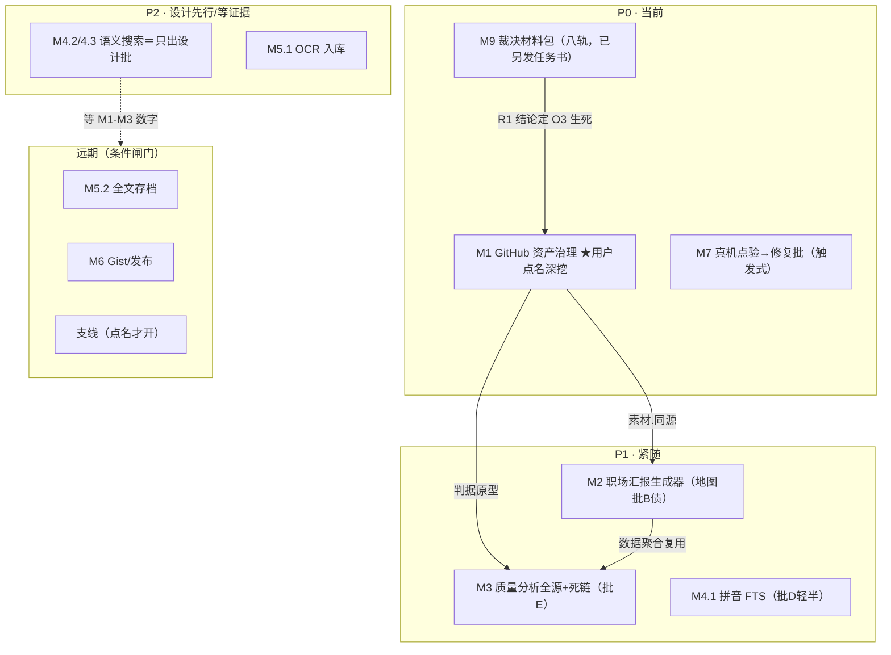
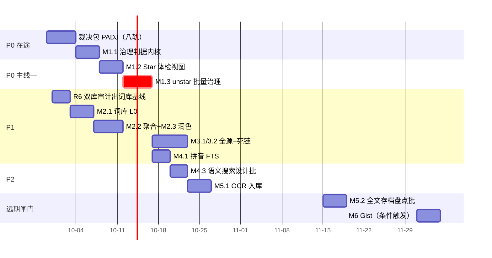

# StarMarkDesktop · 开发主线任务书

> 日期：2026-09-29｜性质：**后续所有开发主线的执行规划**（不含代码，只定任务、次序、依赖与避坑）
> 上游：docs/产品定位与演进地图.md（准入判定框架）；本文把地图的批 A–F/远期兑现成可派发任务。
> 现状基线：批A/批C 已收官（AI 层仅剩 O3 复估=裁决包R1）；批B 欠"汇报生成器"；批D/E/F **零实现**；
> 截图/画布/剪贴板图片三大功能域代码侧收官，项目进入"按地图补主线"阶段。
> 优先级：P0（立即排）／P1（主线间依赖就绪后）／P2（设计先行或等需求证据）／远期（条件闸门后）。
> 横切纪律见文末 §十——每一条都来自本仓真实踩过并记入坑表的形状，不是假设。

---

## 总览

---

## M1 · GitHub 资产治理（P0 首位）

**用户问题**（地图②原话）："这个 Star 半年没动过，还留吗？"＋环节⑥的流转。
**数据就绪度**（已核实）：StarredAt(实为 pushed_at 代理)/archived/stargazers_count/topics/ETag 条件请求/错误分类/`SetStarredAsync` PUT+DELETE 写链/活动流表/InsightsService 单扫基线——**判据在本地即可成型，写链现成，缺的只是治理层**。

### M1.1 治理判据内核（Core 纯函数批）
- 产出：Star 的三档信号判据——**僵尸上游**（pushed_at 超 N 年/archived=true）、**用户遗忘**（最后一次本地活动=打开/复制/引用 超 M 天，从未活动单列）、**活跃保留**（两信号都新）。
- 判据全部住 Core（横切纪律"判据下沉"），参数（N/M 天、从未活动单独成组）进设置页，默认值先钉后校。
- 验收：单测钉三档边界值与降级（字段缺失/0 数据）；真机拿用户自己的 1000+ Star 库跑一遍分布合理性（大名单不该 80% 判遗忘）。

**⚠ 避坑（每条都有代码出处，先读再动手）**
1. **「StarredAt」不是用户加星时间**——GitHubSource 存的是 `repo.PushedAt` 代理（GitHubClient.cs:80/115 注释原话：逐条 starred_at 要单独 API 调用，过于昂贵）。任何文案**不许说"你于 X 日 Star 了它"**；治理分档里它只能当"仓库上游活跃度"输入，"用户遗忘"必须用活动流/created_at，不许挪用这个字段。想拿真 starred_at 是另立批次的事（代价：1 req/repo），当前明确不做。
2. **活动流有观测盲区**：同步入库时只记 staradd，**没有"浏览过旧条目"的全量历史**——老用户"从未活动"会覆盖一大片，判据必须把"从未活动"单独成档给文案（"这条从入库起没被打开过"），不许与"90 天没打开"混列同档。
3. **archived 字段可能缺**：`/user/starred` 列表接口的字段完备度与单仓 API 不同（topics/archived 在列表响应的可用性以实采为准）——读侧对缺失字段走"未知"，**未知≠未归档**；文案要分"已归档"与"归档状态未知（重同步可得）"两档，别把数据面缺陷说成仓库事实。
4. **旧库迁移形状**：extra_json 里已躺着的键名/口径不许改义（回放语义，Ditto 保名同款教训）；新增治理字段用新键，坏 JSON 重开对象不炸日常路径。

### M1.2 Star 体检视图（UI+查询批）
- 产出：`Star 体检`入口——组件或页面内嵌统计卡（三档计数、Top 遗忘、僵尸/归档列表），与"按最近 Star 排序"并列不互斥；卡片徽章（归档/僵尸角标——ItemCardViewModel 徽章族现成先例，**角标互斥顺序要按批次 ④ 的教训排优先级**：归档角标和 ⭐Star 状态谁先占位要定死）。
- 查询用现成 json_extract 口径（Search.cs:37 先例），**不许新增每帧全表扫**——InsightsService 那种"两处各跑整表一遍"的反例就记在坑/审计里，一个视图一次聚合，翻页不进聚合。
- 语言/主题分布（topics 已在 meta 里）算增值彩蛋不算本批义务——范围守住"三档+Top 列表"。

### M1.3 unstar 批量治理（远端写批）
- 产出：体检列表内 勾选 → 「在 GitHub 上取消 Star」批式执行：逐条 `SetStarredAsync(false)`，**复用**热榜的速率治理（Classify 401/403/429、条件请求、串行闸门），新增只做"队列+部分失败续跑+结果如实报（成功N/失败M/各原因）"。
- **本地删除与远端 unstar 是两个动作**：默认只 unstar 远端、本地保留（加"本地同步删除"勾选项，分两步确认）；动作完成回写库状态，热榜 ⭐ 状态缓存（TrendingStarState Record）必须同步覆盖——否则"已取消 Star 还显示 ★"就是第二个"预览落笔不一致"。

**⚠ 避坑**
5. **token 权限口径先修注释再动工**：GitHubOptions.cs 注释写"只读 starred 列表，无写权限"，而 SetStarredAsync 在写——classic public_repo 可写/star 不假，但 fine-grained token 默认没 user 写权限。S3 开工第一步：错误分类 403 的提示必须说得出"哪种 token 缺什么 scope"（热榜批只测过单发，没测批中断）；配置页权限说明文案同批改。**不修这条，批量 403 会被用户读成网络坏了。**
6. **速率风暴红线**：一次勾 500 条 unstar＝500 个写请求。批内节流上限（如 1 req/s、失败退避、总时长预估先展示"约 N 分钟"再确认）；写入失败不自动重试第三次（远端写幂等≠免费，配额被烧光时诚实说"明天再续"）。分页 5000 上限（GitHubClient:139）在同步侧、非写侧——别顺手抄进写循环当"全部"。
7. **404 语义**：Unstar 成功码 204；对已非星仓库 GitHub 回 404——SetStarredAsync 已把 404 当成功吞了（:206），批治理要把这一口径透传（计数分类别：真取消/本来就没星/失败），**"未执行"不许算进"已治理 N 条"的吹牛数字**。
8. 真机点验新增项：副屏 token 失效场景、断网 30 条时队列状态、UI 关窗后在途批次去向（沿用 MV3 长任务那套"启动即返回+状态落盘"心智：批中断后重开看得见续跑入口）。

---

## M2 · 职场汇报生成器（P1，地图批B欠账）

**入口**：环节⑤回顾；设计出处：组件功能扩展实现详解 §17（词库 L0+模板 L1，"复用扩展资产"——若 R6 双库实查发现扩展侧词库更新，**以扩展新侧为基线回灌**再开工，防 #182 式"按旧图造新墙"）。

### M2.1 词库与模板（离线 L0）
- 内置模板+用户可编辑 JSON（词库外置先例=扩展词典四库；"内置为底、外置整文件替换、坏档整份回退"口径直接沿用；**存储键名册唯一出处**——同名覆盖的扩展事故别在桌面复刻）。
- 生成=时间窗聚合的本地条目→模板词库话术（大白话版）；**数据不足时如实写"本期新增较少"，不许编大**。

### M2.2 聚合层
- 时间窗数据源：activity 表+items created_at。**一个窗口一次聚合**（InsightsService 单扫模式：先建 parsed 再取值，禁两处各整表——扩展侧性能先例已在坑表）。
- 窗口的"周/双周/月"以**本地日历日**对齐即可，但注意：活动表存 Unix 秒——**换算基准钉死一处**（时区漂移那族坑 #48/时钟绝对值那族 #205 家族），别让设置页和生成器各推一次。

### M2.3 AI 润色（L1 可选）
- 复用 AI 基座全部现成件：Provider/AiSettings/计量(feature="report"——**ai_usage 口径里提前占词，别和 classify 混**)/预算熔断闸（新 AI 功能入口必须过 BudgetVerdictAsync——闸是判额入口的纪律，漏挂=预算被旁路）。
- 降级三态（没配AI/配了失败/成功）文案照 OCR 批现形；失败时 L0 产物照常出。
- 提示词载荷守 §19 全套已定标准（title-only、行式、禁把用户数据整段外发以外的新字段——脱敏：汇报里出现的内部项目名/私有仓库名进提示词前问一次或按词库开关处理，BYOK 的"数据出机"边界文案要在入口写明）。

**⚠ 避坑**：① 生成物（文本）落盘方向默认剪贴板/随记引用，**不自动入库**（活动流的"增"必须仍是用户动作）；② L0 词库命中词冲突（一条活动两个模板都收）要有优先级的唯一排序，别靠 Dictionary 遍历序——那正是"两次跑同样输入出不同结果"的不可复现源；③ 导出 Markdown 文件名/敏感路径消毒有 HealthReport 现成消毒器，复用别写第二套。

---

## M3 · 质量分析全源 + 死链探测（P1，批E；依赖 M1.1）

### M3.1 遗忘/僵尸判据泛化到书签/文件
- M1.1 的三档输入抽象成"条目活跃度模型"（来源无关，per-type 参数：书签 N 默认更长、本地文件看 mtime——已有先例 FileSnapshot mtime 防抖家族）。
- **文件条目特别口径**：路径已不存在＝死（不是"遗忘"），mtime 与库内 size 不一致＝外部改过，提示"重同步"。ClipAssets 对账那套"行有文件无/文件有行无"三分类判据是现成模板——**复用结构，不复用表**。

### M3.2 死链探测（用户触发批量）
- 铁律合规形状：**后台不自动探**（无常驻/默认关）；用户点"体检网络状态"才发请求；并发上限+超时预算+域名互斥表（反爬站点直接跳，不顶撞测）。
- HEAD→跟随重定向→304/403/405 降级 GET（部分站禁 HEAD＝"误死"大户）；**结论一律"疑似失效"**并展示状态码——"死了"由用户点头；疑似死不进治理名单（治理只收"遗忘"，死链单独一档"待确认"），防误杀真链接。
- 探测结果落库（新键，带探测时间戳：结果有时效，超期作废重探）。

**⚠ 避坑**：① 探测风暴=最容易好心办坏事的一项：无上限并发对同一批域名（尤其内网/wiki 域）打 HEAD，被对方反拉黑的是用户；互斥表默认内置常见站、设置页暴露增删；② Token：GitHub 私有域探测带不带凭据？**都不带**——带凭据的探测=替用户向第三方泄露 token 使用面，死链探测永远匿名。③ 本地 file:// 条目不进网络探测集（伪死链=必然 100%误报）。

---

## M4 · 检索深耕（批D，拆三档）

### M4.1 拼音首字母 FTS（P1，小）
- 现成基线：CjkTokenizer+FTS5 三触发器链。做法=入库期物化 `pinyin_key` 列（首字母+主读音全拼；**多音字取主音表版本钉死**——表进资源、版本进库 schema 注释，换表=重建表达式，"同机两次跑同输入不许不同结果"是本仓表达式求值的红线）。
- 查询侧：FTS 列匹配优先（`COLLATE NOCASE`），与 CJK 同义检索的既有归一点只有一处。
- 验收必须含**索引体积前后实测**（真实库整表量，不许抄别人数字——本仓口径：数字要么自己量要么标"待测"）。

### M4.2 同义词/关联标签扩展（P2，批内可研不做码先行设计）
- 先盘点数据面（标签共现统计可现成做——同一次 InsightsService 改造顺手），设计"查询期扩展 vs 入库期物化"两案的成本对照，**等 M1–M3 用起来后按真实需求拍**。

### M4.3 语义搜索（P2，**只出设计批，不实现**——铁律红线）
- 设计批必答五题（不许含糊）：BYOK embedding 的 provider 面（不与三家生成重复计费口径）；向量落盘格式（SQLite BLOB+暴力扫的量级上限/内存峰值）；常驻成本红线验证（用完即释）；降级（无 embedding Key=普通检索一切照常——铁律③的测试面）；**retrieval 评测口径先于代码**（拿什么判"语义搜得准"，没评测就做=无验收）。地图 §③ 红线"不引入本地 embedding 模型"写死，实现批永远不许顺手把"那装个 4B 的也行"带进来。

---

## M5 · 收集通道补全（批F，拆先后）

### M5.1 OCR→入库（P2）
- 现状：识别质量改善后评价仍"一般"（用户原话在册）——**入库通道的前提是先有用户想存它的证据**：入口=截图标注链/Pin 上的「识别成文字→收藏」按钮，产物走"先预览可编辑、确认才入库"（不自动入库=不拿低质量换库污染）。
- **隐私闸复用唯一判据**：入库的文本过 `ClipboardPolicy.IsSensitive` 同源判定（**复用不重写**——闸门复制第二份=形状分岔的开始，#182 教训同款）；敏感即拦并说清原因，别静默丢。
- 计量：feature="ocr-ingest"？——识别本身本地零 token；若将来接云端识别才记账，口径提前写进 §20 表免得补账对不上。

### M5.2 网页全文存档（远期，先盘点批）
- 做码前先交盘点（设计批）：fetch 通道（WebView2 已有但它是 UI 资产——无头抓取另评估）、正文提取（**不引第三方阅读库除非满足豁免四条件**：轻量/许可证/解决高难自研/文档记录——§五豁免条；阅读模式自研难度是地图里"高"的那列，评估必须诚实）、存储（全文进 items.description 或旁文件？备份体积斜率会变——对照 3d 的"解回比导出贵一个量级"教训先量）、失败语义（付费墙/动态页抓残=存"快照不完整"标记，不假装完整）。
- **手机→桌面通道**（地图①原文）同入本盘点的"收集摩擦"议题，当前判定：局域网方案=新网络面+新安全面，不进默认收集链——只登记，不排批。

---

## M6 · 沉淀流转（远期，条件闸门）

Gist 同步/Markdown 发布（地图批F外/远期条目）。
**开工闸门（两条都满足才立项）**：M1.3 远端写链真机稳定运行＋（用户点名或导出量数据证明外部固化需求真实）。
**立项即带的硬要求**：token 权限分层文案（public_repo→gist scope 的获取路径）；**发布=出隐私边界**的显式警告（收藏是本地私密数据——默认 secret gist，公开需二次确认+列出"你正在把 N 条收藏的名字交给 GitHub"的清单预览）；单向 push 定位（冲突=本地优先覆盖远端副本，双向合并明确不做）；发布记录回写 extra_json（id/时间/哈希）供"改了没再发"提醒——复用 FileSnapshot 脏判先例，不另发明。

---

## M7 · 真机长尾（持续，当前在场会话的天然工作）

- 点验单已存在（`c8f42aa` ⑦：剪贴板 8–19＋热榜 ①..⑬＋P-112＋RV 四条）——本任务书不重复列目次；其暴露的修复批按 #182 流程逐条立项（先按点验条目对实现、再机检）。
- 裁决材料包 PADJ 八轨仍在排队（R1 O3 复估/R2+R5 GC AB/R3 Invariant/R4 设置入口/R6 双库审计/R7 账本盘点/R8 判据普查）——R6/R7 的产出会**改变本任务书若干基线**（词库哪侧新、哪些 P- 是活的），M1/M2 开工前把 R6/R7 结论纳入前置输入。

---

## 支线（点名才开，各带一句话边界）

| 支线 | 内容 | 红线/关联 |
|---|---|---|
| Z1 Ditto 图片导入 | ooData BLOB 内 DIB 走 M1 ClipIMG 管线回放进历史 | **Ditto 库文件只读**铁律不变；时间戳取 Ditto 侧口径 |
| Z2 webp/heic 放开 | 3d 裁决口：真机证明确有可解 | 走 §7 裁决流程，不顺手加清单 |
| Z3 P-110/P-111B 观察窗 | 贴图只出笔迹/临时聚光 | 触发才翻案 |
| Z4 SpotlightMode 回归 | 画布荧光不进撤销（P-106 已决维持） | 用户点名想撤再翻 |
| Z5 备份云盘场景 | 3d 留的口：同盘未测跨盘斜率 | 量了再裁 |

---

## 十、横切纪律（每个批次开工页复制一遍，不嫌烦）

1. **在场协议**：开工 `git status + log -3`；大文档单写者（进度报告/坑表/待决策/详解）；他人未提交改动不碰不 stash；工作树"干净"有时效（#182 附带条：十几分钟就会变）。
2. **#182 验收顺序**：逐条对任务书→机检→全量→零触碰证明；**全绿≠符合规格**。
3. **#107 判据下沉**：一切业务谓词住 Core/Abstractions（测试工程不引用 UI），UI 只取结论；数字型门闸改数同刻补新不变量（#181）。
4. **基线数字**：build 0 警 0 错；全量测试对比开工基线（当前 3898，环境红 1 例已登记）；不为绿改断言，环境红恢复原状。
5. **提交卫生**：本地 commit 不 push、精确路径 add、批=commit、文档随批落档（进度报告节+坑表续排）。
6. **数据事实先行**：动任何"字段语义"之前读实现（本任务书中 starred_at 代理、archived 可用性、活动流盲区三个坑全是"先核码再定文案"抓出来的——**文案承诺不出代码给不出的东西**）。
7. **网络/远端写**：无上限并发不做、匿名默认、凭据不出现在非必要链（探测/计数/日志）、失败口径逐类、405/403/timeout≠"死了"。
8. **隐私默认**：新增"看得见用户内容"的功能（OCR 入库/汇报/发布/Gist）逐项回答：敏感闸过没过？默认关不关？出机边界说没说？
9. **性能**：无实测不做优化；每页一次聚合红线；常驻≠默认（临时层有生命周期注释）。
10. **AI 新面孔**：入口先挂预算闸、记账先定 feature 词、降级先写三态、载荷守 §19 标准、不自动调用（收藏派生异步=合规，定时器自发起=违规，判据"用户按了哪颗键"）。

---

## 里程碑视图（建议派发序）

（时长格仅表达相对次序与密度感，**不构成承诺**——本任务书的派发单位是"批"，不是天数。）

## 十一、本任务书作废/修订条件

- R6 判定"桌面侧词库新于扩展"→ M2 基线换侧（§17 回灌方向反转），其余主线不动；
- R1 结论 GO → O3 并入 M1 之后的检索-整理交叉小批（候选标签封闭集对汇报词表也适用），HOLD → 数字阈值到期再议；
- M1.3 真机若暴露批量失败率异常（>20% 条数）→ M3.2/M6 的网络批开工前必须先清这批——同一条写链的地基不牢，上面不许盖新写功能；
- 用户在真机点验中对本任务书任一档默认值（N/M 天、上限、默认关开）给出实际取用反馈 → 默认值裁决回写本文与设置页文案，**参数表只有一处出处**。
