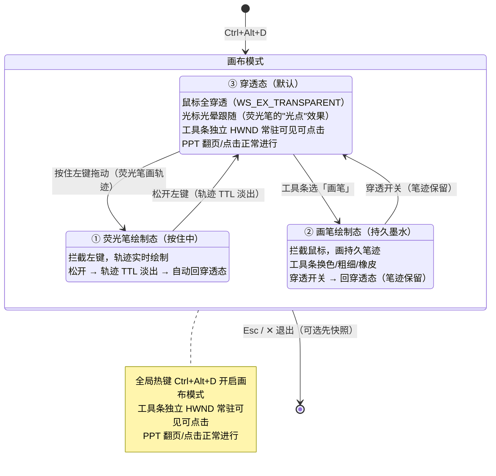

# StarMarkDesktop 组件功能扩展 · 实现详解

> 日期：2026-09-19 ｜ 上游文档：[组件功能扩展可行性分析与实现技术路线.md](组件功能扩展可行性分析与技术路线.md)
> **性质声明**：本文所有代码均为**设计实现示意**，未写入仓库任何源码文件；落码时以实际代码为准（先勘察再动手）。
> **阅读顺序**：§0 实现路径决策 → §2 通用基建 → §3–§9 按功能详解 → §10 截图 → §11 汇总矩阵。

## §0 实现路径决策总表（2026-09-19 修订：成熟实现优先）

**原则修订（发起人指示）**：自主实现仅适用于**实现难度低且边界情况少**的功能；难度较高、易出 bug 的能力一律**参考/移植成熟开源实现**或**接入成熟封装**。每个功能必须先盘点参考项目再决策。

**许可合规**（本项目 MIT）：

| 参考项目 | 许可 | 可否照搬代码 |
|---|---|---|
| PowerToys（Run/Crop and Lock/Screen Ruler/Always On Top） | MIT | ✅ 可移植/照搬，最优先参考（同为 C#/.NET 栈） |
| Catime | MIT | ✅ 可参考交互与实现 |
| NCalcSync（表达式求值） | MIT | ✅ 可作为 NuGet 引入（轻量单包豁免 §5-4） |
| System.Diagnostics.PerformanceCounter | MIT（微软官方） | ✅ 可引入（替代自写 PDH P/Invoke） |
| ShareX | GPL-3.0 | ⚠️ **禁止复制代码**（传染 MIT）；仅参考交互思路，或以独立进程接入 |
| TrafficMonitor | GPL-2.0 | ⚠️ 同上，仅参考算法思路 |

| 功能 | 实现路径 | 参考项目 |
|---|---|---|
| 番茄钟 | **自主**（纯状态机 ~100 行，无系统 API 风险） | 交互参考 Focus Task / Catime |
| 倒计时/纪念日 | **自主**（纯日期计算） | 交互参考滴答清单/小智 ToDo |
| 世界时钟 | **自主**（TimeZoneInfo 封装） | 交互参考 EarthTime |
| 桌面日历 | **官方控件**（WinUI CalendarView）+ 日期查询 | 交互参考优效日历 |
| 快速计算器 | **接入 NCalcSync（MIT）** 替代自写解析器；单位换算仍自写静态表 | PowerToys Run Calculator 的交互形态 |
| 系统监控 | **接入 System.Diagnostics.PerformanceCounter（微软官方包）** 计 CPU/网速/磁盘；内存用 BCL GlobalMemoryStatusEx；**放弃自写 GetIfTable2 P/Invoke** | 形态参考 TrafficMonitor |
| 护眼提醒 | **自主**（复用遮罩基件 + 定时策略） | 参考护眼类工具交互 |
| **截图/贴图** | **参考 PowerToys（MIT）为主**：区域选择/放大镜参考 Screen Ruler，窗口锁定/贴图参考 Crop and Lock；捕获层优先 **Windows.Graphics.Capture 系统API**（GDI BitBlt 降为 MVP 兜底）；选区遮罩/贴图窗壳自主（已有 WidgetWindow 外壳经验） | Snipaste 仅作交互标杆（闭源，禁止反编译） |

> 修订记录：初版全部为自主实现路线（§3–§10 各章代码即为自主方案）；本节修订后，**计算器 / 系统监控 / 截图（捕获与窗口探测）** 三项转入成熟实现优先路线，对应章节标注"⚠️ 路径已修订"。

---

## §1 通用约定

- **分层**：纯逻辑 → `StarMark.Core`；Win32 / 图形互操作 → `StarMark.Integrations`；渲染与窗口 → `StarMark.UI`（约束 §5-7）。
- **组件注册**：走 `WidgetKind` / `WidgetRegistry` / `WidgetContentFactory` 三处（或先落地 T13 反射注册）。
- **日志**：一切 catch 至少 `StarLog.Error`（踩坑 #10）；异步事件处理器必须 try/catch 全包（踩坑 #7）。
- **常量**：新增常量进对应模块文件顶部并命名（对齐扩展侧 constants 收敛惯例）。

---

## §2 通用基建（先行技术件，多章复用）

### 2.1 全屏遮罩窗基件 `OccluderWindow`

**用途**：截图选区（§10）、护眼强制休息（§9）共用——全屏、置顶、每显示器一个、显示一张"冻结屏幕"位图或纯色遮罩。

**关键实现**：

```csharp
// StarMark.Integrations/Win32/MonitorInterop.cs —— 复用踩坑 #55 的 EnumDisplayMonitors + GetMonitorInfoExW
public readonly record struct MonitorInfo(IntPtr Hmonitor, RectInt32 WorkArea, RectInt32 Bounds, string DeviceName);

public static IReadOnlyList<MonitorInfo> GetMonitors()
{
    var list = new List<MonitorInfo>();
    EnumDisplayMonitors(IntPtr.Zero, IntPtr.Zero, (hMonitor, _, _, _) =>
    {
        var mi = new MONITORINFOEX { cbSize = Marshal.SizeOf<MONITORINFOEX>() };
        if (GetMonitorInfoExW(hMonitor, ref mi))
            list.Add(new MonitorInfo(hMonitor,
                new RectInt32(mi.rcMonitor.left, mi.rcMonitor.top,
                              mi.rcMonitor.right - mi.rcMonitor.left, mi.rcMonitor.bottom - mi.rcMonitor.top),
                default, mi.szDevice));
        return true;
    }, IntPtr.Zero);
    return list;
}
```

```csharp
// StarMark.UI/Screenshot/OccluderWindow.cs
public sealed class OccluderWindow : Window
{
    private readonly IntPtr _hMonitor;

    public OccluderWindow(IntPtr hMonitor, RectInt32 boundsPhys)
    {
        _hMonitor = hMonitor;
        // 物理像素 → DIP：沿用 WidgetWindow 的 per-monitor DPI 换算（踩坑 #55 方案）
        var (dipW, dipH) = DpiHelper.PhysicalToDip(hMonitor, boundsPhys.Width, boundsPhys.Height);
        var presenter = (OverlappedPresenter)AppWindow.Presenter;
        presenter.IsAlwaysOnTop = true;
        presenter.IsResizable = false;
        // 无边框 + 精确覆盖该显示器（物理像素 API）
        AppWindow.IsShownInSwitchers = false;
        AppWindow.MoveAndResize(new RectInt32(boundsPhys.X, boundsPhys.Y, boundsPhys.Width, boundsPhys.Height));
        RootBorder.Background = new SolidColorBrush(Microsoft.UI.Colors.FromArgb(96, 0, 0, 0));
    }

    public void ShowFrozen(BitmapImage frozen) { FrozenImage.Source = frozen; Activate(); }
    public void Hide() => AppWindow.Hide();
}
```

**要点**：遮罩窗**预先创建并隐藏**（窗池），触发时仅换内容 + `Activate()`——消除"触发→呈现"的窗口创建延迟（Snipaste 秒级响应的关键之一）。

### 2.2 `WindowInterop` 增量（扩展样式）

```csharp
// StarMark.Integrations/Win32/WindowInterop.cs 追加
private const int GWL_EXSTYLE = -20;
private const long WS_EX_LAYERED = 0x00080000;
private const long WS_EX_TRANSPARENT = 0x00000020;   // 点击穿透
private const long WS_EX_NOACTIVATE = 0x08000000;    // 不抢焦点
private const long WS_EX_TOOLWINDOW = 0x00000080;    // 不出现在 Alt+Tab

public static void SetExStyle(IntPtr hwnd, long add, long remove)
{
    var ex = GetWindowLongPtrW(hwnd, GWL_EXSTYLE);
    ex = (ex | add) & ~remove;
    SetWindowLongPtrW(hwnd, GWL_EXSTYLE, ex);
}
// x64 用 SetWindowLongPtrW；本项目固定 x64（若需兼容 32 位构建须 #if 切换 SetWindowLongW）
```

### 2.3 常量增量

```
MonitorSamplingMs = 1000;  ScreenshotHotkeyDefault = "F1";
PinMaxOpacity = 100;  PinMinScale = 0.2;  PinMaxScale = 5.0;
OccluderAlpha = 96;  EyeRestDefaultMinutes = 45;
```

---

## §3 世界时钟 🟢

### 落地步骤
1. `WidgetKind.WorldClock = 12` + Registry 描述符（默认宽 240 / 高 120，IsResizable=false）；
2. `Core/Widgets/WorldClockModel.cs`：城市条目（`CityName + WindowsTimeZoneId`）；
3. `WorldClockWidget.xaml`：`ItemsRepeater`（**x:Bind，坑 #2**）+ 每分钟刷新计时器（单实例复用，坑 #11）；
4. 设置页组件区自动出现（WidgetRows 按类型构建已泛化）。

### 核心代码

```csharp
public sealed record WorldClockCity(string City, string WindowsTimeZoneId);

public static string FormatCityTime(WorldClockCity c, DateTimeOffset now)
{
    var tzi = TimeZoneInfo.FindSystemTimeZoneById(c.WindowsTimeZoneId);
    var local = TimeZoneInfo.ConvertTime(now, tzi);
    var diff = (local - now.ToLocalTime()).TotalHours;
    return $"{c.City} {local:HH:mm} (UTC{diff:+0.#;-0.#;0})";
}
```

### 漏洞预测
- **Windows 时区 Id 与 IANA 不通用**：仅允许从**系统注册时区列表**中选择（`TimeZoneInfo.GetSystemTimeZones()` 枚举做下拉），不手输 Id——彻底规避 IANA 映射问题；
- 某些历史时区 Id 在精简系统上缺失 → 构造时 `try/catch` 并在 UI 标灰"不可用"；
- **夏令时切换瞬间**的时差展示会跳变——属正确行为，无需处理，但 UI 不应缓存上次偏移量。

### 性能问题
- 每分钟一次的 `ConvertTime` 是 O(城市数) 纯计算，可忽略；**禁止**每秒刷新整列表（无秒针需求时）。

---

## §4 番茄钟 / 专注计时 🟢

### 落地步骤
1. `WidgetKind.Focus = 12` + 描述符；
2. `Core/Widgets/FocusTimer.cs`：状态机（纯逻辑，可单测）；
3. `FocusTimerWidget.xaml`：剩余时间（大字）+ 当前 Todo 文本 + 控制按钮 + 今日完成数；
4. 通知：阶段结束复用 InfoBar + 托盘气泡；完成番茄数持久化到实例配置。

### 核心代码（状态机：**基于时间戳差值**，不基于 tick 累计）

```csharp
public enum FocusPhase { Idle, Focusing, Resting, Paused }

public sealed class FocusTimer
{
    private long _phaseEndTick;      // Environment.TickCount64 基准
    private long _pausedAtTick;
    private long _remainOnPauseMs;

    public FocusPhase Phase { get; private set; } = FocusPhase.Idle;
    public int FocusMinutes { get; set; } = 25;
    public int RestMinutes { get; set; } = 5;
    public string? CurrentTodo { get; set; }
    public event Action<FocusPhase>? PhaseEnded;   // 阶段自然结束（UI 线程触发）

    public void StartFocus(string? todo)
    {
        CurrentTodo = todo;
        Phase = FocusPhase.Focusing;
        _phaseEndTick = Environment.TickCount64 + FocusMinutes * 60_000L;
    }

    public void Pause()
    {
        if (Phase is not (FocusPhase.Focusing or FocusPhase.Resting)) return;
        _pausedAtTick = Environment.TickCount64;
        _remainOnPauseMs = Math.Max(0, _phaseEndTick - _pausedAtTick);
        Phase = FocusPhase.Paused;
    }

    public void Resume()
    {
        if (Phase != FocusPhase.Paused) return;
        _phaseEndTick = Environment.TickCount64 + _remainOnPauseMs;
        Phase = FocusPhase.Focusing;
    }

    /// <summary>UI 每秒调用：返回剩余毫秒；负值 = 阶段已结束（由 UI 触发 Advance）。</summary>
    public long RemainingMs()
        => Phase switch
        {
            FocusPhase.Focusing or FocusPhase.Resting => Math.Max(0, _phaseEndTick - Environment.TickCount64),
            FocusPhase.Paused => _remainOnPauseMs,
            _ => 0,
        };

    public FocusPhase Advance()   // 阶段结束调用：Focusing→Resting→Focusing 循环
    {
        if (Phase == FocusPhase.Focusing)
        {
            Phase = FocusPhase.Resting;
            _phaseEndTick = Environment.TickCount64 + RestMinutes * 60_000L;
        }
        else if (Phase == FocusPhase.Resting)
        {
            Phase = FocusPhase.Focusing;
            _phaseEndTick = Environment.TickCount64 + FocusMinutes * 60_000L;
        }
        PhaseEnded?.Invoke(Phase);
        return Phase;
    }
}
```

### 漏洞预测
| 漏洞 | 场景 | 防御 |
|---|---|---|
| **系统挂起/睡眠导致计时漂移** | 合盖再开，`DispatcherTimer` 期间停走 | 用 `TickCount64` **差值**：睡眠期间 tick 不走，唤醒后剩余时间自然顺延（"闹钟语义"）；若需"净专注时长"语义则改用 `Stopwatch`——**二选一并在设置中说明** |
| `PhaseEnded` 同步回调里再调 `Advance()` → 重入 | UI 事件链 | 回调里 UI 操作经 `DispatcherQueue.TryEnqueue` 异步化；状态机仅 UI 线程访问 |
| 修改 FocusMinutes 时正在 Focusing | 当前阶段被截断 | 仅在 Idle/Paused 应用新时长，运行中修改提示"下阶段生效" |
| Todo 条目被删除后引用悬空 | 组件间联动 | `CurrentTodo` 只存**快照文本**不存 id（显示语义，不回写） |

### 性能问题
- UI 每秒一次文本更新（`x:Bind Mode=OneWay`）——**只更新 TextBlock.Text**，不重建可视树；`TickCount64` 读取无分配。

---

## §5 倒计时 / 纪念日 🟢

### 落地步骤
1. `WidgetKind.Countdown = 13`；
2. `Core/Widgets/CountdownModel.cs`：条目（标题 / 目标时刻 `DateTimeOffset` / 类型：倒计时或纪念日 / 是否重复 yearly）；
3. 持久化：`WidgetInstanceConfig` 扩展 `CountdownItems`（**可空 + 默认值**，踩坑 #50 免迁移）；
4. UI：列表 + 剩余天/时/分 + 到点 InfoBar。

### 核心代码（剩余时间与"第 N 天"）

```csharp
public static (int Days, int Hours, int Minutes) Remaining(DateTimeOffset target, DateTimeOffset now)
{
    var span = target - now;
    if (span <= TimeSpan.Zero) return (0, 0, 0);
    return ((int)span.TotalDays, span.Hours, span.Minutes);
}

public static int DaysSince(DateTimeOffset anniversary, DateTimeOffset now)
{
    // 纪念日"第 N 天"：按本地日历日差计算（不能直接用 TimeSpan.TotalDays，会受时刻差影响）
    var a = anniversary.ToLocalTime().Date;
    var b = now.ToLocalTime().Date;
    return (int)(b - a).TotalDays + 1;
}
```

### 漏洞预测
| 漏洞 | 场景 | 防御 |
|---|---|---|
| **夏令时切换日"剩余一天"差 1 小时** | 用 `TotalDays` 取整比较 | 展示层按 **日历日差**（`Date` 相减）计算天数，时刻级倒计时才用 `TimeSpan` |
| 到点提醒**重复触发** | 计时器每秒检查，目标已过且未标记 → 每秒都提醒 | 条目加 `NotifiedAt`（持久化），到点后置位并落盘 |
| 用户改系统时间向前跳 | 大量倒计时瞬间"过期" | 到点提醒合并为**一次汇总通知**（"3 个倒计时已到期"） |
| 纪念日目标时刻带有时区 | 跨时区语义混乱 | 存储统一 `DateTimeOffset` + 创建时的时区偏移，展示按本地日历日 |

### 性能问题
- 条目数通常 < 50，每秒全量重算可忽略；列表用 `x:Bind` 增量更新而非整表重建。

---

## §6 快速计算器 🟡 中低风险

### 落地步骤
1. `WidgetKind.Calc = 14`；
2. **⚠️ 路径已修订**：表达式求值**接入 NCalcSync（MIT，轻量解析库）**——自写递归下降解析器的边界健壮性（深层括号/unicode/精度）是长期维护负担，成熟库已覆盖；`Core/Calc/` 仅保留**薄封装**（对齐本项目错误体系：解析失败转 `CalcException`，禁抛库原始异常穿透 UI）；
3. `Core/Calc/UnitTables.cs`：单位换算静态表 + `Core/Calc/TimestampConverter.cs`（自写保留——纯表驱动，低风险）；
4. `CalcWidget.xaml`：单行输入 + 即时结果（未按等号也实时求值）+ 历史（最近 20 条，持久化到实例配置）。

### 核心代码（薄封装：NCalcSync + 本项目错误体系）

```csharp
// Core/Calc/ExpressionEvaluator.cs（修订版：库接管解析，本项目只做语义包装）
using NCalc;   // NCalcSync，MIT

public static class ExpressionEvaluator
{
    public static bool TryEvaluate(string input, out double value, out string? error)
    {
        value = 0; error = null;
        try
        {
            var expr = new Expression(input.Replace("×", "*").Replace("÷", "/"),
                ExpressionOptions.IgnoreCase | ExpressionOptions.AllowBooleanCalculation);
            var result = expr.Evaluate();
            value = Convert.ToDouble(result);
            if (!double.IsFinite(value)) { error = "结果超出可表示范围"; return false; }
            return true;
        }
        catch (Exceptions.ExpressionException ex) { error = ex.Message; return false; }   // 库的解析错误 → 本项目错误
        catch (FormatException) { error = "表达式格式不正确"; return false; }
        catch (OverflowException) { error = "结果超出可表示范围"; return false; }
    }
}
```

### 漏洞预测（接入库后残余风险）
| 风险 | 场景 | 防御 |
|---|---|---|
| **依赖引入审查** | NCalcSync 引入传递依赖 | 锁定版本 + `npm` 式 lock（packages.locker）；单包零传递依赖（NCalcSync 为纯解析器）——满足 §5-4 豁免条件 |
| **DoS 面缩小但仍在** | 超长表达式/深层嵌套 | NCalc 有自身解析深度限制；另加输入长度上限（512 字符）与求值超时（不可控表达式直接拒绝） |
| **功能面变化** | 库支持函数调用（如 `Abs()`）可能被滥用 | NCalc 支持 `ExpressionOptions.DisableFunction` 类开关——按需禁用未审计的内置函数 |
| 浮点显示噪音 | 同初版 | 展示 `G15` 去尾零（不变） |
| 历史记录注入 | 同初版 | `TextBlock.Text` 渲染（不变） |

### 性能问题
- 库解析单次 <0.5ms（量级与自写相当）；即时求值无需防抖；历史 20 条上限不变。

---

## §7 桌面日历 / 月视图 🟢

### 落地步骤
1. `WidgetKind.Calendar = 15`；
2. `CalendarWidget.xaml`：内建 **`CalendarView`**（WinUI 官方控件）+ 当日条目列表；
3. `IItemRepository.GetByDateRangeAsync(from, to)`（SQL：`updated_at BETWEEN`，走既有索引）；
4. `CalendarViewDayItemChanging` 事件：有收藏/动态的日期加角标。

### 核心代码

```csharp
private void OnDayItemChanging(CalendarView sender, CalendarViewDayItemChangingEventArgs e)
{
    if (e.Phase == 0)
    {
        e.RegisterUpdateCallback(Phase2);   // 两阶段：先让基线渲染，再补角标（官方建议模式）
    }
    else if (e.Phase == 1)
    {
        var day = (DateTimeOffset)e.Item;
        if (_dayCounts.TryGetValue(day.Date, out var n) && n > 0)
        {
            var badge = new TextBlock { Text = $"●{n}", FontSize = 10, Opacity = 0.8 };
            e.DayItem.Children.Add(badge);
        }
    }
}
```

### 漏洞预测
| 漏洞 | 场景 | 防御 |
|---|---|---|
| **DayItemChanging 对每个日期触发** | 大跨度日期范围性能劣化 | 只对**当前展示月**的日期注册回调 |
| 时区：条目 `updated_at`（UTC 秒）与日历日错位 | UTC 深夜 = 本地当日 | 统一 `DateTimeOffset.FromUnixTimeSeconds(x).ToLocalTime().Date` 分桶 |
| `CalendarView` 黑背景（深色主题） | 官方控件默认样式与 Mica 冲突 | 日历区容器套 `ThemeBrush.For(ActualTheme, "CardBackground")`（守门测试自动覆盖） |

### 性能问题
- 当日条目查询带日期区间索引（无则补 `CREATE INDEX idx_updated`）；DayItem 角标数据**预取一次整月**（一次 SQL）→ 字典查表，禁止每个 DayItem 查一次库。

---

## §8 系统监控悬浮格 🟡 中风险

### 落地步骤
1. `WidgetKind.Monitor = 16`；
2. **⚠️ 路径已修订**：网速/CPU **接入 System.Diagnostics.PerformanceCounter（微软官方，MIT）**——自写 GetIfTable2 P/Invoke 的结构体对齐/缓冲区释放/计数器回绕三处坑（初版方案）全部由库消解；**内存**用 BCL `GlobalMemoryStatusEx`（P/Invoke 极简，无泄漏面）或同库 Memory 计数器；
3. `Core/Widgets/SystemMonitorModel.cs`：采样快照（线程安全发布，保留）；
4. `MonitorWidget.xaml`：三行指标，1s 刷新。

### 核心代码（修订版：PerformanceCounter + BCL）

```csharp
// Integrations/SystemMonitor/PerfCounters.cs（封装层：计数器实例化与错误熔断）
using System.Diagnostics;
using System.Net.NetworkInformation;   // 网速走 BCL，零 NuGet

public sealed class PerfCounters : IDisposable
{
    private readonly PerformanceCounter _cpu;
    private readonly List<(PerformanceCounter Down, PerformanceCounter Up)> _net = new();
    private long _lastIn, _lastOut, _lastTick = -1;

    public PerfCounters()
    {
        _cpu = new PerformanceCounter("Processor", "% Processor Time", "_Total", readOnly: true);
        foreach (var nic in NetworkInterface.GetAllNetworkInterfaces()
                     .Where(n => n.NetworkInterfaceType is NetworkInterfaceType.Ethernet
                              or NetworkInterfaceType.Wireless80211 && n.OperationalStatus == OperationalStatus.Up))
        {
            var name = nic.Name;
            _net.Add((
                new PerformanceCounter("Network Interface", "Bytes Received/sec", name, readOnly: true),
                new PerformanceCounter("Network Interface", "Bytes Sent/sec", name, readOnly: true)));
        }
    }

    public (double DownMbps, double UpMbps) NetworkSpeed()
    {
        // BCL 备选（无计数器初始化延迟问题）：NetworkInterface.GetIPStatistics 差值
        long inB = 0, outB = 0;
        foreach (var nic in NetworkInterface.GetAllNetworkInterfaces()
                     .Where(n => n.NetworkInterfaceType is NetworkInterfaceType.Ethernet
                              or NetworkInterfaceType.Wireless80211 && n.OperationalStatus == OperationalStatus.Up))
        { var st = nic.GetIPStatistics(); inB += st.BytesReceived; outB += st.BytesSent; }

        var now = Environment.TickCount64;
        double down = 0, up = 0;
        if (_lastTick > 0)
        {
            var dtSec = (now - _lastTick) / 1000.0;
            down = Math.Max(0, (inB - _lastIn) * 8 / dtSec / 1_000_000);
            up = Math.Max(0, (outB - _lastOut) * 8 / dtSec / 1_000_000);
        }
        _lastIn = inB; _lastOut = outB; _lastTick = now;
        return (down, up);
    }

    public float CpuUsage() => _cpu.NextValue();          // 首次调用返回 0，需预热一次
    public double MemUsagePercent()
    {
        var m = new Microsoft.Win32.MEMORYSTATUSEX { dwLength = (uint)Marshal.SizeOf<Microsoft.Win32.MEMORYSTATUSEX>() };
        GlobalMemoryStatusEx(ref m);
        return 100.0 * m.dwMemoryLoad;                     // dwMemoryLoad 已是百分比
    }

    public void Dispose() { _cpu.Dispose(); foreach (var (d, u) in _net) { d.Dispose(); u.Dispose(); } }
}
```

```csharp
// Core/Widgets/SystemMonitorModel.cs —— 采样循环（保留：可见实例引用计数驱启停）
public sealed class SystemMonitorModel : IDisposable
{
    private readonly PerfCounters _counters = new();
    private Timer? _timer;
    private int _visibleInstances;
    private bool _warmedUp;

    public MonitorSnapshot Latest { get; private set; } = MonitorSnapshot.Empty;
    public event Action? Updated;

    public void OnInstanceShown() { if (Interlocked.Increment(ref _visibleInstances) == 1) Start(); }
    public void OnInstanceHidden() { if (Interlocked.Decrement(ref _visibleInstances) == 0) Stop(); }

    private void Start()
    {
        // 预热：PerformanceCounter 首次 NextValue 返回 0（需两个采样点），先空跑一轮
        _ = _counters.CpuUsage();
        _timer = new Timer(_ =>
        {
            try
            {
                var (down, up) = _counters.NetworkSpeed();
                Latest = new MonitorSnapshot(down, up, _counters.CpuUsage(), _counters.MemUsagePercent(), DateTime.Now);
                Updated?.Invoke();
            }
            catch (InvalidOperationException) { /* 计数器类别偶发缺失：跳过本帧 */ }
        }, null, MonitorSamplingMs, MonitorSamplingMs);
    }
    private void Stop() { _timer?.Dispose(); _timer = null; }
    public void Dispose() { _timer?.Dispose(); _counters.Dispose(); }
}
```

### 漏洞预测（修订版：库接管后的残余风险）
| 风险 | 场景 | 防御 |
|---|---|---|
| **计数器实例名本地化** | 非中文系统的 "Network Interface"/"_Total" 类别名恒定（英文类别名跨语言稳定 ✓），但**网卡实例名 = 用户可见连接名**（随系统语言） | 枚举 `PerformanceCounterCategory.GetInstances()` 按存在性过滤，而非硬编码实例名 |
| **首帧 0/闪烁** | PerformanceCounter 需两个采样点才有速率 | 预热一轮 + UI 首帧显示"…"而非 0（Model 已有快照解耦） |
| 计数器句柄数 | 每网卡 2 个计数器实例 × 常驻 | 单例复用（不反复 new），Dispose 释放 |
| 网卡热插拔 | USB 网卡/Wi-Fi 切换后旧计数器失效 | 采样捕获异常 → 重建 PerfCounters（每次重建全量刷新） |
| 权限 | PerformanceCounter 部分类别需性能计数用户组 | Processor/Network Interface 类别默认可读（无特殊权限） |

### 性能问题
- PerformanceCounter 首次初始化较慢（类别扫描 ~百 ms 级）→ **惰性单例 + 后台预热**（Widget 显示时即开始，用户无感）；
- 采样 1s 间隔下 CPU 开销 <0.5%（库内部仍是系统调用，无自旋）；
- **BCL NetworkInterface 备选路径**（网速）完全无计数器依赖——若 PerformanceCounter 在目标环境异常，网速项可独立降级为 BCL 差值法（代码已并列给出）。

---

## §9 护眼 / 休息提醒 🟢

### 落地步骤
1. 设置项：`EyeRestEnabled / IntervalMinutes / Enforced / FullscreenDefer`（SettingsStore）；
2. `Core/Health/EyeRestPolicy.cs`：节拍逻辑 + **全屏应用检测延后**；
3. UI：复用 §2.1 `OccluderWindow`（强制模式），非强制走 InfoBar。

### 核心代码（全屏检测与延后）

```csharp
public static bool IsForegroundFullscreen()
{
    var hwnd = GetForegroundWindow();
    if (hwnd == IntPtr.Zero) return false;
    GetWindowRect(hwnd, out var r);
    var screen = ScreenOfHwnd(hwnd);            // 复用 MonitorInterop
    // 前台窗口矩形 ≈ 整屏 → 视为全屏（视频/游戏）
    return r.left <= screen.Bounds.X && r.right >= screen.Bounds.X + screen.Bounds.Width
        && r.top <= screen.Bounds.Y && r.bottom >= screen.Bounds.Y + screen.Bounds.Height;
}
```

### 漏洞预测
| 漏洞 | 场景 | 防御 |
|---|---|---|
| **全屏游戏里弹出遮罩** | 强制休息打断游戏 | 计时到点先 `IsForegroundFullscreen()` 检查 → 延后 60s 重试（循环直至非全屏） |
| 遮罩窗被 Esc/Alt+F4 关闭 | 强制模式形同虚设 | 遮罩窗 `WS_EX_NOACTIVATE` + 不注册关闭钩子；倒计时 20s 自然淡出 |
| 提醒后**不重置计时** | 玩提醒变成计时器 bug | InfoBar 确认 / 遮罩淡出即重置节拍起点 |

### 性能问题
- 全屏检测**仅在节拍到点时执行一次**（不做每秒轮询前台窗口）；遮罩窗复用窗池（§2.1）。

## §10 屏幕截图 / 贴图 🔴→🟡（三级路线，本章为 L1 完整实现 + L2 要点 + L3 预研）

### 10.0 与 Snipaste 的能力对位（差距即路线）＋ **实现路径决策（修订）**

| Snipaste 能力 | 实现层级 | 本项目策略（修订后） |
|---|---|---|
| 毫秒级全屏捕获 + 遮罩呈现 | 确定性工程 | L1：GDI BitBlt（MVP 兜底）→ L2 升级 **Windows.Graphics.Capture（系统 API，WinAppSDK 自带互操作，可捕获窗口/显示器帧池）** |
| **窗口树探测 + 窗口矩形吸附** | 确定性工程 | L2：**参考 PowerToys Crop and Lock（MIT）的窗口枚举与锁定实现**，API 同为 WindowFromPoint/GetAncestor/GetWindowRect |
| **像素级边缘吸附**（对位图做梯度分析） | Snipaste 核心壁垒（C++ 级） | L3 预研（不承诺）；**候选参考 PowerToys Screen Ruler（MIT）的边界与测量实现** |
| 分层窗口贴图（Alpha / 穿透 / 不抢焦点） | 确定性工程 | L1：WS_EX 组合 + SetLayeredWindowAttributes；**贴图窗交互/缩放参考 PowerToys Crop and Lock 的 Thumbnails 模式** |
| 标注编辑器 | 工程 | L2：InkCanvas/Canvas 简版 |
| 滚动长截图 / GIF | 进阶 | 不承诺 |

**路径决策（修订）**：
1. **参考代码以 PowerToys（MIT，C#/WinUI 同栈）为主**——Crop and Lock 的"窗口区域锁定子窗口"与本项目贴图**高度同构**（其 Thumbnails 模式 = 实时镜像子窗口、Rephotograph = 静态重拍，均为无面板集成窗），其窗口枚举/DPI/多屏处理可直接移植；Screen Ruler 的选区边框与测量 UI 同理。**GPL 项目（ShareX/TrafficMonitor）仅参考交互思路，禁止复制代码**。
2. **捕获 API 路线**：L1 保留 **GDI BitBlt**（简单、全屏静态图足够）；L2 起**迁移 Windows.Graphics.Capture**（`GraphicsCapturePicker` 让用户选窗口/显示器、`Direct3D11CaptureFramePool` 帧池——WinAppSDK 自带互操作，支持窗口级捕获与 HDR，是 WinUI 3 时代的官方路线）。**互操作依赖说明**：帧池的 `IDirect3DDevice` 桥接需要 `Microsoft.Graphics.Win2D` 或 WinRT interop 辅助——引入前按 §5-4 走轻量豁免（微软官方包），未豁免前维持 GDI。
3. **贴图窗自主保留**：无边框置顶窗 + Image + 穿透开关（§10.4），难度低且已验证外壳模式（WidgetWindow 同构）。

### 10.1 L1 落地步骤（总览）

1. `Integrations/Capture/GdiScreenCapture.cs`：全屏/区域位图捕获；
2. `Integrations/Capture/WindowProbe.cs`（L2 预留接口，L1 空实现）；
3. `UI/Screenshot/OccluderWindow`（§2.1）+ `ScreenshotSession`（选区状态机）；
4. `UI/Screenshot/PinWindow` + `PinManager`（贴图窗族）；
5. `HotkeyService` 注册默认热键（F1 截图 / F3 贴最近一张）；
6. 托盘菜单接入（截图 / 全部贴图显隐）。

### 10.2 捕获：GDI BitBlt（L1 MVP 兜底；L2 评估升级 Windows.Graphics.Capture）

```csharp
// Integrations/Capture/GdiScreenCapture.cs
public static class GdiScreenCapture
{
    private const int SRCCOPY = 0x00CC0020;
    private const int CAPTUREBLT = 0x40000000;   // 含分层窗口；开销略高，可配置关闭

    /// <summary>捕获虚拟屏整体（物理像素）。返回 BGRA 顶朝下像素数据与尺寸。</summary>
    public static unsafe RawFrame CaptureVirtualScreen()
    {
        var vx = GetSystemMetrics(SM_XVIRTUALSCREEN);
        var vy = GetSystemMetrics(SM_YVIRTUALSCREEN);
        var vw = GetSystemMetrics(SM_CXVIRTUALSCREEN);
        var vh = GetSystemMetrics(SM_CYVIRTUALSCREEN);

        var hdcScreen = GetDC(IntPtr.Zero);
        try
        {
            var hdcMem = CreateCompatibleDC(hdcScreen);
            try
            {
                var hbmp = CreateCompatibleBitmap(hdcScreen, vw, vh);
                try
                {
                    var old = SelectObject(hdcMem, hbmp);
                    _ = BitBlt(hdcMem, 0, 0, vw, vh, hdcScreen, vx, vy, SRCCOPY | CAPTUREBLT);
                    _ = SelectObject(hdcMem, old);

                    var bmi = new BITMAPINFO
                    {
                        bmiHeader = new BITMAPINFOHEADER
                        {
                            biSize = (uint)Marshal.SizeOf<BITMAPINFOHEADER>(),
                            biWidth = vw, biHeight = -vh,          // 负高 = 顶朝下（与 WinUI Image 一致）
                            biPlanes = 1, biBitCount = 32, biCompression = 0,
                        },
                    };
                    var pixels = new byte[vw * vh * 4];
                    fixed (byte* dst = pixels)
                        _ = GetDIBits(hdcMem, hbmp, 0, (uint)vh, dst, ref bmi, 0);
                    return new RawFrame(vx, vy, vw, vh, pixels);
                }
                finally { DeleteObject(hbmp); }
            }
            finally { DeleteDC(hdcMem); }
        }
        finally { ReleaseDC(IntPtr.Zero, hdcScreen); }
    }
}
```

**呈现**：`RawFrame` → `WriteableBitmap(vw, vh)` → 像素拷贝进 `PixelBuffer`（一次 `Buffer.MemoryCopy`）→ 遮罩窗 `Image.Source`。**整屏位图 4K ≈ 33MB，为瞬时资源**——遮罩关闭即解除引用。

### 10.3 选区状态机（ScreenshotSession）

```csharp
public sealed class ScreenshotSession
{
    public enum Phase { Idle, Ready, Dragging, Done }
    public Phase Phase { get; private set; } = Phase.Idle;
    public RectInt32 Region { get; private set; }          // 物理像素，遮罩窗坐标系

    public void OnPointerPressed(PointInt32 p) { Phase = Phase.Dragging; Region = new(p.X, p.Y, 0, 0); }
    public void OnPointerMove(PointInt32 p)
    {
        if (Phase != Phase.Dragging) return;
        Region = RectFromPoints(Region.X, Region.Y, p.X, p.Y);   // 归一化对角
    }
    public void OnPointerReleased(PointInt32 p) { OnPointerMove(p); Phase = Phase.Done; }
}
```

**遮罩窗渲染选区**（"挖洞"技巧）：四块半透明暗色矩形拼出选区外区域 + 选区边框 1px 高亮描边（`Windows.UI.Colors.Cyan`）+ 右下角尺寸文本 `W × H`。拖动中仅更新四个 `Rectangle` 的几何（`Canvas.SetLeft/Top/Width/Height`），**不重建可视树**。

### 10.4 贴图窗 PinWindow

```csharp
public sealed class PinWindow : Window
{
    private readonly IntPtr _hwnd;
    private bool _clickThrough;

    public PinWindow(RawFrame frame, RectInt32 regionPhys)
    {
        // 尺寸/位置 = 选区物理矩形（per-monitor DPI 换算 DIP，踩坑 #55 方案）
        var presenter = (OverlappedPresenter)AppWindow.Presenter;
        presenter.IsAlwaysOnTop = true; presenter.IsResizable = false;
        AppWindow.IsShownInSwitchers = false;                 // 贴图不进 Alt+Tab（WS_EX_TOOLWINDOW 双保险）
        // Image.Source = 选区位图（VirtualSurfaceImage/WriteableBitmap 裁剪子矩形）
    }

    public void SetClickThrough(bool on)
    {
        _clickThrough = on;
        // 穿透：WS_EX_TRANSPARENT 必须与 WS_EX_LAYERED 同设；恢复交互 = 移除 TRANSPARENT
        WindowInterop.SetExStyle(_hwnd,
            on ? (WS_EX_TRANSPARENT | WS_EX_NOACTIVATE) : 0,
            on ? 0 : WS_EX_TRANSPARENT);
        // 穿透时保留托盘菜单入口作为"找回"通道（否则贴图将无法交互关闭）
        TrayHost.NotifyPinState(this, on);
    }

    public void SetOpacity(byte a)
        => SetLayeredWindowAttributes(_hwnd, 0, a, LWA_ALPHA);   // 需先置 WS_EX_LAYERED
}
```

### 10.5 PinManager（贴图窗族管理，独立于 WidgetManager）

```csharp
public sealed class PinManager
{
    private readonly List<PinWindow> _pins = new();
    public event Action? PinsChanged;

    public PinWindow Pin(RawFrame frame, RectInt32 region) { ... PinsChanged?.Invoke(); return pin; }
    public void ShowAll() / HideAll() / CloseAll();
    public IReadOnlyList<PinWindow> Pins => ...;
}
```

**DI**：`services.AddSingleton<PinManager>()`；托盘"贴图"菜单直接消费。

### 10.6 L2 要点（增强级）—— 窗口探测与标注参考 PowerToys（MIT）

**PowerToys Crop and Lock 对照**：其 Thumbnails（实时镜像子窗口）与 Rephotograph（静态重拍）两模式 = 本项目贴图的窗口级变体；其窗口枚举（EnumWindows + 可见性/ToolWindow 过滤 + Z 序）、DPI、多屏处理为 C# 同栈实现，可直接移植到 WindowProbe.cs。**Screen Ruler** 的边界检测与测量 UI 可复用为选区辅助。

- **窗口矩形探测**：
  ```csharp
  // WindowFromPoint(屏幕物理坐标) → GetAncestor(GA_ROOT) → GetWindowRect
  // 排除：自身遮罩窗 / WS_EX_TOOLWINDOW / 不可见 / 矩形面积过小(<16x16)
  // Z 序去重叠：GetWindow(GW_HWNDNEXT) 链上矩形与候选求交裁剪（上层窗口挖掉下层可见区）
  ```
  探测结果 = 一组**互不重叠的可见矩形**，鼠标移动时二分/线性找包含光标的最小矩形 → 高亮吸附。**每次 PointerMove 节流 30ms**（Win32 调用开销与重绘）。
- **放大镜**：捕获位图 + 光标周围 96×96 物理像素 → `WriteableBitmap` 8× 放大 + 网格线 + 中心色值文本（`#RRGGBB`）。
- **标注**：确认选区后进入标注层（`InkCanvas` 自由笔 + `Canvas` 形状），导出时用 `RenderTargetBitmap` 合成。

### 10.7 L3 预研（像素级边缘吸附）

- 算法：捕获位图灰度化 → Sobel 梯度 → 行/列投影积分图 → 鼠标所在行列的强梯度边缘集合 → 最近边缘吸附；
- 托管可行性：1080p 灰度 ~2MB，Sobel 全屏 ~30ms（`unsafe` + `ArrayPool<double>` 零分配可压到 ~15ms）——**触发时机**：仅 PointerMove 节流后针对光标邻域（±200px）局部计算，可压到 <2ms ✓ 可行；
- **决策点**：若需 4K/120Hz 全程实时，评估 C++/WinRT 原生组件（WinRT Component 暴露 WinRT 接口给 .NET）——需豁免"无新依赖"约束（编译期项目引用而非 NuGet）。

### 10.8 漏洞预测（截图/贴图专项）

| 漏洞 | 场景 | 防御 |
|---|---|---|
| **捕获包含自身遮罩窗** | 遮罩显示后再捕获 → 自拍自 | 顺序保证：**先 BitBlt 再显示遮罩**（捕获位图是遮罩显示前抓的静止画面）✓ 结构图上强制此顺序 |
| **多屏拼接坐标错位** | 副屏在主屏上方/左侧（负坐标） | 统一用虚拟屏坐标系（SM_XVIRTUALSCREEN 基准），遮罩窗按各自 Monitor Bounds 定位 |
| **DPI 混排**（主屏 150% 副屏 100%） | 选区坐标跨屏错位 | 全程**物理像素**运算；DIP 换算只发生在窗口尺寸 API 边界（踩坑 #55 方案） |
| **点击穿透后贴图"找不回"** | 穿透开启后无法交互关闭 | 穿透/恢复入口收敛到**托盘菜单**（PinManager 显隐列表）；穿透时贴图边缘保留 1px 非穿透描边 |
| **BitBlt CAPTUREBLT 光标闪烁** | 含分层窗口捕获导致桌面闪烁 | 提供开关（默认含 CAPTUREBLT 保证截图完整，闪烁仅在触发瞬间） |
| **剪贴板格式** | 只写位图句柄，部分应用读不到 | `SetClipboardData(CF_DIB)` **与** PNG 流双写；打开剪贴板用 try/finally CloseClipboard |
| 贴图窗句柄泄漏 | 贴图开关频繁 → HWND 耗尽 | PinManager 持有强引用并 CloseAll 释放；关闭即 `Close()` 销毁 HWND |
| 遮罩窗期间 UAC/安全桌面 | 安全桌面不显示普通窗口 | 捕获瞬间 UAC 弹窗不可捕获（安全桌面独立桌面）——文档注明限制，不做处理 |
| **捕获位图内容过时** | 遮罩显示期间屏幕内容变化（视频） | 冻结语义即如此（Snipaste 同），在遮罩角落提示"画面已冻结" |

### 10.9 性能问题

| 问题 | 分析 | 对策 |
|---|---|---|
| 捕获耗时 | BitBlt 4K 单屏 10–40ms（CAPTUREBLT +50%）| 可接受；遮罩窗预热 + 捕获位图直入 WriteableBitmap 零拷贝链路 |
| **每帧 33MB 位图的 GC 压力** | byte[] 进入 LOH（>85KB 即 LOH） | `GCSettings.LargeObjectHeapCompactionMode` 按需压缩；捕获数组复用（窗池共享一块缓冲）；`unsafe` 固定后直拷 `PixelBuffer` |
| 贴图缩放模糊 | 位图放大插值 | `Image` 默认线性插值可接受；高倍缩放提示"已放大，可能模糊"（Snipaste 同） |
| 遮罩拖动重绘卡顿 | 每帧重建矩形 | 只改既有 Rectangle 几何属性（依赖属性批量更新），Canvas 不增删子元素 |

---

## §11 漏洞与性能汇总矩阵

| 功能 | 最高风险项 | 性能敏感项 | 前置依赖 |
|---|---|---|---|
| 世界时钟 | 时区 Id 缺失（灰名单） | 无 | — |
| 番茄钟 | 挂起计时漂移（TickCount64 差值法） | 每秒 TextBlock 更新 | — |
| 倒计时 | 重复提醒（NotifiedAt 落盘）/ 夏令时日差 | 条目 <50 无感 | 通知通道 |
| 计算器 | 幂爆炸 DoS / 浮点显示 | 即时求值 <0.1ms | — |
| 日历 | DayItem 虚拟化回调滥用 | 整月一次 SQL 预取 | GetByDateRangeAsync |
| 系统监控 | **GetIfTable2 泄漏** / 计数器回绕 | 1s 采样 CPU<0.5% | — |
| 护眼 | 全屏误弹（前台检测延后） | 遮罩窗池复用 | §2.1 / §10 遮罩件 |
| 截图 L1 | **自捕获顺序** / 多屏坐标 / DPI 混排 / 穿透找回 | LOH 位图 GC / 遮罩预热 | HotkeyService / MonitorInterop / TrayHost |
| 截图 L2 | 窗口探测节流 | 放大镜 WriteableBitmap | L1 |
| 截图 L3 | 托管图像处理实时性 | unsafe + ArrayPool | L2 |

## §12 测试矩阵

| 层 | 用例 |
|---|---|
| Core 单测 | FocusTimer 状态机（含暂停/恢复/挂起漂移模拟）；Countdown 日差/夏令时；ExpressionEvaluator（合法/非法/幂爆炸/深度括号）；SystemMonitorModel 计数器回绕与负差值丢弃；倒计时到点合并通知 |
| SmokeTest | `-- capture`：GDI 捕获一张位图（断言尺寸 = 虚拟屏、非全黑、四角颜色与截图源一致性抽样）；`-- widgets` 扩展新组件 kind 注册断言 |
| 手工冒烟 | 多屏（主/副不同 DPI）遮罩与贴图定位；穿透开关节奏；贴图 20 张开关后句柄数稳定（任务管理器句柄列） |
| 守门 | 主题画笔守门测试自动覆盖全部新 XAML/code-behind |

---

> 实施顺序与批次划分见上游《组件功能扩展可行性分析与实现技术路线.md》§四；本文与其配对使用——可行性回答"做不做"，本文回答"怎么做、会踩什么坑"。

---

## §13 重新评估接入的功能（成熟实现优先原则复核，2026-09-19）

> 原过滤清单中，以下三项在"成熟实现优先"原则下重新评估后**升级为推荐接入**。许可与依赖均在 §0 合规表内。

### 13.1 截图 OCR 文字提取 🟡 中低风险

**功能定义**：截图确认后（或对已存在贴图）一键提取图中文字 → 剪贴板；可选"存为随记"（入 QuickNote 组件，与收藏定位协同）。

**实现路径**：**Windows.Media.Ocr（系统内置 WinRT API，离线、免费、多语言）+ PowerToys Text Extractor（MIT）交互参考**——零模型、零训练、零外部服务，与 §10 截图链路天然协同（选区位图直接复用）。

**核心代码**：

```csharp
// Integrations/Ocr/TextExtractor.cs
using Windows.Globalization;
using Windows.Media.Ocr;
using Windows.Graphics.Imaging;

public static class TextExtractor
{
    /// <summary>从截图选区像素提取文字（自动匹配系统已装 OCR 语言）。</summary>
    public static async Task<OcrOutcome> ExtractAsync(
        byte[] bgraPixels, int width, int height, string? preferredLang = null)
    {
        // 1) 引擎选择：优先用户指定语言 → 用户界面语言 → 系统最佳
        var engine = preferredLang is not null
            ? OcrEngine.TryCreateFromLanguage(new Language(preferredLang))
            : OcrEngine.TryCreateFromUserProfileLanguages();
        engine ??= OcrEngine.TryCreateFromLanguage(OcrEngine.AvailableRecognizerLanguages.FirstOrDefault()
                    ?? throw new InvalidOperationException("系统未安装任何 OCR 语言包（设置 → 时间和语言 → 语言 → 添加可选功能）"));

        // 2) BGRA 像素 → SoftwareBitmap（与 GdiScreenCapture 的顶朝下 BGRA 格式一致）
        var bmp = SoftwareBitmap.CreateCopyFromBuffer(
            pixels.AsBuffer(), BitmapPixelFormat.Bgra8, width, height, BitmapAlphaMode.Ignore);

        // 3) 识别（WinRT API 需在 UI 线程或 MTA 上下文调用；WinAppSDK 托管环境默认 OK）
        var result = await engine.RecognizeAsync(bmp);

        // 4) 行序修复：OcrResult.Lines 的顺序不保证阅读顺序，按 Y 坐标排序后拼接
        var lines = result.Lines
            .OrderBy(l => l.BoundingRect.Y)
            .ThenBy(l => l.BoundingRect.X)
            .Select(l => l.Text.Trim())
            .Where(t => t.Length > 0);
        return new OcrOutcome(string.Join(Environment.NewLine, lines), result.Lines.Count);
    }
}

public sealed record OcrOutcome(string Text, int LineCount);
```

**接线（与截图链路协同）**：确认选区后的快捷条新增「T 提取文字」→ 裁剪位图 → ExtractAsync → 写剪贴板 + 弹出"存为随记"入口（写入 QuickNote 实例，复用既有随记持久化）。

**漏洞预测**：
| 漏洞 | 场景 | 防御 |
|---|---|---|
| **OCR 语言包未安装** | 精简系统/裸机 | `AvailableRecognizerLanguages` 为空或 TryCreate 返回 null → 明确报错引导"系统设置 → 添加可选功能 → 中文(简体)文本识别" |
| **MaxImageDimension 超限** | 多屏拼接整图（>像素上限） | 截图引擎按显示器分块识别后合并（每屏一张 SoftwareBitmap） |
| **识别行序错乱**（多栏布局） | 代码截图/双栏文档 | 按 Y 排序兜底；多栏精确阅读序不做承诺（Snipaste 同样不做），结果可编辑 |
| 内存 | 整屏 SoftwareBitmap（4K ≈ 33MB）×2（像素 + 位图） | 即用即弃（RecognizeAsync 后双 Dispose），不在 OCR 链路外持有 |
| 混排语言识别质量 | 中文截图含英文术语 | 引擎单语言限制为系统 API 固有；提示用户可在设置选择 OCR 语言 |

**性能问题**：
- RecognizeAsync 一屏 1080p ≈ 200–800ms（视内容密度）——异步 + 骨架提示"识别中…"；
- SoftwareBitmap 拷贝一次 33MB → 用后即弃，无常驻；
- 频繁截图+OCR 场景复用同一 OcrEngine 实例（引擎创建有开销，静态缓存按语言缓存）。

---

### 13.2 RSS 源集成（收藏条目源）🟡 中风险

**功能定义**：用户添加 RSS/Atom 源 → 定时拉取新文章 → 以 `source='rss'` 写入 items 表 → 获得**全量能力**：搜索/标签/置顶/组件（QuickLaunch/ItemGrid 均自然可见）；设置页管理源列表（添加/启停/删除 + 最近拉取状态）。

**实现路径**：**System.ServiceModel.Syndication（微软官方 NuGet，RSS 2.0 + Atom 全覆盖）+ 复用既有同步骨架**（状态机/检查点/条件请求——RSS 同样支持 ETag/Last-Modified，GitHub 同步的模式直接套用）。

**核心代码**：

```csharp
// StarMark.Integrations/Rss/RssSource.cs —— 对齐既有 IItemSource 抽象（与 GitHubSource/EverythingSource 同构）
public sealed class RssSource : IItemSource
{
    private readonly IReadOnlyList<RssFeedConfig> _feeds;   // 来自设置（url + name + enabled）

    public async Task<SourceFetchResult> FetchAsync(CancellationToken ct)
    {
        var all = new List<ItemModel>();
        var changed = false;
        foreach (var feed in _feeds.Where(f => f.Enabled))
        {
            var etag = await _stateStore.GetAsync($"rss.etag.{feed.Id}");       // 条件请求（复用 GitHub 同步骨架模式）
            using var resp = await _http.GetAsync(feed.Url,
                etag is null ? HttpCompletionOption.ResponseContentRead : AddIfNoneMatch(etag), ct);
            if (resp.StatusCode == HttpStatusCode.NotModified) continue;        // 增量：源未更新直接跳过
            if (!resp.IsSuccessStatusCode) { /* 记录该源错误，不影响其他源 */ continue; }

            using var stream = await resp.Content.ReadAsStreamAsync(ct);
            using var reader = XmlReader.Create(stream, new XmlReaderSettings { DtdProcessing = DtdProcessing.Ignore, XmlResolver = null });
            var feedDoc = SyndicationFeed.Load(reader);                          // 官方解析（RSS 2.0 + Atom）
            foreach (var item in feedDoc.Items.Take(LatestPerFeed))
            {
                var link = item.Links.FirstOrDefault()?.GetAbsoluteUri()?.ToString() ?? item.Id;
                var summary = HtmlUtil.Strip(item.Summary?.Text ?? item.Content?.Text ?? "");
                all.Add(new ItemModel
                {
                    Source = "rss",
                    SourceId = $"{feed.Id}|{StableHash(link)}",                  // guid 漂移防御：以链接稳定哈希为主键成分
                    Title = HtmlUtil.Strip(item.Title?.Text ?? "(无标题)"),
                    Uri = link,
                    Description = summary,
                    CreatedAt = item.PublishDate?.ToUnixTimeMilliseconds() ?? DateTimeOffset.UtcNow.ToUnixTimeMilliseconds(),
                    Tags = new[] { feed.Name },                                  // 源名作为初始标签
                });
                changed = true;
            }
            if (resp.Headers.ETag is not null)
                await _stateStore.SetAsync($"rss.etag.{feed.Id}", resp.Headers.ETag.Tag);
        }
        return new SourceFetchResult(all, changed);
    }
}
```

**接入方式**：
- DI：`services.AddSingleton<IItemSource>(sp => sp.GetRequiredService<RssSource>())` —— 与 GitHub/Everything 源**同构注册**，SyncCoordinator/搜索/组件**零改动**接入；
- 设置页：新增「RSS 源」管理区（源列表 + 添加 URL + 启停），复用组件区/规则区的面板模式；
- 定时：随 GitHub 同步节拍（同一 alarm，源各自检查点独立）。

**漏洞预测**：
| 漏洞 | 场景 | 防御 |
|---|---|---|
| **guid 不稳定 / 跨源重复** | 部分源 guid 漂移或多篇共用 | source_id 用 `feedId + 链接稳定哈希`（不信任 guid）；upsert 幂等 |
| **XML 炸弹 / DTD 实体攻击（XXE）** | 恶意/损坏的源 | `XmlReaderSettings { DtdProcessing = Ignore, XmlResolver = null }`（禁 DTD/外部实体）+ 响应大小上限（如 10MB） |
| **Summary 含 HTML/脚本** | 源摘要为富文本 | 写库前 Strip 标签（展示一律 TextBlock.Text） |
| **单源损坏拖垮整轮同步** | 某源 500/超时/格式错 | per-feed try/catch，错误记录到该源状态，其余源继续 |
| **ETag 误判** | 源不支持 ETag 却返回头 | 交给 HTTP 语义（仅条件命中 304 才跳过），无额外逻辑 |
| 全量拉取节流 | 源多 + 每次全量 | LatestPerFeed 上限 + 增量跳过（304）+ 源级错误退避（连续失败 ×2 间隔） |
| 条目洪峰 | 单次数百新文章 | FetchAsync 结果交由既有 upsert 分块管线（复用 items 写入路径，meta 自动维护） |

**性能问题**：
- HttpClient 复用（静态实例）；SyndicationFeed 解析单源 1–5ms/百条；
- items 表增量 upsert 走既有分块管线；FTS 增量同步机制沿用（SyncCoordinator 职责内）。

---

### 13.3 汇率换算 🟢 低风险

**功能定义**：计算器组件新增「货币换算」模式：金额 + 源/目标货币下拉 → 即时换算；汇率每日自动更新（Frankfurter API，欧洲央行数据，免费无 Key），离线用最后缓存并标注日期。

**实现路径**：**Frankfurter API（免费、无 Key、开源、ECB 数据）+ 本地日缓存**；结果以 **decimal** 计算（金额精度）。

**核心代码**：

```csharp
// StarMark.Core/Calc/ExchangeRateModel.cs（纯逻辑 + 数据获取）
public sealed class ExchangeRates(DateTimeOffset asOf, string Base, IReadOnlyDictionary<string, decimal> Rates)
{
    public bool TryConvert(decimal amount, string from, string to, out decimal converted)
    {
        converted = 0;
        if (from == to) { converted = amount; return true; }
        if (!Rates.TryGetValue(from, out var fromRate) || !Rates.TryGetValue(to, out var toRate)) return false;
        converted = decimal.Round(amount * toRate / fromRate, 4, MidpointRounding.ToEven);
        return true;   // Base 为锚（如 EUR）：X→锚→Y 链式换算
    }
}

public static class ExchangeRateService
{
    private static ExchangeRates? _cache;
    private static DateTimeOffset _cachedAt;

    public static async Task<ExchangeRates?> GetLatestAsync(HttpClient http, CancellationToken ct)
    {
        if (_cache is not null && DateTimeOffset.UtcNow - _cachedAt < TimeSpan.FromHours(24))
            return _cache;                                        // 24h 缓存（ECB 每工作日更新一次）
        try
        {
            var json = await http.GetStringAsync("https://api.frankfurter.app/latest?base=EUR", ct);
            _cache = Parse(json); _cachedAt = DateTimeOffset.UtcNow;
            return _cache;
        }
        catch { return _cache; }                                  // 网络失败 → 回退旧缓存（带日期标注）
    }
}
```

**接线**：CalcWidget 顶部模式 Tab（表达式 / 货币换算 / 单位换算）→ 货币模式下的换算行使用 `ExchangeRateModel.TryConvert`，底部显示"汇率日期：YYYY-MM-DD"。

**漏洞预测**：
| 漏洞 | 场景 | 防御 |
|---|---|---|
| **金额精度**（double 二进制误差） | 金额换算出现 0.30000000000000004 | 全程 **decimal**（JSON 解析亦 decimal） |
| API 不可用 / 结构变更 | Frankfurter 停服/改版 | 24h 缓存 + 失败回退旧缓存 + 底部**日期标注**（用户可辨识数据时效）；解析失败静默回退不崩溃 |
| 货币代码大小写 / 非法代码 | 用户选 ECB 不支持的货币 | 仅允许下拉枚举（Frankfurter 返回的 rates 键 + base），不自由输入 |
| 单一来源风险 | Frankfurter 停运 | 文档标注备选（exchangerate.host 等，接入点单一可换）；离线缓存保证功能不中断 |
| 恶意构造的大金额 | UI 输入 1e30 | decimal 上限校验（输入 ≤ 10^12），超出拒绝 |

**性能问题**：
- 24h 一次网络调用 + 内存缓存；换算为 O(1) 查表；无采样、无常驻计时器。

---

### 13.4 三项与既有架构的集成位置汇总

| 功能 | Core | Integrations | UI | 数据 |
|---|---|---|---|---|
| OCR | OcrOutcome 模型 | —（WinRT API 经 UI 层直接调用，仅 UI 可见） | 截图快捷条 + 随记入口 | 可选写入随记实例 |
| RSS | —（源逻辑即 Integrations） | RssSource : IItemSource | 设置页 RSS 管理区 | items 表（source='rss'） |
| 汇率 | ExchangeRateModel / TryConvert | —（HttpClient 在 Core 层——纯数据 API 无系统权限） | CalcWidget 货币模式 | 24h 内存缓存（无持久化需要） |

---

## §14 性能洞察补充（全项目扫描 + 精读，2026-09-19）

> 方法：171 处探针扫描（SQLite 配置/同步 IO/启动路径/图片/JSON/集合）+ 关键文件精读。
> 范围：**Desktop 项目本体**（不含组件功能扩展新增项）。

### 14.1 启动路径（App.OnLaunched）

**发现 1 · Seed 与 LocalItems 迁移的"Task.Run + GetAwaiter().GetResult()"双层反模式**

```csharp
// 现状（App.xaml.cs ~253/268）：
Task.Run(() => SeedData.SeedIfEmptyAsync(repo, ct)).GetAwaiter().GetResult();
// ...
Task.Run(() => migration.MigrateAsync(ct)).GetAwaiter().GetResult();
```

- 问题：① `Task.Run` 把异步方法扔进线程池再**同步阻塞**等待——白占一个线程池线程，且在启动线程上造成同步阻塞（UI 出现前）；② 两个步骤**每次启动都执行**（幂等检查虽快，但 LocalItems 迁移每次都读 widgets.json + 查 items 表）。
- 修复：迁移器有幂等标志（`LocalItemsMigrated`），**先查标志再决定是否执行**——稳态启动跳过磁盘读；调用改为直接同步方法或 `await`（OnLaunched 内允许 await，窗口在迁移后才 Activate 的顺序保持不变）。

**发现 2 · 窗口激活早于数据就绪的边界**：`_window.Activate()` 在迁移**之后**（一致性正确 ✓）——但 ItemGrid/QuickLaunch 的首帧查询在窗口显示后才发起，用户感知"窗口先空后满"。可选：窗口先显示骨架，数据 ready 后填充（现状可接受，仅记录）。

**发现 3 · 自动备份延迟 20s（Task.Delay）** ✓ 已优化（不占启动路径），保持。

### 14.2 数据层（SQLite）

**发现 4 · 连接 PRAGMA 缺 cache_size / mmap_size**

```csharp
// 现状（DbConnectionFactory.Open）：journal_mode=WAL ✓ / foreign_keys ✓ / synchronous=NORMAL ✓ / busy_timeout=5s ✓
// 缺失：
cmd.CommandText = "PRAGMA journal_mode=WAL; PRAGMA foreign_keys=ON; PRAGMA synchronous=NORMAL; " +
                  "PRAGMA busy_timeout=5000; " +
                  "PRAGMA cache_size=-8000; PRAGMA mmap_size=134217728;";
```

- `cache_size=-8000`（8MB 页缓存）：FTS5 与标签 JOIN 的热页驻留，万级条目查询显著受益；
- `mmap_size=134217728`（128MB）：读路径免系统调用拷贝——**每次连接 Open 都会执行**，Microsoft.Data.Sqlite 有连接池，实际是每池化连接一次，可接受。

**发现 5 · FolderPathUtil 每次树构建对每条书签做 JSON 反序列化**

```csharp
// FolderPathUtil.cs:37：var meta = JsonSerializer.Deserialize<BookmarkMeta>(item.ExtraJson);
```

- 标签过滤 / 收藏夹树构建会对**每条书签**反序列化 `ExtraJson`（含 folderPaths），1000 书签 = 1000 次 JSON 解析/次树构建；标签过滤变更、indexVersion 失效、页签切换都会触发。
- 修复：① 树构建一次性预取所有书签的 ExtraJson 解析结果（字典复用）；② 或在 `ItemModel` 上做 **Lazy 缓存字段**（首次解析后驻留，条目更新时失效）——①简单且无模型改动。

**发现 6 · InsightsService 健康报告对同一条目反序列化 ExtraJson 两次**（211/225 行）——单次报告 2N 次解析。修复：报告内局部缓存 `item.id → meta` 字典；配合 indexVersion 缓存报告（扩展侧已有同款模式，见扩展侧 §14）。

### 14.3 搜索路径

**发现 7 · SearchService 对异步源包 Task.Run（反模式）**

```csharp
// 现状（SearchService ~88）：var ftsTask = Task.Run(() => _repository.SearchAsync(...), ct);
// 以及每个实时源：Task.Run(() => s.SearchAsync(...), ct)
```

- `SearchAsync` 本身是 async——`Task.Run` 再包一层：**每次搜索白占 N+1 个线程池线程**（IO 等待期间线程池线程被占用），对 UI 线程池饥饿有放大效应。
- 修复：FTS 直接 `_repository.SearchAsync(keyword, legFilter, ct)`（异步方法无需 Task.Run）；**仅真正同步 IO 的源**（Ditto SQLite 直读等）保留 Task.Run 包裹——按源标注（IItemSource 实现上加 `bool RequiresDedicatedThread` 或接口分层）。

**发现 8 · SearchPageViewModel 搜索无输入防抖**

```csharp
// 现状：OnQueryChanged → _ = SearchAsync()（每次按键立即触发全链路）
// 有 CTS 取消旧查询 ✓（正确性没问题），但每键一次 FTS + 多源 + 合并 + UI 全量替换
```

- 扩展版侧边栏有 120ms 防抖 ✓；**Desktop 侧缺失**——每键全链路在 Everything/Ditto 源可用时开销放大。
- 修复：Query 属性 setter 加 150–250ms 防抖（CommunityToolkit `DispatcherQueueTimer` debounce），保留 CTS 作为兜底取消。

**发现 9 · 合并结果多次物化**：`.Where(...).ToList()` 链式多次分配——结果 ≤ 100 行可忽略（记录不处理）。

### 14.4 图片渲染

**发现 10 · favicon 无解码尺寸约束**：ItemCard 的 favicon 若直接 `BitmapImage(Uri)` 加载原图（部分站点 favicon 为 128–512px），列表滚动时解码开销与内存放大。修复：加载时 `DecodePixelWidth = 32`（与显示尺寸一致）或本地缓存 32px 缩略图。PreviewHost 已用 DecodePixelWidth=900 ✓（正面示例）。

**发现 11 · ObservableCollection 逐条 Add**：搜索结果整批替换时逐条 Add 触发 N 次集合变更通知——批量场景用 `ObservableCollection.ReplaceAll` 扩展（CommunityToolkit）或临时换 List + OnPropertyChanged。

### 14.5 汇总表

| # | 位置 | 问题 | 修复 | 收益 | 风险 | 优先级 |
|---|---|---|---|---|---|---|
| 1 | App.OnLaunched | Task.Run+GetResult 双层反模式 | 幂等前置 + 直接调用 | 启动 -50~150ms | 低 | P1 |
| 2 | SearchPageViewModel | **搜索无输入防抖** | 150–250ms 防抖 | 每键全链路 → 3 次/秒上限 | 低 | P1 |
| 3 | SearchService | 异步源包 Task.Run | 直调 async / 按源标注 | 线程池线程节省 | 低 | P1 |
| 4 | DbConnectionFactory | 缺 cache_size/mmap_size | PRAGMA 追加 | 大库查询提速 | 低 | P1 |
| 5 | FolderPathUtil | 树构建每条书签 JSON 反序列化 | 预取字典复用 | 树构建 -50%+（千书签） | 低 | P2 |
| 6 | InsightsService | ExtraJson 双重反序列化 | 局部缓存 + 报告缓存 | 健康报告提速 | 低 | P2 |
| 7 | ItemCard | favicon 无解码约束 | DecodePixelWidth=32 | 滚动流畅度 | 低 | P2 |
| 8 | Results 集合 | 逐条 Add | ReplaceAll 批量 | UI 线程停顿缩短 | 低 | P3 |
| 9 | 发布配置 | R2R/PGO/ServerGC 未开（见前轮语言洞察） | csproj 补全 | 启动 -30~50% | 低 | P1 |

> 注：FTS 查询本身（P-49 CTE、EXISTS 标签）与 MemoryReclaimer/Everything 退避等已有优化**保持好评**，不在本表。

---

## §15 AI 整理标签 —— Desktop 侧推荐添加（2026-09-19 决策）

> 发起人提问："是否如扩展项目那样添加 AI 建议功能"。结论：**推荐添加**。
> 本节为决策记录与路线；代码级实现落码时按扩展项目 StarMark（TS 版）的 `core/ai/` 与《踩坑记录》对照翻译。

### 15.1 结论与理由

**推荐添加，且条件优于扩展首次接入。**

1. **价值高于扩展**：Desktop 聚合 Stars + 书签 + 本地文件 + 剪贴板 + RSS（未来）五类异构源——后两类**天然无标签**，标签分散问题更严重；AI 批量整理直接补齐。items 统一模型意味着"整理一次，搜索/标签/置顶/组件全家桶受益"。
2. **成本低于扩展首次实现**：扩展侧踩过的全部坑都有现成解法（见 15.3）；提示词/解析/交互/测试用例均可翻译移植。
3. **地基完备（扫描确认）**：items 多源聚合表、标签体系、DataChangeHub 数据联动、WidgetManager、托盘/全局热键、SQLite 事务均就绪——**仅缺 AI 层**（扫描确认当前零 AI/LLM 代码，命中的只是种子数据标签字符串）。
4. **常驻进程优势**：扩展最头疼的"SW 随时被杀"在 Desktop **天然不存在**——长任务（批量分类）的暂停/断点续跑反而更简单。

### 15.2 可移植资产（来自扩展项目）

| 资产 | 说明 |
|---|---|
| Provider 抽象设计 | Ollama/OpenAI/Anthropic 三家多态 + `isAiConfigured` 统一入口（Ollama 免 Key 豁免）——翻译为 C# 接口 + HttpClient 实现 |
| 批量分类状态机 | 50 条/批 + 参考类别锚定（globalTags topN）+ items/categories/裸数组三态容错解析 + 检查点 |
| 长任务交互规范 | 状态落盘后返回 → 后台循环 → UI 轮询；暂停 = cancelRequested + AbortSignal（§10 心跳/暂停模式直接照搬） |
| 测试用例 | 暂停断点/叠加语义/防重入/配置豁免等扩展侧 xUnit 用例翻译为 C# 版 |
| 踩坑清单 | 见 15.4 |

### 15.3 C# 技术路线（两批次，均为增量文件）

**批次 A · AI 基础层**（`StarMark.Core/Ai/` + `StarMark.Integrations/Ai/`）：

| 组件 | 内容 |
|---|---|
| `IAiProvider` 三实现 | OllamaClient / OpenAiCompatibleClient / AnthropicClient——HttpClient + System.Text.Json；**流式不需要**（批量整理用非流式） |
| `AiSettings` + `SettingsStore` 扩展 | provider/enabled/apiKey/model/ollamaBaseUrl/baseUrl——**语义化 storage key**（独立命名，扩展曾四 key 同名 `'***'`） |
| `isAiConfigured` 统一入口 | Ollama 免 Key 豁免；禁止散落 apiKey 判断（扩展两次故障根因） |
| 错误体系 | 复用 §13 前的 errors 模式：AiConfigError / AiRateLimitError / OllamaConnectError（扩展 errors.ts 翻译） |
| Ollama 对接 | 端点默认 `http://127.0.0.1:11434`；**桌面应用无 Origin 头 → 无 403 白名单问题**（比扩展更简单）；404/连接失败给可操作提示 |
| 设置页 Provider 区 | Provider 下拉 + Key/模型/端点 + 「测试连接」 |

**批次 B · 批量分类**：

| 组件 | 内容 |
|---|---|
| `ClassifyService` | 50 条/批 + 参考类别锚定（items 标签频次 topN 进提示词）+ 三态容错解析 + 每批检查点落 SQLite（**事务**，比 IndexedDB 更稳） |
| 长任务模式 | **常驻进程无 SW 回收**——仍按"状态落盘后返回 + 后台循环 + 轮询"实现（与扩展同规范，未来若迁 SW 形态不变） |
| 暂停/继续 | cancelRequested + CancellationToken（批次边界优雅停止）；断点从 batch 续跑 |
| 防重入 | 运行标志单例；重复触发返回当前状态 |
| UI | 主界面/设置页各一个入口（**单一"AI 整理"功能**，不做两个重叠按钮——扩展教训）；分组预览 + 按组/全部应用 |
| 应用 | 分组标签追加进条目（updateItem 语义）→ DataChangeHub.Notify → 全窗口/组件联动（Phase 2 机制复用） |

**依赖**：零新增 NuGet（HttpClient/Json 均内建）；可选 NCalcSync 类库仅计算器场景（§6），与 AI 无关。

### 15.4 必须避开的坑（扩展侧已踩，直接抄答案）

1. **storage key 语义化且独立**——扩展曾 AI 域四 key 全为占位串 `'***'` 互相覆盖（第一批分类落盘即冲掉 AI 设置）；
2. **isAiConfigured 统一入口**——Ollama 免 Key 豁免漏掉导致"AI 无法调用"（两处入口判断不一致曾各故障一次）；
3. **状态落盘后才返回**——fire-and-forget 后紧接读状态读到旧值（UI 误判瞬间完成）；
4. **运行态单例为唯一事实来源**——pause 写 storage / 循环读内存的双写竞态曾使暂停完全失效；
5. **UI 单一入口**——两个功能重叠按钮引发多次返工；
6. **长任务消息/调用必须状态先行**——设置页轮询前确保 running 已落盘；
7. **GC 断言在 xUnit 不可靠**——扩展侧弱引用测试三轮不可稳定的结论直接沿用（写存活路径断言）。

### 15.5 边界

- **UI 只保留批量整理**（逐条建议流水线不做——扩展已验证批量模式优于此，且本地文件/剪贴板条目无"网页标题"语境，逐条建议质量不稳）；
- AI 整理**不触碰** source='local' 的本地文件路径本身，只整理元数据（标题/标签）；
- Provider 调用默认关闭（设置显式开启），隐私双档说明随设置页文案。

---

## §16 屏幕画布与荧光笔（不冻结屏幕的透明绘制层）🔴→🟡 中高风险

> 发起人需求：**直接在电脑屏幕上绘制讲解，不冻结屏幕**（区别于截屏的冻结语义）——演示 PPT / 汇报时实时圈画，画完可继续操作下层应用；另需**荧光笔**：光标变为荧光点（可改色），按住拖动画出荧光轨迹，松开轨迹消失。
> 对标产品：Epic Pen / gInk（开源 C#，MIT）/ ZoomIt。**结论：可行，推荐 gInk 同款路线（纯 Win32 分层透明窗），MVP 6–10 人日。**

### 16.1 与截图的本质区别（一句话架构）

| | 截图遮罩（§10） | 屏幕画布（§16） |
|---|---|---|
| 背景 | **冻结位图**（BitBlt 捕获后静态显示） | **无背景**——透明玻璃层，下层实时可见 |
| 生命周期 | 选区确认即结束 | 常驻（进出演示模式反复开关） |
| 鼠标 | 拦截（选区操作） | **可切换**：绘制态拦截 / 穿透态放行 |
| 捕获 | 必须（BitBlt） | **不需要**——这是与截图最关键的结构差异 |

因此画布**不复用** ScreenshotService/CaptureOverlayWindow 的会话链路，仅复用：MonitorInterop（多屏）、HotkeyService、托盘、`WindowInterop` 扩展样式（穿透先例已在贴图窗验证）。

### 16.2 为什么必须用纯 Win32 分层窗（而非 WinUI 3 Window）

WinUI 3 的 `Window` **不支持真透明画布语义**（背景可半透明材质化，但无法做"整窗透明 + 只显示笔迹像素"的分层合成）。Snipaste/Epic Pen/gInk 全部走 **Win32 分层窗**：

```csharp
// StarMark.Integrations/Canvas/LayeredCanvasWindow.cs（每屏一个）
public sealed class LayeredCanvasWindow : IDisposable
{
    private readonly IntPtr _hwnd;
    private readonly int _w, _h;                       // 物理像素
    private IntPtr _memDc, _dibSection, _oldBmp;       // 分层窗后备位图（ARGB 预乘）
    private uint[] _pixels;                            // 托管侧绘制缓冲（ARGB 预乘）
    private readonly object _gate = new();

    public LayeredCanvasWindow(IntPtr hMonitor, RectInt32 boundsPhys)
    {
        (_w, _h) = (boundsPhys.Width, boundsPhys.Height);
        // 无边框 + WS_EX_LAYERED | WS_EX_NOACTIVATE；初始隐藏，进入绘制态再 Show
        _hwnd = CanvasNative.CreateLayeredWindow(boundsPhys);
        _memDc = CanvasNative.CreateMemDc(_hwnd, _w, _h, out _dibSection, out _pixels);
    }

    /// <summary>把托管 ARGB 缓冲提交到屏幕。调用方保证脏区已合并渲染。</summary>
    public unsafe void Present()
    {
        fixed (uint* src = _pixels)
            CanvasNative.UpdateLayer(_hwnd, _memDc, _dibSection, (byte*)src, _w, _h);
    }

    public void SetClickThrough(bool on)
        => WindowInterop.SetExStyle(_hwnd, on ? WS_EX_TRANSPARENT : 0,
                                    on ? WS_EX_TRANSPARENT : 0);

    public void Dispose() { CanvasNative.DestroyWindow(_hwnd, _memDc, _dibSection, _oldBmp); }
}
```

- **Windows 前置**：进程已有 Per-Monitor-V2 DPI（同截图）——笔迹坐标全程物理像素；
- **WinUI 3 主窗 / 组件窗不受影响**：分层窗是独立 HWND 独立消息循环窗口（线程内），与 XAML 岛无交互；
- **工具条**：独立小窗（两窗体系同贴图先例）。

### 16.3 双墨水引擎（画布笔迹 + 荧光笔）

同一透明层承载两种墨水，差异只在**生命周期与渲染**：

| | 画布笔迹（持久） | 荧光笔（瞬时） |
|---|---|---|
| 生命周期 | 保留至橡皮/清屏/退出 | **TTL 消退**（默认 1.5s，可调）+ 光标光晕常驻 |
| 视觉 | 实色线（多色/粗细） | **荧光效果**：宽笔 + 外圈低透明度光晕 + 内圈高亮；颜色可改（默认红） |
| 鼠标 | 绘制态拦截 | 按住拖动=绘制；松开=光晕跟随（不拦截） |

```csharp
// Core/Canvas/EphemeralInk.cs（纯逻辑，可单测）：荧光段的生命周期管理
public sealed class EphemeralInk
{
    private readonly List<InkSegment> _segments = new();
    public TimeSpan Ttl { get; set; } = TimeSpan.FromMilliseconds(1500);
    public bool CursorHaloEnabled { get; set; } = true;
    public RgbaColour HaloColour { get; set; } = new(0xFF, 0x30, 0x30); // 默认红

    public void BeginStroke(PixelPoint p, byte[] colour, int width) => _segments.Add(InkSegment.NewStroke(p, colour, width));
    public void ExtendStroke(PixelPoint p) { if (_segments.Count > 0) _segments[^1].Points.Add(p); }

    /// <summary>每帧调用：淘汰超时段，返回存活段（供渲染）。nowMs 用 Environment.TickCount64。</summary>
    public IReadOnlyList<InkSegment> Tick(long nowMs)
    {
        for (var i = _segments.Count - 1; i >= 0; i--)
        {
            var s = _segments[i];
            s.AlphaScale = Math.Clamp(1.0 - (nowMs - s.LastPointTick) / Ttl.TotalMilliseconds, 0, 1);
            if (s.AlphaScale <= 0) _segments.RemoveAt(i);
        }
        return _segments;
    }

    public void Clear() => _segments.Clear();
}
```

### 16.4 渲染循环与脏区（性能核心）

```
// UI 线程每帧（CompositionTarget.Rendering 或 60fps Timer）：
// 1) EphemeralInk.Tick 淘汰过期段；2) 计算脏区 = 本次变化段的包围盒 ∪ 上次包围盒；
// 3) 脏区内重绘（清透明 → 画持久笔迹∩脏区 → 画荧光段 → 光晕）；4) UpdateLayeredWindow 仅提交脏区矩形。
```

- **荧光视觉**：外圈（width×3，alpha≈25%）+ 中圈（width，alpha≈45%）+ 内芯（width÷2，alpha≈90%）三层描边叠加——GDI 三次 polyline 即可，无需着色器；
- **光标光晕**：预渲染一张径向渐变光晕贴图（128×128，启动时生成一次），每帧贴到光标位置；
- **脏区必做**：4K 全屏整帧提交 = 33MB/帧，60fps 不可行；脏区（轨迹包围盒 + 光晕半径）通常 < 1/20 屏 → 实测 gInk 流畅的原因；
- **光标位置获取**：绘制态由 PointerMove 事件；**穿透态**（光晕跟随）用 `GetCursorPos` 每帧轮询（穿透时收不到本窗事件）。

### 16.5 交互设计（三态状态机，市面产品对照后修订）

#### 16.5.1 市面产品交互模式对照

| 产品 | 模式切换 | 绘制态鼠标 | 穿透/操作下层 | 冲突处理 |
|---|---|---|---|---|
| **ZoomIt**（键盘驱动，无 UI 面板） | Ctrl+2 进绘图态；Esc/右键退出 | 全拦截（绘图态内） | 绘图态不穿透（放大模式 Ctrl+1 可操作） | Esc 一键退出所有 |
| **Epic Pen**（工具条常驻） | 工具条「鼠标/画笔」切换按钮 | 拦截 | 工具条切回鼠标模式 | 一键切换 + 快捷键 |
| **gInk**（工具条+穿透开关） | 工具条「穿透切换」按钮 | 拦截 | 穿透开关 ON（笔迹保持） | 工具条不穿透可随时切回 |
| **本项目采用** | **按操作类型自动切换**（荧光笔）+ **一键显式切换**（画笔） | 混合 | 见状态机 | 见冲突消解表 |

**核心洞察**：荧光笔（瞬时轨迹）与画笔（持久笔迹）的**鼠标占用语义天然不同**——荧光笔 = "按住即画、松开即透"（无切换摩擦，ZoomIt LiveDraw 同款思路）；画笔 = 需要显式进入/退出（笔迹要保留和编辑）。**不把它们塞进同一个模式开关**是避免冲突的关键。

#### 16.5.2 三态状态机



#### 16.5.3 状态转换表

| 当前态 | 事件 | 目标态 | 动作 |
|---|---|---|---|
| 穿透态 | 按住 Ctrl+Alt + 左键拖动 | 快速圈画（画笔墨水） | **无需切模式**——修饰键按住即画，松开恢复穿透 |
| 穿透态 | 工具条选「荧光笔」按住左键拖动 | 荧光笔绘制态 | 移除 WS_EX_TRANSPARENT（拦截），开始轨迹 |
| 荧光笔绘制态 | 松开左键 | 穿透态 | 轨迹进入 TTL 淡出，加回 WS_EX_TRANSPARENT |
| 穿透态 | 工具条选「画笔」 | 画笔绘制态 | 移除 WS_EX_TRANSPARENT，持久墨水引擎接管 |
| 画笔绘制态 | 工具条「穿透开关」 | 穿透态 | 加回 WS_EX_TRANSPARENT，笔迹保持显示 |
| 任意绘制态 | Esc / 工具条 ✕ | 关闭 | 清屏确认（有持久笔迹时）→ 层销毁 |
| 任意态 | 全局热键 | 关闭 | 同上 |

#### 16.5.4 冲突消解设计

| 冲突场景 | 消解机制 |
|---|---|
| **荧光笔画轨迹 vs PPT 翻页** | 荧光笔按住=绘制（拦截左键），**松开=立即穿透**（翻页正常）——**无模式切换摩擦**；拖动中的右键/滚轮仍穿透到 PPT（只拦截左键按下到抬起） |
| **画笔持久笔迹 vs 演示中翻页** | 画笔态显式进入/退出（工具条一键）；演示中途翻页 → 切穿透态（笔迹保留）→ 翻页 → 切回画笔态继续画 |
| **工具条 vs 全屏鼠标拦截** | 工具条是**独立 HWND**（不穿透，所有状态可点）；绘制态下工具条半透明缩小（减少遮挡），鼠标靠近展开 |
| **荧光笔 vs 画笔误切** | 工具条上两个按钮视觉区分（⭐荧光笔 = 瞬时、🖊画笔 = 持久）+ 快捷键 F=荧光笔 / D=画笔 |
| **键盘快捷键**（绘制态内，ZoomIt 风格） | 1-6 换色 / [ ] 粗细 / E 橡皮 / X 清屏 / Space 穿透切换 / Esc 退出——**手不离开键盘** |
| **误开画布** | 全局热键需组合键（Ctrl+Alt+D）防误触；Esc 一键退出 |
| **修饰键快速圈画 vs 底层文本选取** | 按住 Ctrl+Alt = 画布层拦截绘制；**不按修饰键** = 鼠标正常穿透到底层应用选文本——用户自由选择"画"或"选" |

#### 16.5.5 实现要点（状态机 → 代码）

```csharp
// LayeredCanvasWindow 内：绘制态 ↔ 穿透态的 WS_EX 动态切换
// （按下=拦截、抬起=穿透——荧光笔的核心体验，无模式切换摩擦）
private void CanvasLayer_PointerPressed(...) {
    if (_inkMode == InkMode.Highlighter) {
        WindowInterop.SetExStyle(_hwnd, 0, WS_EX_TRANSPARENT);   // 拦截：开始绘制
        _ephemeral.BeginStroke(ToLocal(physical), HaloColour, Width);
    }
}
private void CanvasLayer_PointerReleased(...) {
    if (_ephemeral.HasActiveStroke) {
        _ephemeral.EndStroke();
        WindowInterop.SetExStyle(_hwnd, WS_EX_TRANSPARENT, 0);   // 穿透：恢复
    }
}
```

- **WS_EX 运行时切换**：贴图窗穿透开关已验证同款 API（§10.4）；
- **穿透态光晕跟随**：透明层虽然穿透鼠标事件，但可用 `GetCursorPos` 轮询（每帧）获取光标位置绘制光晕——穿透不影响**观察**；
- **工具条不穿透**：独立 HWND（非分层窗），所有状态下可点击。

### 16.6 漏洞预测

| 漏洞 | 场景 | 防御 |
|---|---|---|
| **穿透态"找不回"** | 穿透 ON 后画布收不到任何鼠标事件，用户以为功能坏了 | 工具条窗**不穿透**（独立 HWND 常驻可见）+ 全局热键可随时切回 + 托盘菜单兜底（贴图穿透的既有方案） |
| **绘制时误触下层** | 绘制态拦截全屏鼠标——用户想点工具条外的按钮做不到 | 这是设计语义（绘制态=专用）；穿透开关一键放行 |
| **UpdateLayeredWindow 大位图卡顿** | 4K 全帧提交 33MB/帧 | **脏区矩形提交**（仅提交变化区域）——必须实现，见 §16.4 |
| **多显示器光晕/笔迹跨屏断裂** | 笔迹跨屏拖动 | 每屏独立层，笔迹按坐标分发到对应屏的层；跨屏瞬间由相邻屏层接续 |
| **独占全屏应用盖住画布** | 全屏游戏/视频演示 | 与截图同限制；PPT 放映为非独占 ✓ 界面说明 |
| **DPI 混排**（主副屏不同缩放） | 笔迹粗细/光晕尺寸漂移 | 全程物理像素 + 按屏 DPI 缩放笔宽（踩坑 #55 方案） |
| **halo 贴图每帧重生成** | 光晕若每帧新建渐变笔刷 → GC 压力 | 光晕贴图**启动时预渲染一次**（颜色变更时重建），每帧仅 BitBlt 贴图 |
| **退出后分层窗残留** | 崩溃/强杀时透明层遗留 | 常规 Close + 进程退出由 OS 回收 HWND；崩溃恢复场景与组件窗同策略 |
| 橡皮误删荧光段 | 橡皮语义应作用于持久笔迹 | 荧光段 TTL 自灭，橡皮只处理持久层（语义分离，工具条上荧光笔与橡皮互斥提示） |

### 16.7 性能问题

| 问题 | 分析 | 对策 |
|---|---|---|
| 全帧提交带宽 | 4K 全屏 33MB/帧 @60fps 不可行 | **脏区提交**（UpdateLayeredWindow 支持 dirty rect）；典型脏区 < 屏 1/20 → 带宽 < 2MB/帧 |
| 荧光段累积 | 快速拖动产生大量段 | 段按时间窗存活（1.5s）+ 段点数上限（相邻点距离合并 <2px） |
| 光晕每帧贴图 | 预渲染位图 + BitBlt 拷贝，O(光晕面积) | 光晕 128×128 固定面积，可忽略 |
| GDI 单线程绘制 | 脏区重绘在 UI 线程 | 脏区小（见上）+ 60fps 节流（渲染循环与显示器刷新对齐） |
| 常驻内存 | 分层窗后备位图（每屏一张 ARGB 全屏） | 4K 屏 ≈ 33MB/屏——**仅在画布模式开启期间存在**，退出即释放（写入 §15 性能预算说明） |

### 16.8 与现有资产的复用与工作量

| 复用 | 说明 |
|---|---|
| MonitorInterop / DPI | 多屏枚举与物理像素换算（踩坑 #55） |
| WindowInterop.SetExStyle | 穿透/不抢焦点（贴图窗先例） |
| HotkeyService | 模式热键 |
| AnnotationPainter / AnnotationHistory | 持久笔迹绘制与撤销（画布墨水） |
| PinManager | 快照为贴图 |
| 托盘 / TrayHost | 模式入口与穿透找回 |
| 参考实现 | **gInk（开源 C#，MIT）**——分层窗绘制全套可直接对照；Epic Pen 交互标杆 |

**工作量**：MVP（单屏透明层 + 画笔/荧光笔/清屏/退出/穿透切换）6–8 人日；完整（工具条/多屏/橡皮/快照联动）+4–6 人日。

### 16.9 与截图/贴图的关系定位

- 画布与截图共享"透明工具层"技术与托盘/热键入口，但**会话模型不同**：截图是一次性会话（捕获→选区→产出→销毁），画布是**常驻模式**（开→讲→关）；
- 建议 UI 上作为**并列的两个模式**（截图 / 画布），共享工具条视觉语言，避免"截图的画布模式"这种嵌套语义。

---

## §17 职场汇报生成器 🟢 低风险（无 AI 默认 + AI 增强分级）

> 发起人需求澄清后的定位：**写日报/周报是极其烦人的事**——不是所有工作都值得每日汇报（如摸鱼日），但汇报往往不得不写，内容空洞、充斥职场术语。理想形态：
> ① 用户**简短大白话输入**大致做了什么 → AI/模板润色成符合职场文书习惯的正式汇报（润色 + 填充字数）；
> ② **什么都没写时也能生成**——"持续维护 XX、保持 XX 稳定运行"类的存在感话术。
> **结论：可以无 AI 实现**——"场景模板 + 词库组合"的经典架构（市面已有验证：废话生成器场景模板×语气变体、互联网黑话生成器、狗屁不通文章生成器），且"正确但空洞"的输出**恰好匹配需求本质**。

### 17.1 三层生成架构

```
大白话输入（可选）
   ↓ ① 同义升级映射表（"修bug" → "定位并解决…异常问题"；JSON 外置可自定义）
关键词槽位注入
   ↓ ② 句式模板层（三段式：本周完成 / 进行中 / 下周计划；多套模板随机抽取，同输入多次生成不重样）
词库组合填充
   ↓ ③ 词库层（动词库 × 宾语库 × 修饰语库，组合空间大）
输出：Markdown（可编辑微调 → 复制 / 保存 / 历史记录）
```

### 17.2 核心代码

```csharp
// Core/Report/WorkReportGenerator.cs
public sealed class WorkReportGenerator
{
    private readonly WordBank _wordBank;          // 词库（JSON 外置，可自定义扩充）
    private readonly BuzzwordMapper _mapper;      // 大白话 → 职场话 同义升级表（JSON 外置）
    private readonly Random _random;

    /// <summary>生成汇报。plainNotes 为空时走纯词库组合模式。</summary>
    public string Generate(ReportKind kind, IReadOnlyList<string> plainNotes, int flavour)
    {
        var skeleton = _wordBank.PickSkeleton(kind, _random);        // 三段式骨架模板
        var segments = new List<string>();

        // 大白话逐条升级注入（有则优先，真实感来源）
        foreach (var note in plainNotes)
            segments.Add(_mapper.Upgrade(note, _random));

        // 不足时以词库组合补齐（保证段落数量/字数达标——填充效果的核心）
        while (segments.Count < skeleton.MinSegments)
            segments.Add(ComposeFiller(flavour));

        return skeleton.Render(segments, flavour);
    }

    private string ComposeFiller(int flavour)
    {
        var verb = _wordBank.PickVerb(_random);
        var obj = _wordBank.PickObject(_random);
        var modifier = _wordBank.PickModifier(flavour, _random);
        return modifier + verb + obj;
    }
}
```

```csharp
// Core/Report/BuzzwordMapper.cs（大白话 → 职场话 同义升级表，JSON 外置可自定义）
public sealed class BuzzwordMapper
{
    private readonly IReadOnlyList<(string Pattern, string Template)> _rules;

    /// <summary>把一条大白话升级为职场表述。"修了个登录bug" → "定位并解决了登录模块的异常问题"。</summary>
    public string Upgrade(string plain, Random random)
    {
        foreach (var (pattern, template) in _rules)
        {
            var m = Regex.Match(plain, pattern, RegexOptions.IgnoreCase);
            if (m.Success)
                return template.Replace("{obj}", m.Groups["obj"].Success ? m.Groups["obj"].Value : "相关问题");
        }
        // 无规则命中：通用包装（保证任何输入都有得输出）
        return "跟进并处理了「" + plain.Trim() + "」相关事项，同步对齐了后续安排";
    }
}
```

**映射表与词库均为 JSON 外置**（用户可自定义扩充话术风格），首版内置一份覆盖高频场景（修复/开会/调研/评审/部署/文档/摸鱼兜底）。

### 17.3 AI 增强分级（与"先模板后 AI"决策无缝衔接）

| 级别 | 实现 | 质量 |
|---|---|---|
| **L0 无 AI（默认）** | 模板 + 词库引擎，纯本地零成本离线可用 | 正确但空洞——**恰好符合"填充字数"定位** |
| **L1 AI 增强（开关，需 Provider 批次 A）** | 同输入交 LLM：语义级改写（大白话真正被理解并关联上下文）、风格定制 | 更贴切自然；无 AI 时的输出可作为 LLM 的**参考底稿**（prompt 中附上，要求"在基础上润色"——比裸生成更可控） |

UI 上 AI 增强为**可选开关**：未配置 Provider 时 L0 完全可用；配置后出现"AI 润色"按钮（生成结果二次升级，非重新生成）。

### 17.4 UI 与数据

- 主窗新增「报告」页：类型切换（日报/周报）+ 大白话输入（多行，每行一条）+ 风格档位（朴实 ↔ 浓郁）+ 生成/重新生成 + 结果编辑框（可手动微调）+ 复制/保存 + 历史（最近 30 份，本地 JSON）；
- **可选素材注入**：今日收藏 / 完成待办作为参考数据附进 prompt（增强真实感，不强制）；
- AI 增强依赖 Provider 批次 A（§15.3）——未配置时 L0 全功能可用。

### 17.5 漏洞预测
| 漏洞 | 场景 | 防御 |
|---|---|---|
| 生成内容重复感 | 同输入多次生成 | 模板/词库条目随机抽取 + 变体池足够大（词库条目 ≥ 30/类） |
| **AI 润色改变原意** | LLM 把"修 bug"润成"重构了整个鉴权体系" | prompt 约束"基于底稿润色，不虚构具体成果"——扩展侧同款经验；输出仍可编辑 |
| 敏感信息入报告 | 大白话含内部系统名/人名 | 本地生成无外发（L0）；L1 AI 增强时提示"内容将发往所配服务商" |
| 词库文件被篡改 | JSON 外置 | 反序列化失败回退内置默认词库（词库随程序内嵌一份 + 外置可覆盖） |

### 17.6 性能问题
- 纯字符串组合，单次生成 <1ms；历史持久化追加写入；无任何性能风险点。

---

## §18 日程提醒（待办级，轻量）🟢 低风险

> 发起人确认：**待办级提醒（轻量）**——Todo 条目可设提醒时刻 → 到点托盘气泡 + InfoBar；不做日历级日程视图（随日历月视图组件另行演进）。

### 18.1 数据（免迁移）

```csharp
// TodoItem 追加可空字段（踩坑 #50 模式：可空新字段 + 默认值，免 schema 迁移）
public long? RemindAt { get; set; }        // 提醒时刻（Unix ms，UTC）
public long? RemindedAt { get; set; }      // 已提醒标记（防跨会话重复触发）
```

### 18.2 提醒调度器

```csharp
// Core/Widgets/ReminderScheduler.cs（纯逻辑 + Timer 驱动，可单测）
public sealed class ReminderScheduler : IDisposable
{
    private readonly Func<IReadOnlyList<TodoItem>> _loadTodos;   // 每 30s 从存储重读（持久化为准）
    private readonly Action<TodoItem> _persist;                  // 写回 RemindedAt
    private readonly HashSet<long> _fired = new();               // 会话内去重
    private Timer? _timer;

    public event Action<TodoItem>? ReminderDue;                  // UI 订阅：InfoBar + 托盘气泡

    public void Start() => _timer = new Timer(_ => Check(), null, 5000, 30_000);
    public void Stop() => _timer?.Dispose();

    private void Check()
    {
        var now = DateTimeOffset.UtcNow.ToUnixTimeMilliseconds();
        foreach (var t in _loadTodos())
        {
            if (t.Done || t.RemindAt is not { } at || at > now) continue;
            if (!_fired.Add(t.Id)) continue;
            ReminderDue?.Invoke(t);
            t.RemindedAt = now;
            _persist(t);                                          // 落盘防跨会话重复
        }
    }
}
```

- **30s 轮询**：提醒精度分钟级足够（待办提醒不需要秒级）；轮询开销可忽略；
- **过期待办补发**：应用启动时 `RemindAt < now && RemindedAt == null` 的条目**汇总一次 InfoBar**（"有 N 条待办提醒已过期"），避免静默丢失。

### 18.3 UI

- Todo 组件行：条目右键 / 长按 → 「设置提醒」（时间选择器：今天/明天 + 时刻）→ 行内显示 🔔 图标；
- 到点：托盘气泡 + 主窗 InfoBar（"待办提醒：{text}"），点击跳转 Todo 组件；
- 完成待办时若 RemindAt 未来到 → 自动清除（Done 后不再提醒）。

### 18.4 漏洞预测
| 漏洞 | 场景 | 防御 |
|---|---|---|
| **应用未运行时到点** | 提醒时刻 PC 关机/应用未启动 | 启动时补发过期待办（汇总一次）；**不承诺系统级闹钟**（那需要后台任务注册，WinUI 3 可用 AppNotification 增强后续评估） |
| 重复触发 | 轮询每 30s 重读同一过期条目 | `_fired` 会话内去重 + `RemindedAt` 落盘跨会话去重 |
| 系统时间被修改 | 回拨导致重复/跳过 | 以 `RemindedAt` 落盘标记为准（幂等） |
| 提醒与完成竞态 | 提醒触发同时用户勾选完成 | ReminderDue UI 提示无害；Done 条目不再进入轮询 |

### 18.5 性能问题
- 30s 轮询 × 条目数读取：存储为 JSON 小文件，读取开销 μs 级；无任何分配热点。

---

## §19 AI 分类的 Token 成本优化（Desktop 分类管线，2026-09-19 · 2026-09-26 按已落码实现复核修订）

> 发起人反馈：分类把每条条目全量信息丢给 AI，token 消耗负担不起。本章量化问题并给出七项优化，**综合可降 85–95%**（配合本地 Ollama 可趋近零成本）。
> 落点：`Abstractions/Ai/AiClassify.cs`（`ClassifyPrompt`：截断/分批/解析单出处）、`Core/Ai/ClassifyRunner.cs`+`UI/Services/AiClassifyService.cs`（编排）。
> **09-26 复核**：批次 A/B（Provider 三实现、Runner 暂停/检查点、Plan 预览/应用链）均已落码——本节由"设计稿"升级为"对现役代码的改造清单"，下列项的落点均按实际代码核对过；文中引用的截断参数 90/60/120、参考标签 ≤40、`MaxItemsPerBatch=50`、用户段预算 18K、输出预算 MaxTokens=1200 与 `AiWire.MaxPromptChars=24K` **全部与代码现状一致**。
> **⛔ 09-29 批次 R1/R4 更正（原句留着，因为它下面那句"落点均按实际代码核对过"正是后人会信的东西）**：
> 上列数字有两组已经**不是现状**——截断常数现为 **40 / 40 / 12**（O1 之后，`AiClassify.cs:121-123`），
> `MaxItemsPerBatch` 现为 **80**（O7 之后，`AiClassify.cs:107`）；`MaxPromptChars = 24 000` 这颗常数
> **声明在 `AiRequest` 而不是 `AiWire`**（`Abstractions/Ai/AiWire.cs:26` 是文件里的 `AiRequest.Problem()`；文件名与类型名不同名，
> 靠文件名推归属必错——坑表 **#184** 的第二半就是从这句抄出来的）。现行值以 §19.6 那张"抽到的现行参数"表为准。
> **09-26 落地进度（批 AI-B2–B5）**：O1/O2/O4/O5/O6/O7 已落码并过全量测试；O3（两阶段）按本节裁定仍为未落码的新增流程，待单独评审；§19.3 数字仍为估算口径——`ai_usage` 已有实测通道，攒够一轮真实整理后校准回写。

### 19.1 问题量化（当前实现的 token 账）

```
每条载荷 = Title(≤90字符) + Subtitle(≤60) + Description(≤120) + 来源 + 现有标签(≤6)
        ≈ 300+ 字符 ≈ 250–400 token（中文 1 字 ≈ 1 token）
每批 50 条 + SystemPrompt(含 40 参考标签 ≈ 1K) ≈ 13K–21K token
500 条全量整理 ≈ 10 批 × 15K ≈ 150K token   ← 负担不起的量级
```

且本地 Ollama 场景下 150K token ≈ 1–2 小时推理时间——**即使零费用，时间也不可接受**。

> **09-29 R1 复核**：上面那段的两处数都是**顶格口径**——"每条 300+ 字符"拿截断上限当均值，150K 是它的乘积。
> 按真库 1063 条的真实长度分布重算：旧参数 mean 115 字/条 ⇒ 500 条一轮 **≈83K**；而已落地的 O1/O2/O4/O7 把它做到 **≈9.5K**。
> 逐参数两遍账、O3 的边际与结论见 **§19.6**（本节原文保留，作为当时的立项理由）。

### 19.2 七项优化

**O1 · 载荷瘦身（输入 -70%）**：分类需要的语义几乎全在标题——Title 截 40 字符、**删 Subtitle**、Desc 仅在 Title 无信息量时保留 40 字符兜底、**去来源与现有标签**（来源可从类型推断，现有标签由 Plan 去重阶段处理）。每条 300+ 字符 → ~60 字符。
> **09-26 落地注**：截断发生在 `ClassifyPrompt.UserPrompt`，而字符预算按 **`CostOf` 独立复算**（Subtitle/Desc 各按 min(60/120, len) 计）——两处是同一事实的两份口径，**只改前者会出现"预算按旧口径放行、实际载荷已瘦身"的双口径漂移**。要求：两处同一批改动，并补一条"CostOf ≥ 实际渲染字符"的一致性断言（现有 `Batches` 用例顺手扩）。

**O2 · 规则预分类（零 AI 打底，实际发送量 -50~70%）**：高置信规则先本地打标，AI 只处理剩余模糊条目——
```csharp
// 规则示例（Domain/Type/Language 已知即打标，置信度高）：
//   github.com + Language=C#        → ["开发", "C#"]
//   docs.microsoft.com              → ["文档", "微软"]
//   type=file                       → ["本地文件"]
// 命中规则的条目不进 AI 批次——500 条中通常 60%+ 可规则覆盖
```
> **09-26 落地注**：插入点 = `ClassifyRunner.RunAsync` 里 `ClassifyPrompt.Batches(items)` **之前**——命中条目直接折算成 `TagProposal` 进入同一份 `ClassifyPlan`。下游（预览/分组/`WithoutAlreadyTagged`/`WithoutSingletonTags`/应用）不区分提案来源，**零改动**是架构现状而非愿望。规则产出的标签同样受预览确认闸门管辖：O2 的"零 AI"指省调用，不省确认。

**O3 · 两阶段分类（**2026-09-29 R1 裁定：不立项——账见 §19.6；原文保留，因为立项理由本身要连着看。09-26 更正**：`ClassifyPlan` 是应用方案的输出容器、不是两阶段雏形——阶段 1 的"候选标签集"是现在**不存在**的新流程，此项为七项中唯一净新增，落地排在最后单独评审**）**：
- 阶段 1：全量条目的**纯标题列表**一次调用 → 产出候选标签集（8–15 个）——输入 500 条 × 40 字符 ≈ 8–10K token，1 次搞定；
- 阶段 2：title-only + **候选标签集限定** → 归类输出（AI 在封闭集内分配，格式稳定且输出短）。
- **接口就绪是真的**：候选集只需要以 `referenceTags` 身份进 `SystemPrompt`（参数位现成），产出仍归一为 `TagProposal` 进 Plan——改造被限制在"Runner 多一次调用 + 一个新解析函数"范围内。

**O4 · 输出紧凑化**：JSON `{"items":[{"id":1,"tags":["…"]}]}` → 行格式 `1:tag1,tag2`（每条 40→15 token）；解析用宽松容错（扩展侧三态容错经验）。
> **09-26 落地注**：三态容错**已在 `ClassifyPrompt.Parse` 落地**（items 对象/categories 分组/裸数组三形状 + 代码围栏剥离 + 幻觉编号丢弃都在），加行格式是第四个分支而非新建容错——成本比"移植经验"更低，但要同步改 `SystemPrompt` 的格式说明行，两处一体。

**O5 · 增量语义**：仅处理未分类/新增条目（`WithoutAlreadyTagged` 已有 ✓，AiClassifyPlan.cs:34 实证）；**收藏时异步单条分类**（~60 token/条，用户无感，存量清零后增量趋近零）。
> **口径裁定（09-26，与 §20.4 的冲突在此关闭）**："收藏时异步分类"**属于**用户显式触发——动作是用户点的、执行是异步的，不违反"永不自动调用"；落码时须按此口径写进 §20.4 条文，防止后来者按字面"仅显式触发"把它当自动调用砍掉。开关归设置页（默认关，AI 未配置时该链自然闭口）。

**O6 · 模型分级**：分类是封闭集分配任务，**小模型足够**——默认推荐 gpt-4o-mini / qwen-turbo / 本地 Ollama 3B（零成本）；高端模型仅留给生成类任务。模型选择进 AiSettings。

**O7 · 批量重平衡**：载荷瘦身后 50 条/批 ≈ 5K token → 提升至 80 条/批（仍 <8K），批次数 -40%。

### 19.3 效果估算（500 条全量整理）

| 方案 | token 消耗 | 本地 Ollama 耗时 | 云端小模型费用 |
|---|---|---|---|
| 当前实现 | ~150K | 1–2 小时 | ~$0.05 |
| O1 载荷瘦身 | ~45K | 20–40 分钟 | ~$0.015 |
| +O2 规则预分类（60% 规则覆盖） | ~18K | 8–15 分钟 | ~$0.006 |
| +O3/O4/O6/O7 全套 | **~15K** | **6–12 分钟** | **~$0.005** |

> **09-29 R1 校准注**：本表四行都是当年估算口径，至今没被实测更新过（`ai_usage` 0 行）。按真库长度分布重算的现役数字是
> **旧参数 83K → 现状 23.6K（不截胡）/ 9.5K（截胡 60%）**——最后一行写的"要 O3 才到 ~15K"已经不成立，
> **不欠 O3 就已经更低**。逐参数两遍账与"出现什么数字时重开"见 **§19.6**。

### 19.4 质量权衡（诚实评估）

| 优化 | 质量代价 | 缓解 |
|---|---|---|
| O1 载荷瘦身 | 描述截断可能丢失分类线索 | 标题已含主语义；Title 无信息量的条目保留 40 字符 Desc 兜底 |
| O2 规则预分类 | 规则标签与 AI 标签风格可能不同质 | 规则=高置信基础标签，AI=语义标签——可接受分层；规则表可由 AI 首轮产出的高频标签反哺 |
| O3 两阶段 | 候选标签集可能遗漏长尾分类 | 阶段 2 允许 AI 在候选集之外提出 ≤2 个新标签（带标记，供用户审核） |
| O4 输出紧凑化 | 紧凑格式解析容错要求高 | 扩展侧三态容错经验直接移植；解析失败该批重试一次 |
| O7 批量加大 | 单批输出变长、截断风险 | 80 条 × 15 token 输出 ≈ 1.2K，仍在输出预算内 |

### 19.5 实施注意

- **与 ClassifyPlan 结构兼容**：两阶段产出仍归一为 `TagGroup/TagProposal`，下游 `WithoutAlreadyTagged`/应用链路**零改动**（09-26 实证成立——Plan 就是提案池，不区分来源）；
- **守门**：分类前后跑既有 `ClassifyPrompt.Parse` 用例与 `ItemCardPolicy` 断言；
- **token 计量同步接入**（与 §20 同批）：优化效果用 `ai_usage` 实测数据说话，§19.3 的估算表在计量落地后**校准一次并回写本节**；
- **规则表**：首版内置 + 用户可编辑（JSON），与扩展侧词库外置惯例一致；
- **落地次序（09-26 裁定，跨 §19/§20）**：
  第一批 O1+O7（同文件同步改）＋ O6（设置字段）＋ O2（Runner 前插）与 §20 计量表/字段**同批**（无计量则优化效果不可证）→ 第二批 O4 → O5（须 §20.4 口径先落）→ §19.3 估算表用实测校准 → 最后 O3（新增流程）单独评审。
  > **09-29 R1 收尾**：前六项已落地，最后一格 O3 的"单独评审"已做完，**结论＝不立项**（§19.6）；
  > §19.3 的实测校准仍欠——不是欠工具，是欠一轮真实整理（`ai_usage` 0 行），读法由 R5 的 `aiusage` 档备好。

### 19.6 裁决区（2026-09-29 批次 R1：O3 两阶段的收益复估——**结论 NO，不立项**）

> 触发：R1 任务书指出 O3 的立项前提是"单次分类烧 150K token"，而 O1/O2/O4/O5/O6/O7 已陆续生效，前提需重算。
> **本批零代码零配置**——只复算、只落这一节。口径先说明白：下面所有 token 数都是**字符口径**（中文 1 字 ≈ 1 token），
> 与 `ClassifyPrompt.Estimate`、§20.5 用的是同一把尺子（`AiClassify.cs` 的注释原话"中文按字≈token 的粗口径"）。
> 尺子偏保守只会让 O3 显得更便宜，而结论是"更便宜也算不过来"，所以方向不受它影响。
> 载荷不是假设值：`ClassifyPrompt` 的截断常数与提示词字面量**从 `AiClassify.cs` 源码抽出**，
> 每条载荷的长度按**真库 1063 条 item 的真实 title/description 长度分布**逐条数出来（只取长度，不外泄内容）。

**一、抽到的现行参数（源码原值）**

| 常数 | 现值 | 出处 |
|---|---|---|
| `TitleChars` / `DescFallbackChars` / `ThinTitleChars` | 40 / 40 / 12 | `AiClassify.cs:121-123` |
| `MaxItemsPerBatch` | **80**（旧 50） | `AiClassify.cs:107` |
| `UserBudgetChars` | 18 000（一批 80 条的用户段实测 ≈2.2K ⇒ 已退居保险丝，够不到） | `AiClassify.cs:116` |
| `MaxReferenceTags` | 40 | `AiClassify.cs:111` |
| `AiRequest.MaxPromptChars` / 输出 `MaxTokens` | 24 000（输入闸门，`Abstractions/Ai/AiWire.cs:26`——**类型是 `AiRequest`**）/ `clamp(批条数 × 28, 400, 4000)` | `ClassifyRunner.cs:147`（R4 之后行号已漂移，旧写法 131 作废） |

> **09-29 批次 R4 补一行去向**：上表这四个数里，`TitleChars/DescFallbackChars/ThinTitleChars`、`MaxItemsPerBatch`、
> `UserBudgetChars`、`MaxReferenceTags`、`MaxPromptChars` **全部仍是代码里的常数，没有一格开放给用户填**。
> 其中**后三个**（每批条数 / 用户段预算 / 参考标签数）连同 `MaxPromptChars` 一起被拼成设置页的一枚只读说明
> （`SettingsPage.Ai.cs` 的 `DescribeFixedBatchLimits()`，四个数字全引常数）；三个截断常数没有上界面。
> 口径与"为什么不开放"的理由记在 `docs/待决策事项.md` **P-124**；
> 那批真正开放出去的是**另外三格**：分类模型名（O6，此前"存了却没格子"）、单批超时（10–900 秒）、预警比例（`AiBudget` 的 0.8）。

真库里 40 个高频标签的名字均长 **4.50 字** ⇒ 词汇表段 **219 字**，整段 SystemPrompt **463 字**
（12 个候选时 303 字；空库走另一句替代引导，246 字）。固定段拆开是 head 15 + 词汇引导 21 + 规则与输出说明 208 = 244 字。
每条载荷 mean **23.12 字**（p50 22 / p90 41），摘要兜底只对 **1.51%** 的条目触发——O1 把载荷压到了标题级。
旧参数按同一份真库分布复算 mean **115.3 字**（p90 168），不是 §19.1 当年写的"300+ 字符"。

**二、500 条一轮，两遍参数各一遍（§19.1 那笔账重算）**

| 口径 | 批次 | 输入 | 输出 | 合计 |
|---|---|---|---|---|
| 旧参数（Title90+Sub60+Desc120+来源+标签，50/批，JSON 出） | 10 | 62.8K | 20.0K | **≈ 83K** |
| 现状（O1+O4+O7 已落，规则不截胡，80/批） | 7 | 17.1K | 6.5K | **≈ 23.6K** |
| 现状 + O2 截胡 60%（只问 200 条） | 3 | 6.9K | 2.6K | **≈ 9.5K** |

⇒ 立项前提**两处都不成立**：① 旧账按真库分布重算是 **83K 不是 150K**（当年那条"每条 300+ 字符"是拿上限当均值——真库 subtitle 大面积为空）；
② 已落地的 O1/O2/O4/O7 已经把它做到 **9.5K（对旧口径 −89%）**，**低于** §19.3 表里"+O3/O4/O6/O7 全套 ~15K"那一行——
**那一行现在是过时口径**，不是待达目标。

**三、O3 的边际：不是省，是加**

按 §19.2 的定义算两阶段本身（阶段 1 全量纯标题一次调用；阶段 2 title-only + 候选集限定）：

| | 批次 | 输入 | 输出 | 小计 |
|---|---|---|---|---|
| 阶段 1（全量 500 条，1 次） | 1 | 14.1K | 0.17K | 14.3K |
| 阶段 2（截胡后 200 条 + 12 个候选） | 3 | 6.5K | 2.4K | 8.9K |
| **O3 合计** | | | | **≈ 23.2K** |
| 现状（同样截胡后，无阶段 1） | 3 | 6.9K | 2.6K | **≈ 9.5K** |

**净增 +13.7K（+144%）**。机制说清一句：阶段 1 必须扫**全量**才能出候选集，而 O2 的全部意义就是**把 60% 的条目从 AI 路径上摘掉**——
两阶段把摘掉的那 60% 又请回来一遍。它声称省的两处都是真的、但都撑不起一次全量扫描：

- "封闭集输出更短"：O4 之后输出已是行格式（每条 ≈13 字），封闭集最多到 12 字 ⇒ 200 条省 0.2K，**≈2%**；
- "参考标签 ≤40 段可省"：词汇表 219 字 → 换成 12 个候选 ≈55 字，每批省 164 字，3 批省 **0.49K（对 9.5K 是 −5%）**。
  这半笔**根本不需要新流程**：把 `MaxReferenceTags` 从 40 调小，或把送进去的 catalog 换成本轮规则命中频率的前 12 个，
  都是一行常数/一处取值。单独做它的账是 **9.5K → ≈9.0K**（输出那一层不动）。
- 两笔合起来 ≈0.7K（0.49 + 0.2）＝上表"阶段 2 的 8.9K"比现状 9.5K 少的那一块（表里两行各按 0.1K 取整，
  所以按显示值相减是 0.6K，按未取整的两笔是 0.69K）。**O3 的全部可归省就这么多，
  而它要付的是 14.3K 的阶段 1**——省下不到 0.7K、多花 14.3K，比值 20:1 以上。

**四、规模也不支持**：真库 1063 条，其中**未打标 76 条** ⇒ 今天真跑一轮是 **1 批 ≈ 3.6K**（不是 500 条 10 批）。
"500 条全量整理"是 §19 的纸面场景，现役数据量在它 1/6 以下。

**五、结论 NO 与重看条件**

不立项，且 §19.2 的 O3 条目按本节作废（不删条目，就地标注去向，同 #160 的口径）。
**账本这边不需要动作**：本批 grep 过 `docs/待决策事项.md`，O3 从未作为 P 条目挂过账（命中的"两阶段"三处是
`SearchAsync` 的 CTE 截断与 `IItemSource.CommitAsync`，与 §19 无关），所以这条结论只落在本节，没有要摘的挂账。
之所以不是 HOLD：**在现状参数下它连"值不值"都还没进入权衡，方向就已经是负的**。

以下任一条出现就重开本节（数字一律从 `ai_usage` 读，出口见 R5 的 `aiusage` 冒烟档）：

| 触发数字（feature='classify'） | 阈值 | 说明它变了什么 |
|---|---|---|
| 单轮 `sum(input_tokens)` | **> 20K** | 真库载荷翻倍以上（截断参数被调大 / 摘要兜底命中率上升）⇒ 载荷这一层再有权衡 |
| 一轮里 `estimated = 1` 的行占比 | **> 50%** 且 sum > 10K | 服务不回 usage、全靠字符折算 ⇒ 先修计量再谈优化（本节全部数字都是折算口径下的估计） |
| 未打标条目数 | **> 2000**（⇒ 25 批以上） | 词汇表段在多批里重复的绝对量才升上来；那时的正确药方仍是"收缩 `MaxReferenceTags`"，不是两阶段 |
| 一轮产出的新标签数 | **> 80** | 40 个参考标签没锚住（O3 想治的病）⇒ 但病在 catalog 取值与 `WithoutSingletonTags` 阈值，先查那两处 |

**六、本轮顺带查出的三件（R1 零代码，只登记不修）**

1. **`WithoutAlreadyTagged` 在 `src/` 里零调用点**（`git grep` 只有定义 `AiClassifyPlan.cs:34` 与测试 `AiClassifyPlanTests.cs:103`），
   而 `AiClassify.cs:155` 的注释仍写"已有标签由 `ClassifyPlan.WithoutAlreadyTagged` 在发出前过滤"，§19.2/O5 与 §19.5 也各写了一遍"已有 ✓"。
   **实际过滤发生在 SQL 侧**：`AiClassifyService.cs:76` 走 `GetUntaggedAsync` ⇒ `ItemRepository.Items.cs:193` 的
   `AND NOT EXISTS (SELECT 1 FROM item_tags …)`。行为是对的（条目级已过滤），**注释与文档描述的实现是过时的**——
   载荷不发已有标签这句仍然成立，发不发由 SQL 选集决定，而不是那个方法。移交：R8 清单登记 + 待决策账本（谁先持有文档谁写）。
2. **O2 的"60% 覆盖"至今是 §19.2 的假设值**：代码里只有条数（`AiClassifyService.cs:175` 那句"共 N 条待整理：M 条按规则先定了…"），
   没有命中率字段、没有日志。上面表里的 60% 因此**是借来的参数**，不是实测——所以本节的表把"不截胡"那一行也并列给出，
   要坐实这一格，跑一次真实整理即可（`ai_usage` 与那句状态行都会留下数）。
   **两行都算过了**：不截胡时现状 ≈23.6K、O3 ≈36.3K ⇒ 净增 +12.7K（**+54%**）；截胡 60% 时现状 ≈9.5K、O3 ≈23.2K ⇒ 净增 +13.7K（**+144%**）。
   **截胡率是 0 还是 60%，方向都不翻。**
3. **`ai_usage` 是空表（0 行）**，且 `%LOCALAPPDATA%\StarMark\logs` 里没有任何一轮整理的痕迹（"按规则先定了 / 标签整理 / 分类"关键词命中 0）
   ⇒ §19.5 与 §20 说的"攒够一轮真实整理后校准回写"**目前没有数据源**，本节的数因此是复算而非实测，这一点已在口径里写明；
   R5 的 `aiusage` 档就是为这一步准备的读法（它还要覆盖空表话术，不许报错）。

**七、复现方式**（供后来者重算，不必信我的算术）：抽常数与提示词字面量 → 读真库 `items.title/description` 与
top-40 标签名的**长度**分布 → 按 `Batches` 的双闸语义（条数 80 且用户段 18K）分批 → 输入 = 批数×(SystemPrompt+10) + Σ(载荷+4.5)，
输出 = 条数×13 字。改动任一常数（`TitleChars`/`MaxItemsPerBatch`/`MaxReferenceTags`）后重跑，本节表的第一行就会动。

---

## §20 AI Token 计量与预算系统（与 Provider 层同期落地，非后期补丁 · 09-26 复核：Provider 层已先行完工，本节现为 retrofit——当前调用点仅分类一处，改造窗口最小）

> 发起人担忧：API 调用产生大量 token 费用且用户无法观测——轻度使用一次后发现"质量一般还大量消耗 token"是致命口碑问题。
> **结构性优势**：本项目所有 AI 调用 = 用户显式操作的次数（无后台静默调用、无 Agent 循环、无隐藏重试风暴）——计量系统把这个优势变成用户可见的信任。
> **09-26 落地进度**：20.1 计量（`ai_usage` 表 + 分类/即时两处入账 + 面板分布）、20.2 预算与熔断（`AiBudget` 三态裁决 + 手动恢复 + 设置页档位）、20.3 预估前置（整理前确认弹窗，`Estimate` 与实发字节逐字同源）已随批 AI-B2/B3a/B3b/B5 落码；20.4 的调用纪律为既有事实 + O5 口径裁定生效；"估算费用（按单价）"未做——留给真实用量数据校准后一并设计，空表上编单价没有意义。

### 20.1 计量（可见性）

- **采集**：三家 Provider 响应均含 `usage` 字段（input/output tokens）——每次调用落库：`{ 功能来源, 模型, inputTokens, outputTokens, 时间戳 }`（SQLite 新表 `ai_usage`）；
  > **09-26 代码事实修正**：现状**没有**采集挂载点——`AiWire.ReadOllamaText/ReadOpenAiText` 只提取文本、响应其余字段（含 usage）整份丢弃；`IAiProvider.CompleteAsync` 返回的 `AiReply(Ok,Text,Failure)` 也没有计量容器。落地顺序固定为四步：**① `AiReply` 扩 `Usage` 两字段 → ② `AiWire` 补 `ReadUsage`（Ollama 读 `prompt_eval_count/eval_count`，OpenAI 读 `usage.prompt_tokens/completion_tokens`；非流式无需 stream_options）→ ③ Provider 返回透传 → ④ 调用点写 `ai_usage`**。建表走 Schema.sql 的 `CREATE TABLE IF NOT EXISTS` 追加式（8 表先例，无迁移框架负担）。"同期落地"的说法已过时，但 retrofit 成本此刻仍然最低（AI 功能只有分类一个调用方）。
- **设置页「AI 用量」面板**：本月累计 / 按功能分布（整理/分类/搜索/汇报）/ 按模型分布 / **估算费用**（用户填单价，或按主流定价预置估算）。面板挂载点现成：`SettingsPage.Ai.cs` 已有"AI 区 + 整理区"两段，用量面板为第三段（344 行文件内增量）。

### 20.2 预算与熔断（可控性）

- 用户设月度 token 预算（默认 500K）→ **80% InfoBar 警告** → **100% 自动暂停 AI 功能**（提示手动重置或调额）——这是用户"敢开启 AI"的信任基础；
- 熔断状态持久化（跨会话生效），重置 = 手动点击（防自动恢复的意外消耗）。

### 20.3 预估前置（可预估性）

- 批量操作前显示预估："AI 整理 500 条 ≈ 10 批 ≈ 约 35K tokens"——确认后才执行；
- 每类操作记录历史单次消耗，作为下次预估参考。

### 20.4 调用纪律（结构性防线）

- **永不自动调用**：所有 AI 调用由用户显式触发；embedding 仅在新条目/修改时增量调用；
  > **口径（09-26 裁定）**："用户显式触发"以**动作**论、不以线程论——收藏/整理等用户动作派生的**异步执行**（含 §19 O5 收藏即时分类）合规；后台定时器自发起、无人动作挂靠的调用才是违规。判据：能指出"用户按了哪颗键"。
- **批量合并**：50 条/批（一次调用处理 50 条，非 50 次调用）——09-26 注：实际按 `Batches` 双上限（条数 + 18K 字符）自适应切批，O1/O7 落地后该数值随瘦身重算；
- **模型分层**：分类/打标 = 小模型足够（成本 -10~30×）；高端模型留给生成类任务；——09-26 注：`AiSettings.Model` 单字段已存在，此项落地 = 增设分类专用可选模型字段 + 默认推荐文案；
- **本地 Ollama = 零 token**：整理/分类/生成均可走本地模型（质量看用户模型，成本为零）。

### 20.5 漏洞预测

| 漏洞 | 场景 | 防御 |
|---|---|---|
| usage 字段缺失 | 部分本地模型/代理不返回 usage | 按**字符数估算**（中文 1 字≈1 token，英文 4 字符≈1 token）并标注"估算"——09-26 注：字符计量器**仓库已有现成件**（`Abstractions/Text/CjkTokenizer.cs`），估算侧不新写，只定义"CJK 字数 + 非 CJK 字符数/4"的近似口径 |
| 预算重置绕过 | 改系统时间绕过月度重置 | 月度窗口按**记录中的最大时间戳**滚动（非墙钟），重置需手动确认 |
| 并发调用竞态 | 多组件同时触发 AI | 计量写入走同一锁/事务（单进程桌面应用天然串行） |

---

## §21 语言与性能决策（2026-09-19，不换语言结论的落地记录 · 09-26 按 csproj/publish.ps1/全仓比对实测修正）

**结论：C#/.NET 保留，不换语言**（C++/WinRT 重写与 Rust 均评估过，成本/收益不成立——瓶颈不在语言层：检索走 SQLite FTS5（C 引擎）、Everything 为独立进程、网络同步为等待型 IO、截图/监控已 P/Invoke 原生）。

**性能提取路径（替代换语言）**——09-26 实测：`StarMark.UI.csproj` 四项属性确实全部未显式配置（本行陈述当时与现在均成立），但**"写进 csproj"≠"获得收益"**，四项的修正后清单：

```xml
<!-- StarMark.UI.csproj（修正后的落地清单） -->
<PublishReadyToRun>true</PublishReadyToRun>           <!-- ✅ 可直接落：配 publish.ps1 现有参数（-c Release -r win-x64 框架依赖）兼容；启动 JIT 时间 -30~50% -->
<!-- <TieredPGO>true</TieredPGO> -->                  <!-- ⛔ 从清单移除：.NET 8+ 默认即开启，显式写入是 no-op；.NET 9 默认开，这条属性不产生任何增量 -->
<!-- <ServerGarbageCollector>true</ServerGarbageCollector> -->
                                                      <!-- ⚠️ 撤出默认清单：Server GC 以内存换停顿，正面顶撞本地优先铁律①（内存最小化）；而画布/截图场景每屏 10–33MB 位图堆确有停顿需求。改为 A/B 实测项：双版本发布对比工作集峰值与 GC 停顿，用数据择一，不做默认承诺 -->
<InvariantGlobalization>true</InvariantGlobalization> <!-- ✅ 风险面实测远小于原估：全仓 C# 无任何 CurrentCulture/InvariantCulture 字符串比较（唯一出处是 Ordinal/ToLowerInvariant）——"中文标签排序退化"的对象在 C# 侧不存在；剩余风险转移到 XAML 控件的日期/数字本地化格式，做一次专项验证（DatePicker/Binding 格式化路径）后可开 -->
```

- `PublishTrimmed` 维持不启用（WinUI 3 XAML 反射兼容风险高，收益仅包体积）；
- **落地次序（09-26）**：R2R 独立可做（一行发布参数 + 产物冒烟）→ ServerGC 走 A/B 实验分支测量 → InvariantGlobalization 待 XAML 格式专项验证后开；三者互不依赖；
> **⛔ 09-29 R3 撤回（上面那份清单里 `InvariantGlobalization` 那一行的 ✅ 与依据都已作废）**：
> 那句"全仓 C# 无任何 CurrentCulture ⇒ 风险面远小于原估"的**推理不成立**——隐式 `ToString("yyyy-MM-dd dddd")`
> 不写 `CultureInfo` 也照样吃当前文化。实测数：日期/时间格式串 32 处，其中 18 处已显式钉文化、**14 处没钉**
> （注释占 2，实际调用 12 处），风险面全在 C# 显示侧、**不在 XAML**（36 个 .xaml 里 `StringFormat` 0 次、`ConverterCulture` 0 次、无 .resw）。
> 结论与重开条件见 **§21.1**（结论＝**不开**；时钟组件的 `dddd` 那条 `UI/ViewModels/ClockWidgetViewModel.cs:30/:63` 是决定性证据）。
> 本节上方那份 XML 清单原文保留，作为当时的判断记录。
>
> **09-29 批次 R5 补一句"怎么才算测过"**：上面那句"ServerGC 走 A/B 实验分支测量，用数据择一"今天**有了出口**——
> `scripts/gc-ab-probe.ps1` 零依赖量三件事（工作集峰值/均值、私有内存峰值、CPU 累计增量；自己启动的产物另测"启动→主窗口句柄"），
> `-Compare a.csv;b.csv` 直接出两行对比表。第四维 GC 停顿/分配率需要 `dotnet-counters`，
> **本机实测没有**（环境＝Windows PowerShell 5.1、无 dotnet-counters、无 pwsh 7），脚本会明说"这一维测不到"而不含混过去。
> ⇒ 判读口径也写在脚本输出里：**两列差异小于 5% 就分不出高下，那就按本节原口径不开 ServerGC**（它是"以内存换停顿"）。
> 停顿这一维要不要用"应用内自测量"补，是取舍不是事实，已登记 **P-126**（默认先按三维度判，打平时才动启动路径）。
> 另：`ai_usage` 的出口是同一批的冒烟档 `aiusage`（§19.6 四条阈值逐条报数）。

- 其余优化项见《组件功能扩展实现详解》§14（启动反模式/防抖缺失/Task.Run 反模式/PRAGMA 补全/favicon 解码）。

### 21.1 裁决区（2026-09-29 批次 R3：InvariantGlobalization 的 XAML 侧专项核查——**结论 NO，且 §21 那句依据要撤回**）

> 任务书：R3 = 纯读、落 §21 裁决区、**零代码零配置**。本批没动 csproj、没动 publish.ps1、没跑任何 GUI。
> 触发点：`StarMark.UI.csproj:32` 写着"**InvariantGlobalization——待 XAML 本地化日期/数字格式专项验证，通过后再开**"，
> 而本节上方那份清单（`:1795`）写着"**✅ 风险面实测远小于原估：全仓 C# 无任何 CurrentCulture…**"。
> **同一件事，一处说"待验证"、一处说"已实测可开"——这本身就是本批查出的第一条。**

**一、XAML 侧：确实没有风险面，因为 XAML 根本不格式化任何东西**

36 个 `.xaml` 文件里，`StringFormat` **出现 0 次**（全仓含 `.cs` 也是 0 次），`ConverterCulture` 0 次，
`.resw` 本地化资源 0 份。⇒ 日期/数字**全部**在 C# 侧转成字符串再绑上去
（`UI/ViewModels/ClockWidgetViewModel.cs:62`、`UI/Helpers/RelativeTimeHelper.cs:18`、`UI/ViewModels/ActivityItemViewModel.cs:82` 等）。
**所以 csproj 那道"待 XAML 验证"的闸指错了地方**——XAML 侧没什么可验的，验完也不会改变任何结论。

**二、真正的风险面在 C#，而且 §21 用来判"风险小"的推理是错的**

判据不是"有没有写 `CurrentCulture`"：**隐式调用根本不写 `CultureInfo` 也照样吃当前文化**。
按格式串实数（`git grep 'ToString("' -- src` → 59 处，其中日期/时间格式串 32 处）：

| 分类 | 处数 | 含义 |
|---|---|---|
| 日期/时间格式串**已显式钉** `CultureInfo.*` | **18** | 开不开都一样（如 `StarLog.cs:34`、`WeatherWidget.xaml.cs:201`、`InsightsService.cs:123`） |
| 日期/时间格式串**没钉、吃当前文化** | **14**（其中 2 处在注释里，**实际调用 12 处**） | 这才是 `InvariantGlobalization` 会改的东西 |
| 其余（GUID `"N"`、枚举、`StringBuilder.ToString()`…） | 与文化无关 | 不受影响 |

**决定性的那一条**：`UI/ViewModels/ClockWidgetViewModel.cs:30` 与 `:63`

```csharp
private string _dateText = DateTime.Now.ToString("yyyy-MM-dd dddd");   // :30（:63 同）
```

`dddd` 取的是**当前文化里的星期名**。开 `InvariantGlobalization=true` 之后 ICU 被摘掉，
星期名不再是"星期一"，而是变成不变文化下的英文名——**首屏时钟组件当天就能看见**，
而这正是本项目面向中文用户的主打件。同批还有 `WorldClockViewModel.cs:122`、`CountdownViewModel.cs:70`、
`SettingsPageViewModel.cs:522`、`BuildInfo.cs:22` 等 12 处依赖当前文化的显示串。

⇒ 这不是"性能开关"，是**用户可见行为开关**。而且它的效果是**混合**的，别简单说"开了就坏"：
- **会变好的一半**：`th-TH`（佛历）/`ar-SA`（希吉来历）等文化下，没钉文化的 `yyyyMMdd`/`yyyy-MM-dd`
  今天就会算出 **2569 / 1447** 这种年份——这不是假设，是本仓已确认过的坑：
  `tests/StarMark.Tests/CultureInvariantNamingTests.cs:11-15` 的类注释原话就写着这条，并且**已经为此把文件名那条路显式锁了 InvariantCulture**。
  开了 `InvariantGlobalization` 会把显示侧那 12 处也一并拽回公历 ⇒ 与已锁的文件名口径**一致**。
- **会变坏的一半**：`dddd` 取的是**当前文化里的星期名**。开开关后 ICU 被摘，星期名不再是"星期三"，
  而是不变文化下的英文名——**首屏时钟组件当天就能看见**，而这是本项目面向中文用户的主打件。
  全仓 `git grep dddd -- tests` **0 命中** ⇒ 没有任何一条测试覆盖过星期名渲染，这一半没人守。

⇒ 一半是"修好了本已确认的坑"，一半是"打坏中文用户的首屏"。**所以真正的结论不是"要不要开这个全局开关"，
而是"显示侧那 12 处本来就该按文件名那条同样的办法收口"**——收口之后，开关的净收益才谈得上测量。
收益（省 ICU 数据、启动略降、包体略小）**本仓 0 个实测数字**，代价恰好落在首屏 ⇒ **NO，本批不开**。

**三、就地撤回的两处过时口径**（零配置改动，只改文档；本批不动 csproj 那三行注释，因为它们**描述的就是"未开"这个现状**，是对的）

1. §21 清单里 `:1795` 那句 `✅ 风险面实测远小于原估：全仓 C# 无任何 CurrentCulture…` —— **依据不成立**，
   按上面的 32/18/14 分法重述；结论从"✅ 可开"降级为"⛔ 不开，理由见 §21.1"。
2. `StarMark.UI.csproj:32` 的"待 XAML 本地化日期/数字格式专项验证" —— **验证对象不存在**（XAML 0 处格式化），
   真正要验的清单在 C# 侧，已在本节列出。**下次动 csproj 那一批**（R2 的 ServerGC 批会一并碰这份清单）把它改成
   "C# 侧 12 处未钉文化的显示串先收口 + 时钟 `dddd` 换自绘星期表，否则不开"。本批不单独改注释，
   避免与 R2 的写入面撞车（同"同一事实不许两处各写"）。

**四、什么条件下重开这一节**（三条都要满足，缺一不开）

| # | 重开条件 | 为什么是它 |
|---|---|---|
| 1 | 12 处未钉文化的显示串**全部**改走一个 helper（星期名自绘或显式指定文化），并有一枚闸门钉住"UI 层不得出现裸 `ToString("…dd…")`" | 把"用户可见"这一票先取消掉 |
| 2 | 拿到 A/B 实测：开与不开的**启动时间**与**包体积**差值（口径同 §21 的 R2R 那一发，跑 publish 产物冒烟） | 现在收益是 0 个数字，纯推测 |
| 3 | 产品明确"要不要按系统文化显示日期"——若答案是"要"，则本开关**永久不开**（它恰好会关掉这件事） | 这是产品口径，不是技术判断 |

**五、本批顺带查出、按零配置约束只登记不修**

- **同一事实两处各写**（csproj"待验" vs §21"可开"）——正是坑表 #144/#183 那一族：量化结论分散在两处，必分岔。
  已在本节定源：**以后 `InvariantGlobalization` 的口径只看 §21.1**。
- **文化这条线在本仓是"半保护"的**：已有 `CultureInvariantNamingTests`（专测文件名那段，10 个测试文件引用 `CultureInfo`），
  但它锁的是**文件名**；显示侧 12 处未钉文化的调用**一条测试都没覆盖**（`dddd` 全仓 0 命中）。
  ⇒ 今天真有人把开关拨到 true，全量 3898 仍然全绿，坏的是首屏那块时钟。这是 R3 最该留下的一条事实。
- **顺带纠正一处我自己的过程错误**（防下次重踩）：本节初稿写成"全仓没有任何测试断言过文化相关输出"，
  实测 `git grep CultureInfo -- tests` 命中 10 个文件、且有专门的 `CultureInvariantNamingTests.cs` ⇒ 该说法已作废，
  准确说法见上一条（**有测试，但没覆盖显示侧**）。同 #141："没找到的证据"不能写成"证明不存在"。
